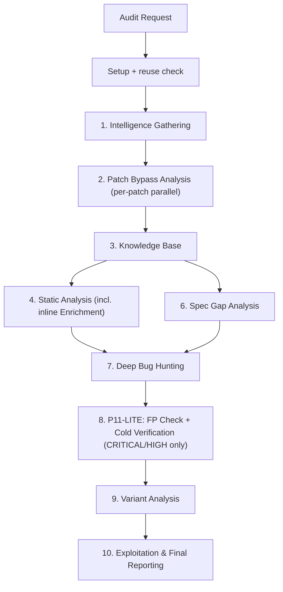

# Audit — Full Security Audit Methodology

10-phase security audit methodology for arbitrary source code repositories. Each phase defines what to analyze and what to produce. Orchestration (branching, state management, agent dispatch) is handled by the plugin commands.

## When to Apply

- Full security audit of a repository
- Advisory regression check combined with static analysis
- Deep vulnerability research on a specific codebase
- Large or unusual architectures where default SAST modeling is likely incomplete
- "Run the security agents" / "audit for vulnerabilities" / "is this secure?"

## Idempotency & Resumption

Before executing any phase, apply these rules to avoid redundant work:

- **Skip completed phases**: if the expected KB sections already exist and neither the codebase nor
  the threat-model inputs have fundamentally changed, reuse the existing content and mark the phase
  skipped.
- **Re-audit as KB update**: for re-audits, `xevon-results/attack-surface/knowledge-base-report.md` from the previous
  run is the starting knowledge base. Do not regenerate it from scratch. Load it, diff the codebase
  against the `commit` field of the last completed entry in `xevon-results/audit-state.json`, and update
  only the sections whose source inputs changed. Mark unchanged sections with
  `[reused from <short-sha>]`. Documentation-only changes require no re-audit; changes to auth,
  core business logic, or attack-surface components invalidate the Static Analysis Summary and
  Phase 10 Addendum (`## Phase 10 Addendum`, written by the Review Chambers) sections at minimum.
- **Partial resumption (Phases 7-9)**: if `xevon-results/findings-draft/` already contains draft files,
  resume from the existing drafts rather than starting fresh.
- **State recording**: `xevon-results/audit-state.json` is append-only. Before starting a new audit,
  append a new entry to the `audits` array with `status: "in_progress"`. After each phase
  completes or fails, update that entry's `phases` map in-place. Never overwrite or remove
  earlier entries — they are the permanent audit history. See `references/report-templates.md`
  for the full schema.

## Setup

Before executing Phase 1, perform the following environment checks:

1. **Security folder dirtiness check**: Run `git status xevon-results/` to determine if `xevon-results/` has
   uncommitted changes or untracked files.

2. **Concurrent agent detection**: Check whether another agent is actively writing to the source
   code tree. Indicators include uncommitted modifications outside `xevon-results/` in the working tree
   (e.g., staged edits, new untracked source files) or the presence of `.claude/` task state that
   suggests a live session.

3. **Run in place — never switch branches or create a worktree**: The audit ALWAYS runs in the
   target directory on the **current branch**. Do NOT run `git worktree add`, `git checkout`,
   `git switch`, `git branch`, `git commit`, `git add`, or `git push` against the target repo at
   any point, and never create an `../audit-*` worktree or an `audit` branch. Leave the user's
   branch and working tree exactly as they were — the user controls staging and commits. All
   audit output is written under `xevon-results/` (untracked), so it never collides with the user's
   source even when BOTH conditions above hold. If a concurrent agent is actively modifying
   source, record `"snapshot": "non-stable"` in the current `xevon-results/audit-state.json` entry and
   continue auditing the working tree in place — do not isolate.

## 10-Phase Workflow



## Phase 1 — Intelligence Gathering

Use the cve-scout workflow to collect:

- advisories, CVEs, GHSAs, and patch commits
- coarse architecture inventory: components, transports, execution contexts, trust boundaries
- security-relevant dependencies, with runtime context noted for each one. Use the `supply-chain-risk-auditor` skill to systematically assess dependency risks.

Treat dependency findings as hypotheses until the audit proves the affected runtime path is reachable.

Write all findings to the `## Advisory Intelligence` section of `xevon-results/attack-surface/knowledge-base-report.md`.

## Phase 2 — Patch Bypass Analysis

For each advisory patch:

- fetch the full diff and surrounding callers
- test bypass hypotheses: alternate entry points, config-gated checks, default-state gaps, compatibility branches, parser differentials, missing normalization
- check whether a sibling or related path remains vulnerable even if the patched path is sound
- cluster duplicate advisories by the same upstream commit or PR so one fix is not re-audited as multiple distinct bugs

Write all findings to the `## Bypass Analysis` section of `xevon-results/attack-surface/knowledge-base-report.md`.

## Phase 3 — Knowledge Base

Build the project model from source:

- classify project type: web app, API, CLI, desktop, library, plugin, protocol, worker, CI action
- map attacker-controlled inputs, trust boundaries, and security-critical decisions
- build compact DFD/CFD slices only for the highest-risk flows
- record implemented specs and RFCs
- Use the `security-threat-model` skill to formally document the threat model.
- Run **Domain Attack Research** (Modes A, B, and C) to build a domain-specific attack playbook:
  use `last30days`, `wooyun-legacy`, MCP tools, and web search. See
  `references/domain-attack-playbooks.md` for the research action sequence and per-domain templates.

Before completing Phase 3, add a `## Phase 4 CodeQL Extraction Targets` section to the KB draft.
For each high-risk DFD slice, record the expected CodeQL source type (RemoteFlowSource,
LocalUserInput, EnvironmentVariable) and the expected sink kind (sql-execution, command-execution,
file-access, http-request, code-execution, deserialization). This is the data contract that tells
Phase 4's structural extractor which per-slice call graph queries to run. Leave the section blank
if no DFD slices were identified — structural extraction will run generic enumeration only.

Produce `xevon-results/attack-surface/knowledge-base-report.md` with all Phase 3 sections populated. This is the
single knowledge base file for the entire audit. The threat model and attack surface content
live inside it as sections — no separate files.

The Phase 3 threat model is mandatory input for all later phases.

## Phase 4 — Static Analysis

**CRITICAL ENFORCEMENT:** You MUST physically execute the SAST tools. Do not hallucinate results or skip execution. You must ensure `codeql` successfully runs and that `semgrep` uses the **Pro** engine (`--pro`) exclusively. Standard Semgrep is only permitted as a fallback when Pro is unavailable due to an authentication or licensing failure; document the fallback and its reason in the report.

### Sub-step 4.1 — Structural Extraction (runs first, before security scan)

Before running any security suite, build the CodeQL database and store it at
`xevon-results/codeql-artifacts/db/` (not a transient path). Do not delete it after this sub-step.

Follow the `## Structural Extraction Workflow` in `references/architecture-aware-sast.md` to produce:

- `xevon-results/codeql-artifacts/entry-points.json`
- `xevon-results/codeql-artifacts/sinks.json`
- `xevon-results/codeql-artifacts/call-graph-slices.json`
- `xevon-results/codeql-artifacts/flow-paths-raw.sarif` (git-ignored, retained until Phase 12)
- `xevon-results/codeql-artifacts/flow-paths-all-severities.md`
- Machine-generated DFD and CFD Mermaid diagrams embedded in `xevon-results/attack-surface/knowledge-base-report.md`

Populate the `## CodeQL Structural Analysis` section of `xevon-results/attack-surface/knowledge-base-report.md`
after extraction completes.

### Sub-step 4.2 — Security Scan

Baseline requirements:

- Delegate to the `codeql` skill to run built-in security suites against the database built in 4.1.
- Delegate to the `semgrep` skill with `--pro` enforced for **all passes** (baseline, language, framework, and custom). Fall back to standard Semgrep only if the Pro engine fails with an authentication or licensing error; document the fallback reason in the `## Static Analysis Summary` section of `xevon-results/attack-surface/knowledge-base-report.md`.
- Explicitly output the list of CodeQL queries and Semgrep rules that you actually ran.
- For Java applications, run SpotBugs with the FindSecBugs plugin as a required baseline pass; treat this as additive to CodeQL and Semgrep.
- Run GitHub Actions review with `agentic-actions-auditor` when `.github/workflows/` exists; write results to the `## GitHub Actions Audit` section of `xevon-results/attack-surface/knowledge-base-report.md`.

Custom Architecture Generalization (Dynamic Rules):

- Do not solely rely on generic or pre-baked rules. You MUST dynamically generate **custom CodeQL queries and Semgrep rules** specifically tailored to the ad-hoc architecture, framework, and threat model identified in Phase 3 (e.g., custom MCP protocols, specific custom RPC boundaries).
- Store all dynamically generated custom rules in `xevon-results/codeql-queries/` and `xevon-results/semgrep-rules/`.
- Document exactly what custom rules were created, why they match the Phase 3 architecture, and their execution results in the `## Static Analysis Summary` section of `xevon-results/attack-surface/knowledge-base-report.md`.

Operational rules:

- Keep SAST concurrency low enough to avoid exhausting CPU/RAM.
- Merge SARIF outputs with `sarif-parsing` if needed.

### Sub-step 4.3 — Inline Enrichment (Security Relevance Filter)

After SAST runs complete and before deep bug hunting, classify each candidate finding as one of:

- likely security
- likely correctness/robustness
- likely environment/tooling/admin-only

For every candidate, answer:

1. What attacker controls the input?
2. Which runtime executes the vulnerable path?
3. What trust boundary is crossed?
4. Is the effect cross-user, cross-tenant, cross-privilege, or only same-user?
5. Is the vulnerable dependency/code path actually used in that runtime?
6. Query `xevon-results/codeql-artifacts/call-graph-slices.json` for the finding's source-to-sink slice.
   If `reachable: true`, that strengthens the finding. If `reachable: false` and both source and
   sink appear in the enumeration files, that is evidence to downgrade — document the discrepancy.
   For findings without a pre-computed slice, run an on-demand query against
   `xevon-results/codeql-artifacts/db/`.

Downgrade or exclude by default when the issue is only:

- build-time, source-controlled, CI-only, test-only, or dev-only
- browser-only usage of a server-side CVE, or server-only usage of a browser-side CVE
- same-user state/cache/UI correctness without a broader data boundary break
- admin safety, migration robustness, retry/deadlock hardening, data-loss prevention, or workflow correctness
- local tooling behavior where the attacker already has equivalent code execution
- assessable as Low severity after answering the questions above — drop immediately; do not carry
  forward to Phase 10

Write enrichment verdicts to the `## SAST Enrichment` section of `xevon-results/attack-surface/knowledge-base-report.md`. In the
`## CodeQL Structural Analysis` section, note any entry points from `entry-points.json` not
present in the Phase 3 DFD slices, and any sinks from `sinks.json` mapping to unmodeled
high-risk flows.

### Sub-step 4.4 — Cleanup

Delete Semgrep cache, `semgrep-res/`, and `codeql-res/`. Do **not** delete
`xevon-results/codeql-artifacts/db/` — it is retained for Phases 7 and 9. Full database deletion
happens at the end of Phase 12.

## Phase 9 — Spec Gap Analysis

If the repo implements specs or RFCs:

1. Read the `## Domain Attack Research` section of `xevon-results/attack-surface/knowledge-base-report.md` first —
   it contains pre-computed domain attack patterns from Phase 3 that directly inform which spec
   gaps to prioritize.
2. Fetch the relevant documents using built-in web search or fetch tools (do not restrict yourself to MCP tools).
3. Research the RFC for historical attacks, known edge cases, and common implementation failures.
   Cross-reference against the domain attack playbook from Phase 3.
4. Use `spec-to-code-compliance`.
5. Focus on parsing, normalization, sanitization, canonicalization, and state-machine compliance.
6. Identify gaps between the RFC spec and the codebase implementation clearly.
7. Keep only medium-to-critical findings with a credible exploit path.

Write all findings to the `## Spec Gap Analysis` section of `xevon-results/attack-surface/knowledge-base-report.md`.
If no specs or RFCs were identified in Phase 3, mark the section "None identified" and skip.

## Phase 10 — Review Chamber Deep Bug Hunting

Phase 10 uses a **Review Chamber** multi-agent debate system. Instead of a single deep-reviewer
agent, four specialized roles collaborate through structured argumentation to produce findings
with higher creativity and lower false-positive rates.

### Chamber Formation

After Phase 4 (SAST + inline enrichment) and Phase 9 (spec gap) complete:

1. Read `## High-Risk DFD Slices` and `## High-Risk CFD Slices` from `xevon-results/attack-surface/knowledge-base-report.md`
2. Group slices by shared trust boundary or component affinity into **threat clusters**
3. Each cluster becomes one Review Chamber (typical audit: 3-8 chambers)
4. Priority: authentication/authorization first, then data ingestion, then API surface

Create `xevon-results/chamber-workspace/` and `xevon-results/attack-pattern-registry.json`.

### Four Debate Roles

Each chamber spawns four agents that communicate through an append-only debate transcript at
`xevon-results/chamber-workspace/<chamber-id>/debate.md`:

- **Attack Ideator** (Red Team Creative): generates 3-7 attack hypotheses per cluster by cycling
  through 8 creative modes — vulnerability chaining, business logic abuse, race conditions/TOCTOU,
  second-order/stored attacks, trust boundary confusion, parser/protocol differentials, state
  machine attacks, and supply chain interaction. See `references/creative-attack-modes.md`.
  Does NOT trace code or issue verdicts.

- **Code Tracer** (Technical Analyst): takes each hypothesis and traces it through actual code.
  Uses Method 2.6 from `references/deep-analysis.md` (call-graph slices, entry-points.json,
  sinks.json, flow-paths-all-severities.md, on-demand QL queries). Produces reachability verdicts
  (REACHABLE / UNREACHABLE / PARTIAL) with file:line evidence chains.
  Does NOT generate hypotheses or issue final verdicts.

- **Devil's Advocate** (Challenger): challenges EVERY finding. Searches 5 protection layers
  (language, framework, middleware, application, documentation). Checks all 8 Claude-Specific FP
  patterns from `references/triage-and-prereqs.md`. Must argue against even obvious vulnerabilities —
  inability to construct credible defense is itself strong evidence.
  Does NOT generate hypotheses or issue verdicts.

- **Chamber Synthesizer** (Coordinator + Judge): orchestrates debate rounds, reads all arguments,
  resolves disputes, assigns calibrated severity per `references/triage-and-prereqs.md`, and writes
  finding drafts. Only role that writes to `xevon-results/findings-draft/`. Manages the attack pattern
  registry. May request up to 2 follow-up investigation rounds per hypothesis.

Optional 5th role — **Variant Scout**: monitors debate for confirmed patterns and concurrently
searches for structural variants in sibling components, front-loading Phase 12 work.

### Debate Protocol

Each chamber proceeds through structured rounds:

```
Round 1 (Ideation):  Ideator generates 3-7 hypotheses
Round 2 (Tracing):   Tracer traces each hypothesis through code
Round 3 (Challenge): Advocate writes defense brief per hypothesis
Round 4 (Synthesis): Synthesizer evaluates arguments, issues verdicts
Round 5-6 (Optional): Focused re-investigation on unresolved hypotheses
```

**Convergence criteria** — debate ends for a hypothesis when:
- Tracer: UNREACHABLE + Advocate confirms no alternate path → DROP
- Tracer: REACHABLE + Advocate cannot find blocking protection (2 attempts) → VALID
- Tracer: REACHABLE + Advocate finds blocking protection → FALSE POSITIVE
- 3 rounds without resolution → Synthesizer judgment call or INCONCLUSIVE
- Low severity after calibration → DROP (low severity)

**Limits**: max 7 hypotheses per batch, max 3 rounds per hypothesis, max 3 concurrent chambers.

See `references/chamber-protocol.md` for complete debate format, transcript template, and
convergence rules.

### Pre-Finding Quality Gate

Before writing any finding draft, the Synthesizer applies this 5-point check:

1. Attacker control verified by Tracer (not just inferred)?
2. Framework protection searched by Advocate (all 5 layers)?
3. Trust boundary crossing confirmed (not same-origin)?
4. Exploitation requires normal attacker position (not admin)?
5. Vulnerable code ships to production (not test/example)?

If any check fails, drop the finding. If ambiguous, add `Pre-FP-Flag: check-N-ambiguous` to the
draft for Phase 11 priority.

### Cross-Chamber Intelligence

Chambers share a **pattern registry** at `xevon-results/attack-pattern-registry.json`. When a
Synthesizer confirms a finding, it adds the root cause pattern with detection signatures
(CodeQL, grep, Semgrep). Other chambers read the registry before new ideation rounds,
enabling cross-domain pattern discovery.

### Output

- Finding drafts: `xevon-results/findings-draft/p7-<NNN>-<slug>.md` (Medium+ only, Low dropped)
- Debate transcripts: `xevon-results/chamber-workspace/<chamber-id>/debate.md` (audit artifact)
- Variant candidates: `xevon-results/chamber-workspace/<chamber-id>/variant-candidates/` (for Phase 12)
- Pattern registry: `xevon-results/attack-pattern-registry.json` (for Phases 8, 9)

### KB Feedback Loop

After all chambers close, append a `## Phase 10 Addendum` section to
`xevon-results/attack-surface/knowledge-base-report.md` containing: newly discovered attack surfaces, revised trust
boundary assumptions, and additional DFD/CFD paths found during chamber debates. Forward-append
only — Phase 3 content preserved for auditability.

### Specialized Skill Delegation

Chambers may delegate to specialized skills for scope NOT already covered by Phase 3 domain
attack research:

- `insecure-defaults` — fail-open configurations, weak auth defaults
- `sharp-edges` — API design issues, dangerous configurations
- `wooyun-legacy` — web vulnerability techniques
- `zeroize-audit` — C/C++/Rust secret handling

**Context**: Read `references/chamber-protocol.md`, `references/creative-attack-modes.md`,
`references/deep-analysis.md`, and `references/triage-and-prereqs.md`.

## Phase 11 — P11-LITE: FP Elimination and Cold Verification

Phase 11 is reduced from full adversarial review to **P11-LITE** because the Devil's Advocate
already challenged every finding during the Phase 10 chamber debate.

### Stage 1 — Analytical FP Check

Apply `fp-check` to all candidate findings with `Verdict: VALID` from Phase 10.

Retain only findings exploitable within the project's actual threat model.

- Judge the attack vector contextually against the project's threat model and attack surface.
- Check `SECURITY.md` to understand what maintainers consider a vulnerability vs. accepted risk.
- Apply the Bug Bounty Scope Gate and Claude-Specific FP Awareness checklist from
  `references/triage-and-prereqs.md`.
- Prioritize findings with `Pre-FP-Flag` annotations from the chamber debate.

**CRITICAL**: Verify intended behavior vs. bug. Cross-reference framework documentation, user
guides, and inline comments to prove a finding is an unintended flaw, not a documented feature.

**CRITICAL**: Drop theoretical/unexploitable bugs — static IVs without key access, timing
side-channels without practical exploit, by-design behavior, informational findings,
defense-in-depth-only changes, correctness issues without trust boundary crossing, dependency
alerts without reachable runtime path.

**CRITICAL**: "Best practice" is not a valid FP verdict. A missing security control IS a
vulnerability if the threat model shows attacker-controlled input reaches a sensitive sink
without adequate protection.

Use verdicts: `VALID`, `FALSE POSITIVE`, `BY DESIGN`, `OUT OF SCOPE`,
`DROP (low severity)`.

Write each verdict back into the corresponding `xevon-results/findings-draft/` file immediately.

### Stage 2 — Cold Verification (CRITICAL and HIGH only)

**Medium findings skip Stage 2** — already challenged by the Devil's Advocate during the
chamber debate. This reduces Phase 11 cost by ~60%.

For each CRITICAL and HIGH finding with `Verdict: VALID` after Stage 1, spawn a **fresh agent**
per finding. The task description contains only the finding draft file path — no debate transcript,
no context, no Phase 10 reasoning.

Each cold verifier independently:

1. Restates and decomposes the claim into testable sub-claims
2. Traces the code path from scratch
3. Attempts real-environment reproduction following `references/real-env-validation.md`
4. Writes prosecution and defense briefs
5. Challenges severity starting from MEDIUM
6. Issues CONFIRMED or DISPROVED

Cold verifiers write verdicts back into finding drafts and produce
`xevon-results/adversarial-reviews/<slug>-review.md`. DISPROVED findings have their `Verdict:`
updated to `FALSE POSITIVE (adversarial)`. Lower severity wins when challenged.

See `references/adversarial-review.md` for the cold verification protocol (scoped to
CRITICAL/HIGH only).

## Phase 12 — Variant Analysis

For each confirmed finding rated **Medium or higher**, search for variants using the same flow
shape, not just the same syntax.

**Primary input**: `xevon-results/attack-pattern-registry.json` — the structured registry of confirmed
patterns from Phase 10 Review Chambers. Each pattern includes `detection_signature` fields with
ready-made CodeQL, grep, and Semgrep queries for automated variant hunting, plus
`untested_candidates` identifying specific code locations to investigate.

Also read:
- `## Phase 10 Addendum` in `xevon-results/attack-surface/knowledge-base-report.md` for attack surfaces discovered
  during chamber debates
- `xevon-results/chamber-workspace/*/variant-candidates/` for pre-identified candidates from Variant
  Scouts
- `xevon-results/codeql-artifacts/entry-points.json` and `sinks.json` for structurally similar
  entry/sink combinations

Use:

- `variant-analysis` skill
- Detection signatures from the attack pattern registry
- DFD/CFD slices (including Phase 10 Addendum additions)
- Custom CodeQL queries and Semgrep rules when they help scale the variant hunt
- On-demand QL queries against `xevon-results/codeql-artifacts/db/` for AST-level structural matches

**Incremental persistence**: Write each confirmed variant immediately to `xevon-results/findings-draft/p9-<NNN>-<slug>.md` using the finding draft template. Only create drafts for variants rated Medium or higher.

**Database cleanup**: After all variant queries complete, delete the CodeQL database:

```bash
rm -rf xevon-results/codeql-artifacts/db/
```

The extracted JSON and markdown summaries in `xevon-results/codeql-artifacts/` are retained as
permanent audit record.

## Phase 15 — Exploitation & Final Reporting

**Draft promotion**: Before generating individual reports, collect all files in `xevon-results/findings-draft/` with verdict `VALID`. Assign new severity-prefixed IDs (`C1`, `H1`, `M1`) now — discard any `F-NNN` or other ad-hoc IDs used during drafting. For each Critical/High/Medium finding, create the corresponding `xevon-results/findings/<ID>-<slug>/` directory and copy the draft as the basis for the final `vuln-report` output. **Low severity findings are dropped entirely — they do not appear in individual reports, the summary table, or any other output. Never carry forward `F-NNN` draft IDs into final reports.**

For each critical, high, and medium bug confirmed:

1. Construct a realistic PoC on a real host or in a VM. You may spin up environments using the Azure CLI if already configured. Follow `references/real-env-validation.md` for provisioning procedures.
2. Ensure PoCs are valid and do not trivially bypass a security guard unrepresentative of the real environment (e.g., executing a command directly on the host rather than through the intended sandbox).
3. The PoC script must be minimized, clean, and highly effective—styled like a CTF exploit without excessive or unnecessary logging.
4. Make sure that the generated report contains granular, step-by-step details required to reproduce the exact bug.
5. Invoke the `vuln-report` skill for each Critical, High, and Medium finding. Follow its naming convention: number bugs with severity prefixes `C1`, `H1`, `M1`, incrementing the counter per severity tier. Prefix both the report title and the folder name with this ID.
6. Output all technical details and the PoC script for each single bug in its own dedicated subfolder under `xevon-results/findings/<Cn|Hn|Mn>-<bug-name>/`.
7. **CRITICAL/HIGH real-environment mandate**: For every CRITICAL or HIGH finding, real-environment PoC execution is required. Reuse the Stage 2 adversarial environment if available; otherwise provision a new one. Capture evidence in `xevon-results/findings/<ID>-<slug>/evidence/`. Annotate `PoC-Status: executed | theoretical | blocked` in the finding. A `theoretical` or `blocked` status requires a `PoC-Block-Reason:` line.

**Consolidated Pentest-Style Report:**
7. Generate a final `xevon-results/final-audit-report.md` that synthesizes the entire audit:

- **Executive Summary:** High-level risk assessment and key takeaways for non-technical stakeholders.
- **Methodology Summary:** A concise overview of the audit process (Phases 1-9), highlighting the depth of analysis.
- **Summary of Findings:** A prioritized list (table or list) of all **VALID** findings, focusing on Medium-to-Critical severities.
- **Technical Findings Detail:** A consolidated section containing the technical summary, impact, and a link to the detailed report and PoC for each valid finding.
- **Conclusion:** Final professional assessment of the project's security posture.
- **Constraint:** Keep the report concise and professional. Do not include theoretical or unexploitable bugs.

After the consolidated report is written, delete all working artifacts:

```bash
rm -rf xevon-results/findings-draft/
rm -rf xevon-results/adversarial-reviews/
rm -rf xevon-results/real-env-evidence/
rm -rf xevon-results/codeql-artifacts/
rm -rf xevon-results/codeql-queries/
rm -rf xevon-results/semgrep-rules/
rm -f xevon-results/audit-state.json
rm -f xevon-results/merged-results.sarif
rm -f xevon-results/bounty-scope.md
```

Only three paths are retained: `xevon-results/attack-surface/knowledge-base-report.md`, `xevon-results/final-audit-report.md`, and `xevon-results/findings/`.

## Output Directory

All audit output lives in `<repo-root>/xevon-results/`. Three paths are retained after the audit completes. Everything else is cleaned up at the end of Phase 15.

**Retained after audit:**

| Path                                            | Phases that write to it                                                                                                                                                  |
| ----------------------------------------------- | ------------------------------------------------------------------------------------------------------------------------------------------------------------------------ |
| `xevon-results/attack-surface/knowledge-base-report.md`           | 1 (advisory), 2 (bypass), 3 (arch/threat model/attack surface/domain attack research), 4 (SAST summary + CodeQL structural), 5 (enrichment), 6 (spec gaps), 7 (addendum) |
| `xevon-results/final-audit-report.md`              | 10                                                                                                                                                                       |
| `xevon-results/findings/<Cn\|Hn\|Mn>-<bug-name>/` | 10 (promoted from draft)                                                                                                                                                 |

**Working artifacts** (deleted at end of Phase 15):

| Path                                                       | Phase             |
| ---------------------------------------------------------- | ----------------- |
| `xevon-results/codeql-artifacts/`                             | 4-9               |
| `xevon-results/codeql-queries/`                               | 4, 9              |
| `xevon-results/semgrep-rules/`                                | 4, 9              |
| `xevon-results/chamber-workspace/<chamber-id>/debate.md`      | 7 (debate)        |
| `xevon-results/chamber-workspace/<chamber-id>/variant-candidates/` | 7 (scout)    |
| `xevon-results/attack-pattern-registry.json`                  | 7, 9 (intel)      |
| `xevon-results/findings-draft/<phase>-<NNN>-<slug>.md`        | 7-9 (incremental) |
| `xevon-results/adversarial-reviews/<slug>-review.md`          | 8 Stage 2 (C/H)   |
| `xevon-results/real-env-evidence/<finding-slug>/`             | 8 Stage 2         |
| `xevon-results/audit-state.json`                              | all phases        |
| `xevon-results/bounty-scope.md`                               | pre-audit (input) |

## Shared Rules

- Evidence over volume: every retained finding needs attacker control, a reachable path, and a crossed trust boundary.
- Threat-model first: browser, server, CLI, desktop, library, CI, and admin control planes have different security boundaries.
- Do not escalate correctness, robustness, operational safety, or data-loss-prevention fixes into security findings without a demonstrated trust-boundary break.
- Dependency advisories are not enough on their own; prove the vulnerable runtime path is used.
- Custom CodeQL or Semgrep coverage augments built-ins and should be architecture-driven.
- Deduplicate by upstream commit, PR, advisory, and sink so the same underlying bug is reported once.
- Delete Semgrep cache, `semgrep-res/`, and `codeql-res/` after Phase 4. Retain
  `xevon-results/codeql-artifacts/db/` through Phase 12 for on-demand reachability and variant queries.
  Delete the database at the end of Phase 12. Delete all remaining working artifacts at the end of
  Phase 15 — only `xevon-results/attack-surface/knowledge-base-report.md`, `xevon-results/final-audit-report.md`, and
  `xevon-results/findings/` are retained.
- Low severity findings are dropped at the earliest phase that determines their severity (Phase 5,
  7, or 8). They do not appear in Phase 12, Phase 15, or any final output.
- No fix recommendations by default unless the user asks.

## Audit Consistency Checks

Run consistency checks after Phase 15 completes, or on demand, to detect state drift and report inconsistencies:

1. **Finding ID cross-reference**: Every finding ID referenced in `xevon-results/final-audit-report.md` must correspond to a directory in `xevon-results/findings/`.
2. **KB section completeness**: `xevon-results/attack-surface/knowledge-base-report.md` must contain all phase-labelled sections. Sections labelled Phase 1-6 must be non-empty. Phase 10 Addendum must exist after Phase 10.
3. **Orphan detection**: Files present in `xevon-results/` but not referenced by the KB or `final-audit-report.md` are flagged as orphans.
4. **KB phase coverage**: For each completed phase (1-7), the corresponding KB section must be populated or explicitly marked "None identified" / "[reused from `<sha>`]".
5. **Findings-draft promotion**: Before final cleanup, `xevon-results/findings-draft/` should contain no files with verdict `VALID` that are missing a corresponding directory in `xevon-results/findings/`.
6. **CodeQL artifact completeness**: After Phase 4, `xevon-results/codeql-artifacts/entry-points.json`, `sinks.json`, `call-graph-slices.json`, and `flow-paths-all-severities.md` must all exist.
7. **No Low severity leakage**: `xevon-results/findings/` must contain no directory with an `L`-prefixed ID, and `xevon-results/final-audit-report.md` must contain no `LOW` entry in the findings table.
8. **No stale separate reports**: `xevon-results/` must not contain `cve-scout-report.md`, `bypass-analysis-report.md`, `threat-model-report.md`, `attack-surface-report.md`, `static-analysis-report.md`, `actions-audit-report.md`, `spec-gaps-report.md`, or `final-findings-report.md`. These have been consolidated into `knowledge-base-report.md`.

## Post-Audit Skill Improvement

After the audit, use:

- `prompt-optimizer` to tighten weak prompts
- `prompt-builder` to refine targeted audit prompts
- `skill-creator` to update recurring audit workflows when new patterns emerge
