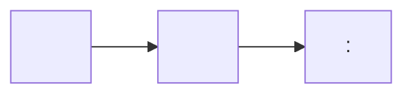
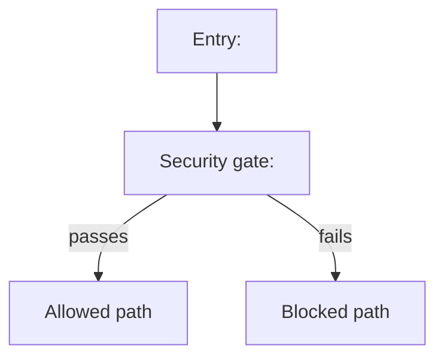

# Knowledge Base Report Template

Unified template for `xevon-results/attack-surface/knowledge-base-report.md`. This is the single knowledge repository
for the entire audit — populated incrementally across phases 1-7. Each section is labelled with
the phase that produces it. Sections left blank by earlier phases are filled in by later ones.

For re-audit: load the existing `xevon-results/attack-surface/knowledge-base-report.md` as the starting point. Update
only the sections whose source inputs have changed since `last_audited_commit`. Sections that
do not need updating are preserved as-is and their phase status is marked `reused`.

---

```markdown
# Knowledge Base: <Project Name>

**Audit date:** YYYY-MM-DD
**Repository:** <owner/repo>
**Branch/commit:** <branch> @ <short-sha>
**Last audited commit:** <short-sha or "first audit">

---

## Project Classification

*Phase 3 — threat-modeler*

**Primary type:** <Web Application | Library | CLI Tool | Plugin/Extension | Protocol Implementation | Infrastructure/Agent>
**Secondary types:** <if applicable>
**Language(s):** <primary languages>
**Deployment model:** <cloud-hosted SaaS | on-premises | embedded | desktop | CI/CD pipeline>
**Typical users:** <developers | end users | administrators | other services>
**Internet-facing:** <yes | no | partial — describe>

---

## Architecture Summary

*Phase 3 — threat-modeler*

<2-4 sentences describing the system's main components, how they interact, and where security-critical operations happen.>

**Key components:**

| Component | Purpose | Security relevance |
|-----------|---------|-------------------|
| <name> | <what it does> | <why it matters for security> |

---

## Architecture Inventory

*Phase 3 — threat-modeler*

| Area | Inventory |
|------|-----------|
| Components | <services, processes, plugins, workers, control planes> |
| Transports | <HTTP, RPC, queues, files, IPC, CLI, custom protocols> |
| Execution environments | <internet-facing, internal, desktop, CI/CD, admin-only> |
| Security-critical wrappers | <custom middleware, adapters, SDKs, generated interfaces> |

---

## Trust Boundaries

*Phase 3 — threat-modeler*

| Boundary | From | To | Trust level |
|----------|------|----|-------------|
| <name> | <external attacker / user / service> | <component> | <untrusted / semi-trusted / trusted> |

---

## High-Risk DFD Slices

*Phase 3 — threat-modeler*

List only the attacker-controlled flows most likely to matter in Phases 4-9.

| Slice | Source | Key transformations | Sink | Trust boundaries crossed |
|------|--------|---------------------|------|--------------------------|
| <name> | <entry point> | <parse, normalize, forward> | <db, exec, authz, file, network> | <boundary list> |

---

## High-Risk CFD Slices

*Phase 3 — threat-modeler*

List only the security-critical decision flows most likely to matter in Phases 4-9.

| Slice | Entry condition | Security gate | Alternate path | Privileged action |
|------|-----------------|---------------|----------------|-------------------|
| <name> | <trigger> | <authz, policy, validation> | <fallback or bypass path> | <effect> |

---

## Threat Model

*Phase 3 — security-threat-model skill*

**Assets:**
- <asset 1> — <why it is valuable to an attacker>
- <asset 2> — ...

**Threat actors:**

| Actor | Access level | Motivation |
|-------|-------------|-----------|
| <e.g., anonymous internet user> | <unauthenticated network> | <data theft, disruption> |

**STRIDE analysis:**

| Component | Spoofing | Tampering | Repudiation | Info Disclosure | DoS | Elevation |
|-----------|---------|-----------|-------------|-----------------|-----|-----------|
| <component> | <risk> | <risk> | <risk> | <risk> | <risk> | <risk> |

**Top threat scenarios:**

| # | Scenario | Likelihood | Impact | Residual risk |
|---|----------|-----------|--------|--------------|
| 1 | As <attacker>, I can <action> via <entry point> to <impact> | High/Med/Low | High/Med/Low | High/Med/Low |

**Security assumptions:**
- <assumption 1>
- <assumption 2>

---

## Attack Surface

*Phase 3 — threat-modeler*

**Entry point count:** <N>
**Unauthenticated entry points:** <N>
**High-risk functionality:** <list key features>

**Full entry point inventory:**

| Entry point | Auth required | Input types | Attacker-controlled fields | Risk |
|-------------|--------------|-------------|---------------------------|------|
| <endpoint/interface> | <none / API key / session / OAuth> | <JSON / XML / multipart / binary> | <fields> | High/Med |

**External dependencies that extend the attack surface:**
- <dependency — how it extends the surface>

---

## Specs and RFCs Implemented

*Phase 3 — threat-modeler (used by Phase 9)*

| Spec / RFC | Version | Implementation location | Official URL |
|-----------|---------|------------------------|-------------|
| <e.g., OAuth 2.0 — RFC 6749> | <full / partial> | `src/auth/oauth.py` | https://www.rfc-editor.org/rfc/rfc6749 |

**None identified** — <if no specs found, state this explicitly>

---

## Key Dependencies

*Phase 3 — threat-modeler*

| Dependency | Version | Purpose | Notes |
|-----------|---------|---------|-------|
| <name> | <version> | <what it does> | <known CVEs, end-of-life, etc.> |

**Dependency intelligence notes:**
- <which dependencies are outdated or security-relevant>
- <which are reachable from the high-risk DFD/CFD slices>
- <which remain hypotheses until exploitability is established>

---

## Domain Attack Research

*Phase 3 — threat-modeler*

**Domains identified:** <e.g., SAML, OAuth 2.0, JWT, HTTP client/server — or "None identified">

*If no relevant technology domains were detected, state "None identified" and skip subsections.*

### Mode A — Library-as-target

*Populated when project type is `library`, `plugin`, or `protocol`.*

| Skill invoked | Scope | Key findings |
|--------------|-------|-------------|
| `sharp-edges` | Library API surface | <footgun designs, dangerous defaults> |
| `wooyun-legacy` | <checklist used> | <relevant patterns> |
| `last30days` | `<library name> CVE security` | <recent advisories, bypass discussions> |

### Mode B — Library-as-consumer

*Populated when security-sensitive dependencies are identified.*

| Dependency | Skill invoked | Key findings |
|-----------|--------------|-------------|
| <name> | `sharp-edges` / `insecure-defaults` / `last30days` | <misuse patterns, recent disclosures> |

### Mode C — Domain-Specific Attack Research

*Populated when technology domains are identified. See `references/domain-attack-playbooks.md`.*

#### Domain: <name>

**Identified via:** <signal>

**Known attack classes:**

| Attack | Description | Detection strategy | Relevance |
|--------|-------------|-------------------|-----------|
| <name> | <brief> | <how to detect in code> | High/Med/Low |

**Custom SAST targets:**

| Attack pattern | Rule type | Source/sink or pattern | Priority |
|---------------|-----------|----------------------|----------|
| <name> | CodeQL / Semgrep | <what to model> | High/Med/Low |

**Manual review checklist:**
- [ ] <concrete check tied to this project's implementation>

**Research sources used:** <last30days, wooyun-legacy (checklist name), web search, MCP>

---

## Phase 4 Custom Modeling Targets

*Phase 3 — threat-modeler*

| Area | Built-in coverage status | Custom modeling needed | Why |
|------|-------------------------|------------------------|-----|
| <component or flow> | <good / partial / weak> | <none / CodeQL / Semgrep / both> | <wrapper, custom transport, policy flow, generated code> |

---

## Phase 4 CodeQL Extraction Targets

*Phase 3 — threat-modeler*

For each high-risk DFD slice, specify the expected CodeQL source type and sink kind so structural
extraction is scoped correctly. Leave blank if no DFD slices were identified.

| DFD Slice | Expected source type | Expected sink kind(s) | Threat model needed |
|----------|--------------------|-----------------------|--------------------|
| <slice name> | RemoteFlowSource / LocalUserInput / EnvironmentVariable | sql-execution, command-execution, file-access, etc. | remote / local / env / all |

---

## Advisory Intelligence

*Phase 1 — cve-scout*

**Advisory sources checked:** <list: GitHub Security Advisories, NVD, OSV, release notes, etc.>
**Total advisories found:** <N>
**Date range:** <earliest> to <latest>

### Published Advisories

| ID | Severity | Description | Patch commit | Status |
|----|----------|-------------|-------------|--------|
| <CVE/GHSA> | <Critical/High/Med/Low> | <brief description> | <commit SHA or PR> | <patched / unpatched / unclear> |

### Vulnerability Class Patterns

| Class | Count | Last seen | Notes |
|-------|-------|-----------|-------|
| <e.g., SSRF> | <N> | <year> | <brief note — recurring pattern, fixed root cause, etc.> |

### Supply Chain Risk Summary

*From `supply-chain-risk-auditor` skill.*

| Dependency | Risk level | Reason | Reachable? |
|-----------|-----------|--------|-----------|
| <name> | <High/Med/Low> | <outdated / known CVE / unmaintained> | <yes / no / unknown> |

### Architecture Intelligence

<Coarse architecture inventory gathered during advisory research — components, transports, execution
contexts, trust boundaries. Refined by Phase 3.>

---

## Bypass Analysis

*Phase 2 — patch-auditor (one instance per patch)*

**Patches analyzed:** <N>
**Bypasses found:** <N>
**Patches confirmed sound:** <N>

### Per-Patch Analysis

#### <CVE/GHSA ID> — <brief title>

**Patch commit:** <SHA>
**Original vulnerability:** <brief description>
**Bypass hypothesis tested:** <what was tested>
**Result:** <sound / bypassable / relocated>
**Evidence:** <code path, alternate entry point, config gap, etc.>

<Repeat for each patch.>

---

## CodeQL Structural Analysis

*Phase 4 — code-scanner (structural extraction sub-step)*

### Entry Point Coverage

**Total CodeQL-recognized sources:** <N>
**Threat models scanned:** <remote | remote+local | remote+local+env | all>

| Source type | Count | Example location | In Phase 3 KB? |
|------------|-------|-----------------|----------------|
| RemoteFlowSource | N | `src/api/handler.py:42` | yes / no |
| LocalUserInput | N | `src/cli/args.py:17` | yes / no |
| EnvironmentVariable | N | `src/config/loader.py:8` | yes / no |

**Entry points found by CodeQL but missing from Phase 3 KB:**
- <file:line — source type — note>

### Sink Coverage

**Total CodeQL-recognized sinks:** <N>

| Sink kind | Count | Example location |
|----------|-------|-----------------|
| sql-execution | N | ... |
| command-execution | N | ... |
| file-access | N | ... |
| http-request | N | ... |
| code-execution | N | ... |
| deserialization | N | ... |

**Sinks not covered by any DFD slice:**
- <file:line — sink kind — note>

### Call Graph Slice Reachability

| DFD Slice | Reachable? | Path count | Notes |
|----------|-----------|-----------|-------|
| <slice name> | yes / no | N | <path summary or no-path reason> |

**Slices with no reachable path — investigation status:**
- <slice name>: <isolated by design / incomplete model / dead code / other>

### Informational Flow Node Summary

*Derived from `xevon-results/codeql-artifacts/flow-paths-all-severities.md`.*

| Rule | Count | Affected file areas | Significance |
|------|-------|-------------------|-------------|
| <rule ID> | N | `src/auth/` | <sanitizer call / validation node / transformation> |

**Key sanitizer/validation nodes identified by CodeQL:**
- <file:line — what it does — manual review status>

### Machine-Generated DFD Diagram

*Auto-generated from `entry-points.json`, `call-graph-slices.json`, and `sinks.json`. Refine
manually if paths are incomplete or misleading.*



### Machine-Generated CFD Diagram

*Auto-generated from CodeQL control-flow data. Supplement with manual additions.*



---

## Static Analysis Summary

*Phase 4 — code-scanner*

**CodeQL version:** <version>
**Semgrep version:** <version>
**Semgrep engine:** Pro / standard (fallback)

### Tools and Rulesets Run

| Tool | Suite / ruleset | Finding count | Notes |
|------|----------------|--------------|-------|
| CodeQL | <language>/<suite> | N | <e.g., built-in security-and-quality> |
| Semgrep | <ruleset> | N | <pro / standard> |
| SpotBugs + FindSecBugs | — | N | <Java only, omit otherwise> |

**Custom rules created:**

| Rule file | Tool | Motivated by | Finding count |
|----------|------|-------------|--------------|
| `xevon-results/codeql-queries/<name>.ql` | CodeQL | <DFD/CFD slice> | N |
| `xevon-results/semgrep-rules/<name>.yaml` | Semgrep | <DFD/CFD slice> | N |

**Fallback documentation:** <if Semgrep Pro unavailable, state reason here; otherwise "N/A">

### Key Findings from SAST

*Medium and above only. Full results in finding drafts.*

| Finding | Tool | Severity | File:line | Disposition |
|---------|------|----------|-----------|-------------|
| <title> | CodeQL / Semgrep | Med/High/Crit | `src/...:N` | <advanced to Phase 10 / false positive — reason> |

### Coverage Gaps

- <area not covered by built-in rules — why — whether custom rules were added>

---

## GitHub Actions Audit

*Phase 4 — agentic-actions-auditor (only if `.github/workflows/` exists; omit section otherwise)*

**Workflows analyzed:** <N>
**Issues found:** <N>

| Workflow | Issue | Severity | Notes |
|---------|-------|----------|-------|
| <file> | <e.g., untrusted input in run step> | High/Med | <brief> |

---

## Spec Gap Analysis

*Phase 9 — spec-to-code-compliance (only if specs/RFCs were identified in Phase 3; omit otherwise)*

**RFCs reviewed:** <list>
**Gaps found:** <N critical/high/med>

### Per-Gap Detail

#### G1 — <Gap Title>

- **RFC Clause:** <RFC XXXX §Y.Z>
- **Code Path:** `<file/function>`
- **Gap Type:** <partial / missing / bypassable>
- **Attack Vector:** <threat-model-relevant vector>
- **Exploit Conditions:** <prerequisites>
- **Impact:** <concrete attacker gain>
- **Evidence:** <code path and reasoning>

<Repeat for each medium-to-critical gap with a credible exploit path.>

---

## SAST Enrichment

*Written inline by the Phase 4 code-scanner after SAST completes (formerly Phase 5 / enrichment-filter)*

**New attack surfaces identified by SAST:**
- <entry point or code path not found in Phase 3>

**SAST findings reclassified by threat model:**
- <finding ID>: reclassified as <FALSE POSITIVE / OUT OF SCOPE> because <reason tied to threat model>
- <finding ID>: confirmed because <DFD/CFD slice shows real trust-boundary crossing>

**CodeQL cross-reference updates:**
- <entry points from entry-points.json missing from Phase 3 KB>
- <sinks from sinks.json mapping to unmodeled high-risk flows>

---

## Phase 10 Addendum

*Phase 10 — deep-reviewer (forward-append only; Phase 3 content preserved for auditability)*

**Newly discovered attack surfaces:**
- <surface not in Phase 3 KB>

**Revised trust boundary assumptions:**
- <original assumption> → <revised assumption — evidence>

**Additional DFD/CFD paths discovered:**
- <path description — file:line chain>
```

---

## Notes for threat-modeler

- This file is the single persistent knowledge store across all phases. Write to it incrementally.
- Read actual source code, not just the README.
- Threat scenarios must reference real code paths.
- Spec detection must cite the file/class that implements the spec.
- DFD/CFD sections should stay compact and risk-prioritized, not exhaustive.
- Leave later-phase sections blank initially (mark with *Phase N* label); they are filled in by those phases.
- Do not perform compliance gap analysis — that is Phase 9's job.
- The `## CodeQL Structural Analysis` section (including diagrams) is populated by the Phase 4
  static analyzer, not by the threat-modeler. The threat-modeler's contribution
  is the `## Phase 4 CodeQL Extraction Targets` section only.
- For re-audit: preserve all original section content. Update sections whose source inputs changed.
  Mark unchanged sections as `[reused from <short-sha>]` at the section header.
