# Phase 3 Architecture & Threat Model Knowledge Base — Shopify CLI

Generated: 2026-05-01  
Target: `/Users/codiologies/Desktop/oss-to-run/shopify-cli`  
HEAD observed from audit state: `c3e54bea421d23743b5f2b83b34347f5bb729cc4` (`main`)  
Primary evidence: source under `packages/*/src`, package manifests, Stage 01 advisory intelligence, and Stage 02 patch-bypass review.

## Project Classification

### Project Type

| Type | Applicability | Evidence |
|---|---:|---|
| **CLI** | Primary | `@shopify/cli` exposes `bin.shopify` and oclif command registry; `@shopify/create-app` exposes `bin.create-app`. |
| **Library** | Significant | `@shopify/cli-kit` exports shared Node/browser utilities; `@shopify/ui-extensions-server-kit` is a published React/server-client helper package. |
| **Plugin** | Significant | `@shopify/plugin-cloudflare` implements oclif tunnel hooks; `@shopify/plugin-did-you-mean` is a plugin package. |
| **Local web app / dev servers** | Significant runtime attack surface | `shopify app dev`, `theme dev`, UI extension dev server, GraphiQL, Store auth callback, and app reverse proxy start local HTTP/WS/SSE services. |
| **Protocol/API client** | Significant | Implements/consumes OAuth2 device auth, OAuth token exchange, PKCE, GraphQL over HTTPS, REST, WebSocket/SSE, HTTP proxying, Liquid/TOML/JSON/YAML/glob parsers. |
| **Worker/build orchestrator** | Significant | Builds/bundles functions/extensions/themes, runs package managers and arbitrary project build commands, downloads external binaries. |
| **CI/release automation** | Out-of-runtime but in repo | GitHub workflows/scripts, Nx/Changesets/release tooling are present; deeper workflow audit is later-phase scope. |

### One-line system summary

Shopify CLI is a Node.js/TypeScript monorepo whose published CLI commands authenticate a developer, parse local app/theme/extension projects, run local dev servers and subprocesses, proxy browser traffic to Shopify services, build/deploy packages and themes, and persist developer/store credentials on the local machine.

### High-risk design center

The highest-risk areas are not conventional internet-facing production endpoints; they are **developer-machine trust boundaries**:

1. A malicious browser origin or tunnel visitor reaching localhost dev servers that carry app/store tokens.
2. A malicious or compromised app/theme/template repository controlling config, globs, Liquid templates, build commands, and files.
3. Environment variables and local project files that select external binaries, proxy behavior, API hosts, and build/runtime commands.
4. Token-bearing GraphQL/REST/API calls to Shopify platform services and local persistence of tokens.

## Architecture Model

### Major components

| Component | Role | Security-relevant files |
|---|---|---|
| `@shopify/cli` | oclif bootstrap, lazy command loading, bundled command registry, global proxy setup, signal/error handling. | `packages/cli/src/bootstrap.ts`, `packages/cli/src/index.ts`, `packages/cli/src/command-registry.ts`, `packages/cli-kit/src/public/node/cli.ts`, `packages/cli-kit/src/public/node/base-command.ts` |
| `@shopify/cli-kit` | Shared auth/session, GraphQL/REST clients, local storage, process execution, filesystem/path helpers, Liquid rendering, telemetry, HTTP wrappers. | `packages/cli-kit/src/private/node/session*.ts`, `packages/cli-kit/src/public/node/api/*.ts`, `packages/cli-kit/src/public/node/http.ts`, `packages/cli-kit/src/public/node/system.ts`, `packages/cli-kit/src/public/node/tree-kill.ts`, `packages/cli-kit/src/public/node/liquid.ts`, `packages/cli-kit/src/private/node/conf-store.ts` |
| `@shopify/app` | App init/generate/build/deploy/dev, extension specs/build steps, dev orchestration, GraphiQL local server, app reverse proxy. | `packages/app/src/cli/services/dev.ts`, `services/dev/processes/setup-dev-processes.ts`, `services/dev/graphiql/server.ts`, `services/dev/extension/server.ts`, `services/build/**`, `models/app/loader.ts`, `models/extensions/**` |
| `@shopify/theme` | Theme commands, theme dev local server, filesystem watcher, renderer/CDN proxy, uploads/downloads, packaging. | `packages/theme/src/cli/services/dev.ts`, `utilities/theme-environment/*.ts`, `utilities/theme-fs.ts`, `utilities/theme-uploader.ts`, `services/package.ts` |
| `@shopify/store` | Store app authentication via PKCE loopback callback, persisted store app sessions, Admin GraphQL execution. | `packages/store/src/cli/services/store/auth/*.ts`, `packages/store/src/cli/services/store/execute/*.ts`, `packages/store/src/cli/commands/store/*.ts` |
| `@shopify/plugin-cloudflare` | Downloads/runs `cloudflared`, exposes tunnel provider/start hooks, returns public tunnel URL. | `packages/plugin-cloudflare/src/install-cloudflared.ts`, `packages/plugin-cloudflare/src/tunnel.ts`, `packages/plugin-cloudflare/src/provider.ts` |
| UI extension dev server and client libraries | Serves dev console, extension payloads/assets, WS updates/logs. | `packages/app/src/cli/services/dev/extension/**`, `packages/ui-extensions-dev-console/src/**`, `packages/ui-extensions-server-kit/src/**` |
| Build/release/tooling | Nx, Changesets, docs/schema generation, e2e, release scripts. | `package.json`, `.github/workflows/**`, `bin/**`, `configurations/**` |

### Runtime transports and data stores

| Transport/store | Direction | Authentication / controls observed |
|---|---|---|
| CLI argv / oclif flags / env vars | User shell → CLI | oclif parsing, Zod/TOML validation in selected flows; many env vars can override paths/tokens/hosts. |
| Local project files | Filesystem → CLI | TOML/JSON/YAML/Liquid/globs; Zod schemas for many configs; incomplete canonical symlink checks in some copy paths per Stage 02. |
| Local HTTP | Browser/tunnel/user → CLI dev servers | GraphiQL key on main/API routes, not all routes; theme CORS allowlist; UI extension server CORS `*`; store PKCE callback state validation. |
| WebSocket/SSE | Browser/dev console/theme editor → CLI | UI extension WS on `/extensions`; theme SSE via `Accept: text/event-stream`; minimal authentication because bound to localhost/proxy/tunnel contexts. |
| HTTPS GraphQL/REST | CLI → Shopify platform | Bearer tokens, `X-Shopify-Access-Token`, rate limiting/retries, URL sanitization in logs. |
| External subprocesses | CLI → local OS | `execa` array args mostly; some string split; `execCommand`/Windows `treeKill` shell path is high risk; command safety warns on cwd binary shadowing. |
| External downloads | Internet/CDN/GitHub → local executable/template | GitHub templates and Cloudflare/Javy/function-runner/wasm-opt binaries downloaded; checksum/signature verification generally not observed in inspected paths. |
| Local credential stores | CLI ↔ conf files under user config dirs | `conf` storage; sessions/tokens stored as JSON strings, schema-validated on load but not encrypted by this code. |


### Trust Boundaries

| ID | Boundary | Why it matters | Key controls / gaps |
|---|---|---|---|
| TB-1 | **Browser / arbitrary web origin → localhost dev servers** | Browser can make requests to loopback or tunnel URLs; dev servers may hold Admin/storefront/app tokens and expose local files/assets. | GraphiQL key on `/graphiql` and `/graphiql/graphql.json`; theme exact CORS allowlist; UI extension server and GraphiQL set `Access-Control-Allow-Origin: *` in some paths; GraphiQL `/status` currently not key-gated per Stage 02. |
| TB-2 | **Public tunnel / remote collaborator → local dev server** | `app dev` can expose local app/theme/extension services through tunnels, changing localhost-only risk into internet-reachable risk. | Tunnel provider abstraction; public URLs intentionally created; authentication often delegated to dev workflow rather than enforced on local endpoints. |
| TB-3 | **Local project/template/theme files → CLI execution and filesystem** | Projects can contain config, globs, Liquid/templates, function code, web commands, package scripts, and symlinks. A malicious repo can try file exfiltration or command execution. | Zod/TOML schemas, path sanitizers for some build outputs; `npm install`/build commands are intentionally executed. Symlink and path canonicalization require focused review. |
| TB-4 | **Environment variables → privileged behavior** | Env vars can inject tokens, override hosts, enable automation, set binary paths, select package managers, configure OTEL endpoints, and influence CLI flags. | Some token URL redaction; little centralized provenance marking. Env-controlled paths/binaries remain high-value sources. |
| TB-5 | **CLI → local OS process boundary** | Running subprocesses changes execution context from TypeScript code to shell/native binaries/package managers. | `execa` array usage is common; `execCommand` and Windows `treeKill` shell behavior are high-risk exceptions. |
| TB-6 | **CLI → Shopify platform APIs** | CLI carries Partners/Admin/App Management/Business Platform tokens that can read/write merchant/app data and deploy app config/extensions. | OAuth flows, GraphQL clients, token exchange; authorization largely server-side. Local storage and logging are local attack vectors. |
| TB-7 | **External downloads → local filesystem/executable trust** | Templates and tool binaries become executable code or trusted project scaffolds. | GitHub/CDN release URLs; cache paths. Signature/checksum verification was not evident in inspected code. |
| TB-8 | **Local credential store → user account/store access** | Compromise of config files yields reusable refresh/access tokens. | Conf-store schema validation and refresh logic; no first-party encryption layer observed in code. |
| TB-9 | **Remote Shopify/storefront responses → browser/dev console rendering** | API responses, extension logs, Liquid/theme HTML, and error messages can enter local UIs. | React rendering, escaping depending on component; GraphiQL template interpolation and dev-console rendering are XSS-sensitive. |
| TB-10 | **Proxy boundary: local client → remote URL / local app target** | Reverse proxies can forward headers/cookies/tokens and can become SSRF or credential-leak primitives if target or path is attacker-controlled. | Target URLs typically derived from CLI config/dev setup; header handling and redirect behavior need SAST/manual coverage. |

### Security-critical decisions

| Decision | Location | Security question |
|---|---|---|
| Select and load command implementation | `packages/cli/src/command-registry.ts`, `packages/cli/src/bootstrap.ts` | Can untrusted flags/env cause unexpected plugin/command loading or bypass prerun hooks? |
| Parse/validate app/theme configs | `packages/app/src/cli/models/app/loader.ts`, `models/extensions/schemas.ts`, `theme` utilities | Are TOML/JSON/YAML fields normalized before use in file/process/network sinks? |
| Choose dev server host/port/CORS/key | `app` GraphiQL/extension server, `theme` dev server, store auth callback | Are local-only assumptions safe when browsers, DNS rebinding, and tunnels are in play? |
| Authenticate local callback | `packages/store/src/cli/services/store/auth/callback.ts`, `pkce.ts` | Is OAuth `state`/PKCE binding strong and replay resistant? |
| Build function/extensions/themes | `packages/app/src/cli/services/build/**`, `theme` package/push | Are include/exclude globs and asset destinations unable to escape build roots or include secrets? |
| Run subprocesses/binaries | `cli-kit/system.ts`, `tree-kill.ts`, `app/services/web.ts`, `function/*.ts`, `plugin-cloudflare` | Are commands invoked without shell injection and are env-selected binaries trusted? |
| Persist/read tokens | `cli-kit/session/store.ts`, `conf-store.ts`, `store/auth/session-store.ts` | Are tokens protected from logs, path confusion, and hostile project code? |
| Build API requests | `cli-kit/api/*.ts`, `store/execute/*.ts`, `app/utilities/developer-platform-client/*.ts` | Are URLs, API versions, headers, and query documents trusted and redacted appropriately? |
| Download template/binaries | `app/init/template/npm.ts`, `plugin-cloudflare/install-cloudflared.ts`, `function/binaries.ts` | Are downloaded artifacts integrity-checked before execution/use? |

### Control-flow overview

1. `bin/shopify`/`bin/dev` → `bootstrap.ts` → `runCLI` → command registry → oclif command class.
2. Command parses flags/env/prompts → reads config/project files → resolves app/theme/store context.
3. Auth layer obtains or refreshes Shopify tokens, either from env automation tokens, device auth, token exchange, or store PKCE.
4. Command either:
   - starts local servers and subprocesses (`app dev`, `theme dev`, `store auth`),
   - performs local build/file operations (`app build`, `theme package`, generators),
   - calls Shopify APIs (`deploy`, `push`, `execute`, `logs`, `bulk`, `webhook trigger`), or
   - downloads/runs helper binaries (`cloudflared`, function runner, Javy, wasm-opt).
5. Results are printed, logged, sent to telemetry, written to disk, and/or rendered in local browser/dev-console pages.

## DFD/CFD Slices

The following compact slices intentionally focus on high-risk attacker-controlled paths that cross trust boundaries, change execution context, or propagate identity.

### DFD-1: Browser or tunnel visitor → GraphiQL local proxy → Admin GraphQL

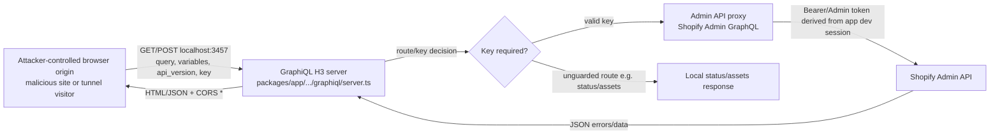

**Sources:** HTTP query/body/headers from browser/tunnel.  
**Sinks:** token-bearing Admin GraphQL request, GraphiQL HTML/JSON rendering/logs.  
**Security decisions:** key derivation/validation, route gating, CORS, API-version validation, response escaping.

### DFD-2: Browser/dev console → UI extension dev server WebSocket/assets → local extension project

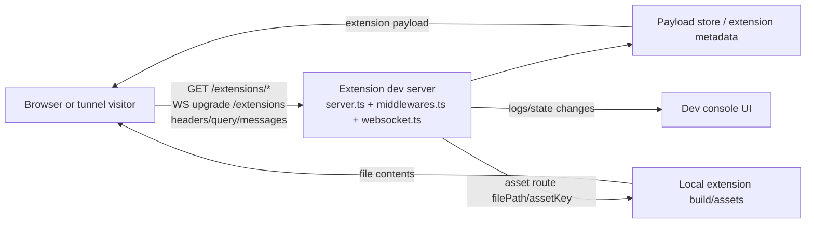

**Sources:** URL path params, query, WS messages, browser headers.  
**Sinks:** local file reads, dev console rendering, WS broadcast.  
**Security decisions:** CORS/host binding, asset path resolution, extension ID authorization, WS origin handling.

### DFD-3: Theme dev browser requests → local files + remote storefront renderer

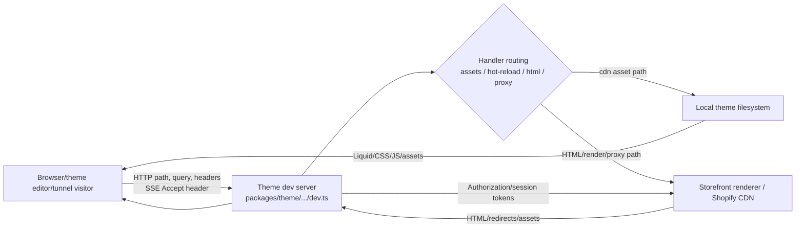

**Sources:** path/query/header from browser/tunnel; local theme file tree and ignore rules.  
**Sinks:** local file reads, token-bearing renderer/CDN requests, SSE/log output, proxy response.  
**Security decisions:** CORS allowlist, route ordering, path canonicalization, proxy header forwarding, no-cache/local-only assumptions.

### DFD-4: Malicious app/theme repo config → build/package include-assets → filesystem writes/archives

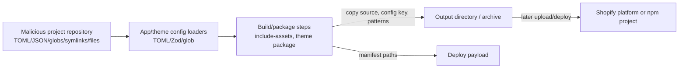

**Sources:** config keys, destination paths, glob patterns, symlinks, ignored files.  
**Sinks:** file reads/writes, ZIP/package creation, deploy payloads.  
**Security decisions:** `sanitizeRelativePath`, root containment, symlink target checks, ignore-file enforcement, secret file exclusion.

### DFD-5: CLI flags/env/local config → subprocess/native binary execution

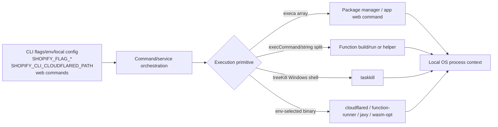

**Sources:** flags, env vars, `shopify.web.toml`, package scripts, PATH/current directory, downloaded binaries.  
**Sinks:** command execution, native executable execution, process termination.  
**Security decisions:** no-shell vs shell, argument array separation, PID validation, cwd/PATH shadowing, binary integrity and cache paths.

### DFD-6: OAuth/device/store auth flows → local credential store → API clients

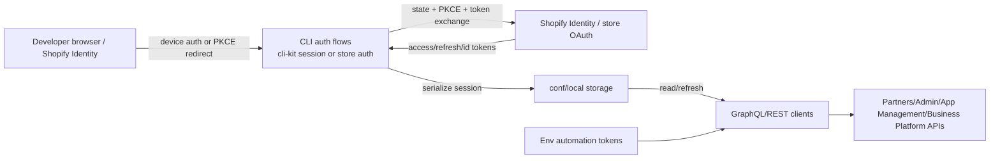

**Sources:** browser callback query params, device auth response, env tokens, local conf files.  
**Sinks:** token storage, authorization headers, logs/telemetry.  
**Security decisions:** state timing-safe comparison, PKCE verifier binding, token audience/scopes, env token precedence, URL redaction.

### DFD-7: Template/init/generate → Liquid/package manager/GitHub template execution

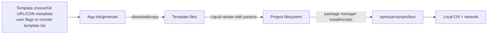

**Sources:** template URLs, template files, prompts/flags, generated names.  
**Sinks:** file writes, Liquid rendering, package manager execution, network.  
**Security decisions:** template origin allowlist, path traversal during copy, Liquid escaping for code/config contexts, script execution warnings.

### CFD-1: Shopify CLI command authentication and authorization routing

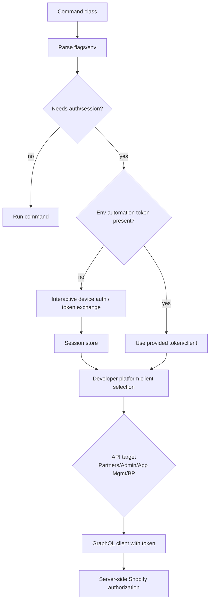

**Security decisions:** command-specific auth requirement, env-token precedence, token refresh, API client/organization/store selection, log redaction.

### CFD-2: Store PKCE callback state validation

```mermaid
flowchart TD
  A[store auth command] --> B[Generate state + code_verifier]
  B --> C[Open authorize URL]
  C --> D[Loopback callback server 127.0.0.1:13387]
  D --> E{Callback contains error?}
  E -->|yes| X[Fail]
  E -->|no| F{timingSafeEqual(state)}
  F -->|no| X
  F -->|yes| G[Exchange code + verifier]
  G --> H[Persist store session]
```

**Security decisions:** loopback binding, exact redirect URI, state entropy/constant-time comparison, single-use callback lifetime, callback logging.

### CFD-3: Dev orchestration privilege/context transition

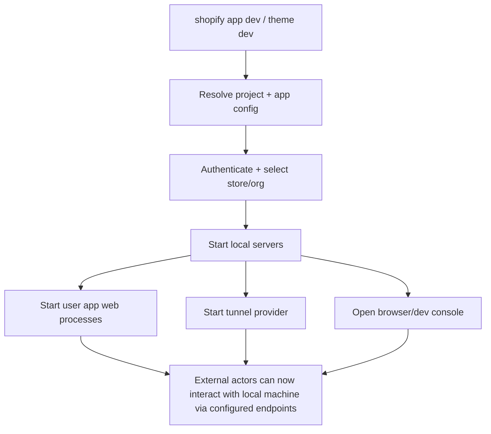

**Security decisions:** tunnel exposure, host binding, URL/key generation, command environment propagation, shutdown/kill safety.

## Attack Surface

### Attacker-controlled inputs

| Input class | Examples | Representative entry files |
|---|---|---|
| CLI argv/flags/prompts/stdin | app/theme/store command flags, file paths, store names, API versions, query files, webhook payloads, template names, `--path`, `--host`, `--port`. | command classes under `packages/*/src/cli/commands/**` |
| Environment variables | `SHOPIFY_APP_AUTOMATION_TOKEN`, `SHOPIFY_CLI_PARTNERS_TOKEN`, `SHOPIFY_CLI_IDENTITY_TOKEN`, `SHOPIFY_CLI_REFRESH_TOKEN`, `SHOPIFY_CLI_THEME_TOKEN`, `SHOPIFY_FLAG_*`, `SHOPIFY_CLI_CLOUDFLARED_PATH`, `HTTP_PROXY/HTTPS_PROXY`, OTEL endpoint, identity/API host overrides, CI/cloud flags. | `cli-kit/src/public/node/environment.ts`, `flags.ts`, package-specific service files |
| Local project config/files | `shopify.app*.toml`, `*.extension.toml`, `shopify.web.toml`, `.env*`, `package.json`, generated code, Liquid/theme assets, symlinks, ignore files, GraphQL query files. | app loaders, extension schemas, theme utilities, build/package steps |
| Local HTTP requests | GraphiQL, extension dev, theme dev, reverse proxy, Store PKCE callback. | `graphiql/server.ts`, `extension/server.ts`, `theme-environment/*.ts`, `store/auth/callback.ts` |
| WebSocket/SSE | `/extensions` WS messages, theme hot-reload SSE. | `extension/websocket.ts`, `websocket/handlers.ts`, `hot-reload/server.ts` |
| Remote API responses | Shopify Admin/Partners/App Management/BP GraphQL, template lists, storefront renderer, CDN, GitHub releases/templates. | `cli-kit/api/*.ts`, app developer platform clients, theme renderer/proxy, template/binary downloaders |
| Downloaded executable/template artifacts | `cloudflared`, `function-runner`, `javy`, `wasm-opt`, app templates. | `plugin-cloudflare`, `app/services/function/binaries.ts`, `app/init/template/npm.ts` |
| Package-manager/script behavior | `npm/pnpm/yarn/bun install/build`, app web commands from config, plugin hooks. | `node-package-manager.ts`, `app/services/web.ts`, build/generate/init services |

### Local HTTP routes and URLs of interest

| Surface | Bind/default | Routes/behavior | Primary risks |
|---|---|---|---|
| App GraphiQL | `localhost:3457` | `/graphiql`, `/graphiql/graphql.json`, `/graphiql/status`, `/graphiql/simple.css`, `/graphiql/favicon.ico`; CORS `*`. | Unauthorized browser/tunnel access, CSRF to token-bearing proxy, XSS in template/error rendering, API-version abuse. |
| UI extension dev server | host/port chosen by app dev | `/extensions`, `/extensions/dev-console`, `/extensions/:extensionId`, extension asset routes, WS upgrade `/extensions`; CORS `*`. | Local file disclosure through asset paths, unauthorized WS control/log exfiltration, dev-console XSS. |
| Theme dev | default `127.0.0.1:9292` | Catch-all handler stack: local assets, hot reload/SSE, storefront renderer, proxy. | Token/header leakage, SSRF/proxy misuse, local asset traversal, CORS/CSRF via tunnel. |
| Store auth callback | `127.0.0.1:13387` | `/auth/callback?shop&state&code&error`. | OAuth code interception or state bypass; port hijacking; callback log leakage. |
| App reverse proxy | local dev configured | Proxies app/frontend/backend requests to local app processes. | Header/cookie forwarding, path normalization, SSRF to configured target, WS upgrade handling. |

### High-value sinks

| Sink kind | Sink examples | Why high value |
|---|---|---|
| Command execution | `execa`, `execCommand`, package manager commands, `treeKill`, `cloudflared`, `function-runner`, `javy`, `wasm-opt`, web commands. | Executes with developer user privileges; malicious project/env can turn into full local compromise. |
| File access/write/archive | include-assets copy steps, theme package/push/pull, template copy/render, local asset routes, zip/tar packaging. | Can disclose local files/secrets or write outside intended project/build roots. |
| HTTP requests/proxy | GraphQL clients, theme proxy/renderer, reverse proxy, webhooks, template/binary downloads. | Token-bearing requests; SSRF/proxy leaks; malicious redirects/downloads. |
| Credential persistence/logging | conf-store/session-store, local storage, URL sanitizer/loggers, telemetry. | Token leakage compromises app/org/store access. |
| Browser-rendered content | GraphiQL template, dev-console, theme HTML/error overlays, logs. | XSS can reach localhost endpoints and developer context. |
| Deployment/state mutation | app deploy/release, theme push/publish/delete, Admin GraphQL execute, bulk operations, webhook trigger. | Unauthorized or confused-deputy actions affect real Shopify resources. |

### Execution environments

- Developer workstation, running as the local OS user with access to project files, SSH/Git/npm credentials, browser, and Shopify CLI session files.
- CI/CD jobs, where env tokens and non-interactive automation flags may be present.
- Local browser context, including arbitrary websites that can attempt loopback/tunnel requests.
- Public tunnel endpoints created during dev; remote actors can reach local CLI-managed servers through Cloudflare or another tunnel provider.
- Shopify platform services enforcing server-side permissions but relying on CLI to protect local tokens and request integrity.

## Threat Model

### Assumptions and scope notes

- The primary deployment model is a developer workstation or CI job running the published Node.js CLI, not an internet-facing production service.
- Local dev servers are assumed reachable by the developer browser; when tunnels or non-loopback `--host` values are used, remote users become network attackers.
- Shopify platform APIs are assumed to enforce final server-side authorization, but the CLI must protect local tokens and avoid confused-deputy requests.
- Malicious project/theme/template repositories are in scope because developers and CI commonly run CLI commands on local source trees.
- Private Shopify platform schemas and authenticated GitHub security metadata were not available in Stage 03; related rankings may change with owner input.

### Assets

| Asset | Confidentiality | Integrity | Availability |
|---|---:|---:|---:|
| Shopify OAuth refresh/access/id tokens and store app tokens | Critical | Critical | Medium |
| Developer local filesystem, SSH/Git/npm credentials, env files | Critical | Critical | Medium |
| Shopify app configuration, extension deploy payloads, releases | High | Critical | Medium |
| Store/theme files, theme previews, Admin GraphQL data | High | High | Medium |
| Local dev server URLs/keys/tunnel URLs | High | High | Medium |
| Downloaded helper binaries and caches | Medium | High | Medium |
| Logs/telemetry containing redacted/unredacted URLs/errors | Medium | Medium | Low |

### Threat actors

| Actor | Capability | Most relevant boundaries |
|---|---|---|
| Malicious website visited by developer | Can make cross-origin loopback requests, attempt DNS rebinding, induce browser navigation/forms/fetches, exploit permissive CORS where present. | TB-1, TB-9, TB-10 |
| Remote user with tunnel URL | Can send arbitrary HTTP/WS/SSE requests to local dev servers exposed by app/theme dev. | TB-2, TB-1, TB-10 |
| Malicious project/template/theme repository | Controls config, files, globs, symlinks, package scripts, web commands, Liquid/templates. | TB-3, TB-5, TB-7 |
| Local unprivileged user or malware | Can race ports, edit env/config/cache files, inspect process args/files depending on OS permissions. | TB-4, TB-8, TB-5 |
| Supply-chain attacker | Controls package dependency, CDN/GitHub release, downloaded binary, template list, or npm lifecycle script. | TB-7, TB-5 |
| Compromised/hostile Shopify store or API data source | Controls GraphQL errors/data, storefront HTML fragments, theme content. | TB-6, TB-9 |
| Insider/misconfigured CI operator | Can inject env tokens/flags, run CLI on untrusted repository in CI. | TB-4, TB-5, TB-6 |

### Abuse scenarios to prioritize

1. **Browser-to-localhost CSRF/CORS abuse:** malicious site probes GraphiQL/extension/theme routes, reads responses where CORS permits, or mutates token-bearing APIs through local proxies.
2. **Tunnel-exposed dev server takeover:** public tunnel URL leaks; attacker uses local dev endpoints to read extension assets, trigger WS actions/logging, or call Admin GraphQL if key is obtainable or route is ungated.
3. **Malicious repository command execution:** app project config or package scripts make `app dev/build/generate` run arbitrary commands or native binaries with developer privileges.
4. **Path traversal/symlink file exfiltration:** include-assets/theme package/local asset serving follows symlinks or normalizes paths insufficiently, including files outside project root in builds/uploads/responses.
5. **Token leakage:** tokens appear in logs, telemetry, browser-rendered errors, local storage with weak permissions, or proxy-forwarded headers to attacker-controlled targets.
6. **Downloaded binary/template compromise:** `cloudflared` or function toolchain binary/template is replaced upstream or via env path/PATH shadowing and executed by the CLI.
7. **OAuth callback confusion:** local attacker/browser races or reuses callback with mismatched state, port hijacking, or code substitution to bind the CLI to attacker-controlled account/session.
8. **GraphQL confused deputy:** user-supplied query files or browser-provided GraphiQL queries perform destructive or excessive Admin/Partners actions with developer token.
9. **XSS in dev UI:** GraphQL errors, extension logs, theme HTML, or generated templates render unsafely in GraphiQL/dev-console/browser and then call localhost APIs.
10. **SSRF/proxy credential leakage:** proxy/webhook/renderer flows forward sensitive headers or request internal/local URLs based on attacker-controlled URL/path/host.

### Existing mitigations observed

- Oclif command/flag framework gives structured parsing and centralized command execution.
- Many app/extension configurations use Zod/TOML schema validation.
- Store auth validates OAuth state with `timingSafeEqual` and uses PKCE.
- URL sanitizer masks sensitive query parameters in at least the OAuth token URL logging path.
- Theme dev CORS was hardened to exact allowed origins per Stage 02.
- Subprocess execution generally prefers `execa` with argument arrays rather than shell strings.
- GraphiQL uses a derived key for primary UI/API routes.

### Notable residual weaknesses / coverage gaps

- Stage 02 found the Windows `treeKill` shell command injection fix is not present in current HEAD.
- Stage 02 found GraphiQL local dev auth/path/XSS protections appear regressed or bypassable; `/status` and route matching deserve priority review.
- Stage 02 found `include_assets` traversal is mostly fixed but symlink bypass remains plausible.
- WebSearch has no Piolium backend; a DuckDuckGo HTML fallback was used for high-risk domain research (`piolium/tmp/stage03-domain-search.txt`). Reddit/X last-30-days telemetry remains unavailable because the `last30days` skill script was absent in this runtime.
- No dynamic localhost/tunnel testing was performed in Stage 03; CORS, DNS rebinding, WS origin, and SSE behavior need runtime validation.
- Generated bundles/dist files and private Shopify platform schemas were not exhaustively inspected.

## Domain Attack Research

### Domain Attack Modes Applied

Research actions performed for Stage 03:

- **Mode A — library/plugin as target:** applicable because `@shopify/cli-kit` is a published utility library and `@shopify/plugin-cloudflare` / oclif command packages expose reusable plugin APIs. Applied the `sharp-edges` lens to API ergonomics around process execution, file/path helpers, local-server helpers, auth/session helpers, and tunnel plugins.
- **Mode B — library-as-consumer:** applicable because Stage 01 identified security-sensitive dependencies (`liquidjs`, `lodash`, `vite`, `graphql-request`, `node-fetch`, `h3`, `ws`, `execa`, `jose`, `conf`, `archiver`, TOML/YAML/glob parsers). Applied `sharp-edges` and `insecure-defaults` to how these dependencies are initialized and consumed.
- **Mode C — domain-specific attack research:** applicable for OAuth2/PKCE/device authorization, JWT/JOSE, HTTP/CORS/localhost servers, WebSocket/SSE, GraphQL, command/process execution, file/path/archive handling, SSRF/proxying, template rendering/Liquid, supply-chain/package managers, parsing/prototype-pollution/ReDoS, CI/CD automation.
- **WooYun-legacy playbooks applied where web-facing:** unauthorized access, CSRF, XSS, SSRF, command execution/RCE, path traversal, file handling, misconfiguration, and logic-flaw checklists.
- **Recent/web research:** `WebSearch` has no Piolium backend; a DuckDuckGo HTML fallback was run for the highest-risk domains and saved to `piolium/tmp/stage03-domain-search.txt`. The `last30days` skill was reviewed but its referenced script was not present in this runtime, so Reddit/X last-30-day telemetry is a coverage gap rather than a source of evidence.

Identified domains: **Localhost HTTP/CORS/CSRF**, **WebSocket/SSE**, **OAuth2/PKCE/device/session/JWT**, **GraphQL**, **Command/process execution**, **File/path traversal/symlink/glob/archive**, **SSRF/proxy/header forwarding**, **Liquid/template rendering**, **Supply chain/package-manager/downloaded binaries**, **Parsing/prototype pollution/ReDoS**, **Credential storage/logging/telemetry**, and **CI/CD automation**.

### Mode A — Library/plugin API sharp edges

| API surface | Sharp edge / dangerous default | Why relevant here | Custom SAST target | Manual review checklist |
|---|---|---|---|---|
| `@shopify/cli-kit` process helpers (`exec`, `execCommand`, `captureCommandWithExitCode`, `treeKill`) | Multiple APIs accept raw strings and stringly commands; `treeKill(pid: number|string)` exports a public API but Windows path shells `taskkill /pid ${pid}`. | Small caller mistakes or downstream plugin usage can become local RCE. Stage 02 shows the Windows fix is not in `main`. | Taint `LocalUserInput`/`EnvironmentVariable` into `execCommand`, `execaCommand`, `exec`, `treeKill`, `spawn`, `child_process.exec`. | Require fixed executable + argv arrays; numeric PID regex; no shell/string commands with tainted content; explicitly test Windows metacharacters. |
| `@shopify/cli-kit` path/fs/Liquid helpers | Helper names imply containment, but some sanitizers are lexical and do not guarantee `realpath`/symlink containment. | App init/generate, include-assets, theme package, and local asset routes copy/read files from attacker-controlled repositories. | Path taint to `readFile`, `writeFile`, `copyFile`, `copyDirectoryContents`, `archiver`, `Liquid.renderFile`/template copy. | Document helper contracts; use `realpath` containment; handle Windows drive/UNC/backslash/encoded separators and symlinks. |
| Auth/session/API helpers | Env-token precedence, plaintext local `conf` storage, debug/log/telemetry helpers can accidentally propagate tokens. | CLI protects Partners/Admin/App Management/store tokens on developer machines and CI. | Token source model for `SHOPIFY_*TOKEN`, session store fields, OAuth responses; sinks are logs, errors, telemetry, HTTP headers, local responses. | Confirm no unverified JWT claims are used for authZ; token stores have OS permissions; redaction covers all token parameter/header names. |
| `@shopify/plugin-cloudflare` tunnel hook | Env-selected `SHOPIFY_CLI_CLOUDFLARED_PATH`, network-downloaded executable, public tunnel URL as a side effect. | Converts localhost-only services into internet-reachable endpoints and executes binaries. | Env/download URL to executable launch; tunnel URL as remote source for local HTTP/WS routes. | Integrity-check binary; warn on env-selected binary; do not log secrets in tunnel URLs; key-gate token-bearing routes. |
| UI extension server/dev-console packages | CORS `*` and unauthenticated WS are convenient but turn browser origins into local clients. | `/extensions` routes carry extension payloads, app API key, store FQDN, logs, assets. | H3 routes and `ws.on('message')` as RemoteFlowSource; React HTML/URL sinks. | Test cross-origin fetch/WS; fuzz extension names/logs/assets; bound message sizes. |

### Mode B — Security-sensitive dependencies as consumed

| Dependency/domain | Known misuse class | Current consumer notes | SAST/manual focus |
|---|---|---|---|
| `liquidjs@10.25.0` | Root restriction bypass, arbitrary file read, symlink traversal, circular-layout DoS, template injection. | `renderLiquidTemplate()` creates a default `Liquid()` engine; `recursiveLiquidTemplateCopy()` renders downloaded template file names and contents. | Track template origin to Liquid rendering and file output; update to patched version; test `.liquid`, `.raw`, symlink, include/layout/render, and quadratic payloads. |
| `lodash@4.17.23` | Prototype pollution through path APIs and code injection through template imports. | Used broadly in `cli-kit`; object/path helpers can operate on parsed TOML/JSON/GraphQL-derived objects. | Flag `set`, `unset`, `merge`, `defaultsDeep`, and template APIs with tainted keys including `__proto__`, `constructor`, `prototype`. |
| `vite@6.4.1` | Dev-server file disclosure and optimized-deps traversal. | Used by UI extension dev console/server kit and direct dependency remains unpatched per Stage 01/02. | Review Vite dev server binding, `server.fs` config, plugin middlewares, HMR WS origin, and `.map` serving. |
| `h3` local HTTP framework | Route guard mistakes, CORS defaults, body/query/header handling, prototype pollution through transitive `defu`. | Used for GraphiQL, extension server, theme dev. | Model `defineEventHandler`, `getQuery`, `getRouterParams`, `readBody`, `getRequestHeaders` as RemoteFlowSource; require route-level guard evidence. |
| `ws` | Cross-site WebSocket hijacking, missing Origin/auth, unbounded message DoS. | Extension server accepts `/extensions` upgrade and parses `JSON.parse(data.toString())`. | Add WS message source model; check Origin/session/key; message schema; size/error handling. |
| `graphql-request` / `graphql` | User-provided query execution, introspection/mutation, error leakage, query DoS. | App/store execute and GraphiQL proxy forward user queries to Admin APIs. | Taint query/variables/API version into GraphQL request; verify single-operation checks and mutation restrictions. |
| `node-fetch`, `http-proxy-node16`, `global-agent` | SSRF, redirect/header leakage, proxy env-variable interception, Host/path confusion. | Theme proxy, app reverse proxy, downloads, GitHub/API clients; `SHOPIFY_` proxy variables are globally honored. | Trace URL/host/header sources to fetch/proxy; model redirect behavior and `Authorization`/Cookie forwarding. |
| `execa` / `child_process` | Command injection, argument injection, executable/PATH shadowing. | Core process sink for package managers, web commands, function tools, mkcert/cloudflared. | Flag shell-like APIs and string splitting of TOML commands; verify `checkCommandSafety` coverage and env-selected paths. |
| `jose` | `decodeJwt` without signature validation used as a footgun. | `buildIdentityToken()` uses `jose.decodeJwt(result.id_token).sub` after token endpoint response. | Confirm decoded claims are not used for security decisions before server-side validation; prefer verified ID token if trust expands. |
| `conf` local storage | Plaintext secrets and file-permission assumptions. | Session JSON and current session IDs stored via `LocalStorage<ConfSchema>`. | Verify permissions on created config files; avoid tokens in cache; handle corrupt/malicious JSON safely. |
| `archiver`/zip/glob/chokidar/minimatch/picomatch | Zip-slip, symlink inclusion, glob ReDoS, watcher storms. | Theme package/build include-assets/project scanners. | Entry-name sanitization, symlink policy, max file count, pattern bounds, archive traversal tests. |
| TOML/YAML/JSON parsers | Parser DoS, prototype pollution through parsed objects, schema bypass through unknown keys. | App/theme/extension configs and variables files. | Require strict schemas; reject unknown/dangerous keys; bound file sizes/depths. |
| OpenTelemetry / `protobufjs` | Telemetry payload serialization bugs, endpoint trust, sensitive attribute leakage. | `cli-kit` analytics/metrics include env-derived metadata and Stage 01 found a critical `protobufjs` lockfile advisory through OTel. | Track telemetry attribute sources, update transitive dependencies, ensure tokens/secrets are excluded before OTLP serialization/export. |

### Mode C — Domain-specific attack catalog

#### Domain: Localhost HTTP / CORS / CSRF / DNS rebinding

**Identified via:** GraphiQL H3 server, UI extension H3 server, theme H3 server, app reverse proxy, Stage 01/02 local-server security signals, DuckDuckGo fallback results for localhost CORS/DNS rebinding.

**Known attack classes:**

| Attack | Description | Detection strategy | Relevance |
|---|---|---|---|
| Browser-to-loopback CSRF | Malicious website submits forms/fetches to `localhost` routes. | Enumerate local routes and check that state-changing/token-bearing routes require key/state and reject simple cross-origin requests. | High |
| Permissive CORS readback | `Access-Control-Allow-Origin: *` lets malicious origins read local JSON/HTML where browser permits. | Grep headers/CORS helpers and map sensitive response bodies. | High for GraphiQL/extension; lower for static-only routes. |
| DNS rebinding / Host confusion | Browser origin becomes `localhost` or private IP after DNS rebind; server trusts `Host` for absolute URLs. | Validate Host/Origin allowlists and route keys; test `localhost`, `127.0.0.1`, `[::1]`, custom hostnames. | Medium/High |
| Route auth gaps | Some routes expose status/data/assets while main API is key-gated. | Build per-route public/key-required matrix; treat route guard as sanitizer only on exact paths. | High (`/graphiql/status` Stage 02). |
| Dev-server info leak | Status endpoints disclose store/app URLs, API keys, extension IDs, file paths. | Taint route output from app/store config/session fields to response body. | Medium |

**Custom SAST targets:**

| Attack pattern | Rule type | Source/sink or pattern | Priority |
|---|---|---|---|
| H3 remote route input to sensitive response/API/file sink without route guard | CodeQL | `defineEventHandler`, `getQuery`, `getRouterParams`, `readBody` → `fetch`, `readFile`, response body | High |
| Wildcard CORS on local token-adjacent routes | Semgrep | `Access-Control-Allow-Origin: '*'`, `handleCors({origin: true})` in server files | High |
| Host header used to build absolute URLs | CodeQL | `getRequestHeader(event,'host')` → template/redirect/fetch URL | Medium |

**Manual review checklist:**
- [ ] Every GraphiQL route is labeled public/static vs key-required; `/status` behavior is intentional or fixed.
- [ ] Sensitive local routes reject cross-origin reads and do not depend on browser-only controls.
- [ ] Host and X-Forwarded-* are not trusted except behind a known tunnel/proxy path.
- [ ] Tunnel exposure treats remote users as unauthenticated internet users.

**Research sources used:** sharp-edges, insecure-defaults, wooyun-legacy CSRF/unauthorized/misconfiguration checklists, DuckDuckGo fallback (`piolium/tmp/stage03-domain-search.txt`).

#### Domain: WebSocket / Server-Sent Events

**Identified via:** UI extension `ws` server on `/extensions`, theme hot-reload SSE (`Accept: text/event-stream`).

**Known attack classes:**

| Attack | Description | Detection strategy | Relevance |
|---|---|---|---|
| Cross-Site WebSocket Hijacking | Browser opens WS to localhost/tunnel with no Origin/auth check. | Search upgrade handlers; require Origin/key/session validation before `handleUpgrade`. | High |
| Unauthenticated state/log injection | Attacker sends Update/Dispatch/Log messages that mutate payload store or terminal output. | Taint `ws.on('message')` JSON to state changes/logs/broadcast. | High |
| Broadcast data exfiltration | Connected attacker receives extension payload/log updates meant for dev console. | Inspect `wss.clients.forEach(send)` and connected payload contents. | Medium/High |
| Large/malformed message DoS | `JSON.parse(data.toString())` without size/schema/error handling can crash/consume memory. | Check max payload, try/catch, schema validation. | Medium |
| SSE leakage | Hot reload events expose file keys/theme IDs/process IDs cross-origin. | Review event stream routes and CORS/Origin handling. | Medium |

**Custom SAST targets:**

| Attack pattern | Rule type | Source/sink or pattern | Priority |
|---|---|---|---|
| WS upgrade without Origin/key validation | Semgrep | `server.on('upgrade', ...)` → `wss.handleUpgrade` | High |
| WS message to state/log/broadcast | CodeQL | `ws.on('message', data)` → `payloadStore.update*`, `stdout.write`, `wss.clients.send` | High |
| SSE route without route-specific auth | Semgrep | `createEventStream(event)` on routes reachable by browser | Medium |

**Manual review checklist:**
- [ ] Validate `Origin` and/or an unguessable dev key on `/extensions` upgrades.
- [ ] Add schema validation and max size for WS messages.
- [ ] Ensure extension logs cannot inject terminal control sequences or dev-console HTML.
- [ ] Confirm SSE hot-reload stream contains no secrets and behaves correctly under tunnel exposure.

**Research sources used:** wooyun-legacy unauthorized/CSRF checklists, OWASP WebSocket security result from DuckDuckGo fallback, skill playbook.

#### Domain: OAuth2 / PKCE / device authorization / sessions / JWT

**Identified via:** `cli-kit` device auth/token exchange, Store PKCE loopback callback, session stores, `jose.decodeJwt`, RFC/spec candidates.

**Known attack classes:**

| Attack | Description | Detection strategy | Relevance |
|---|---|---|---|
| State/PKCE mismatch or replay | Callback code accepted without exact state or verifier binding. | Verify cryptographic random state/verifier, constant-time compare, one server lifetime, exact redirect URI. | Medium; current store flow has good controls. |
| Callback port hijack/race | Local process claims fixed port or attacker races callback. | Review fixed-port behavior, error handling, timeout, loopback binding. | Medium |
| Token substitution/scope confusion | Env tokens or exchanged tokens used for wrong API/audience. | Track token sources to API client selection and audience/scope validation. | High in CI/dev automation. |
| Unverified JWT claim trust | `decodeJwt` claim used as identity without signature/audience verification. | Find `decodeJwt` and test whether claim only comes from trusted token endpoint response. | Medium |
| Token leakage | Tokens in URL, logs, telemetry, local browser pages, local storage. | Taint tokens to output/log/telemetry/response/header sinks. | High |

**Custom SAST targets:**

| Attack pattern | Rule type | Source/sink or pattern | Priority |
|---|---|---|---|
| OAuth callback params to token exchange without state sanitizer | CodeQL | `URLSearchParams.get('code')` → token request; sanitizer `constantTimeEqual(state)` | High |
| Token source to log/response/telemetry | CodeQL | `access_token`, `refresh_token`, `SHOPIFY_*TOKEN`, session fields → `output*`, `render*`, telemetry, local HTTP response | High |
| `decodeJwt` used for authZ/identity decisions | Semgrep | `jose.decodeJwt(...)` then claim used outside storage/metadata | Medium |

**Manual review checklist:**
- [ ] Store PKCE state is one-time, high entropy, exact-match, and verifier is S256.
- [ ] Device flow respects server polling intervals/slow_down and fails in CI unless env credentials are provided.
- [ ] Env automation tokens are clearly privileged and never echoed.
- [ ] Session files are permission-checked and not world-readable in normal installs.

**Research sources used:** OAuth2/PKCE playbook, sharp-edges, insecure-defaults, DuckDuckGo fallback OAuth results.

#### Domain: GraphQL over HTTP and Shopify Admin/Partners APIs

**Identified via:** GraphiQL proxy, `app execute`, `store execute`, Admin/Partners/App Management clients, GraphQL codegen.

**Known attack classes:**

| Attack | Description | Detection strategy | Relevance |
|---|---|---|---|
| Confused-deputy query execution | Attacker-controlled query runs with developer/app/store token. | Track query/variables from CLI flags/files/browser to GraphQL clients. | High |
| Mutation safeguards bypass | Destructive mutation allowed on production store or via GraphiQL local proxy. | Check `validateMutationStore`, `allowMutations`, GraphiQL route behavior and store type. | High |
| API-version/path abuse | User-controlled API version interpolates into Admin URL path. | Enforce `YYYY-MM`/`unstable` or fetched version allowlist before `adminUrl`. | Medium/High (`graphiql` Stage 02). |
| Error/data leakage | GraphQL errors include secrets, scopes, store/app details, request IDs. | Review error rendering and logs. | Medium |
| Query DoS | Very large/deep query consumes Admin API/local parser. | Bound query size/depth or rely on remote rate limits with local timeouts. | Medium |

**Custom SAST targets:**

| Attack pattern | Rule type | Source/sink or pattern | Priority |
|---|---|---|---|
| Browser/CLI query to GraphQL request | CodeQL | `getQuery`/`readBody`/flags/files → `graphqlRequest`, `adminRequestDoc`, `fetch(graphqlUrl)` | High |
| API version string to URL path | Semgrep | `adminUrl(store, $VERSION)` where `$VERSION` comes from query/flag without allowlist | High |
| Mutation validation missing | Semgrep | execute command paths using `parse(query)` without `validateSingleOperation`/mutation guard | Medium |

**Manual review checklist:**
- [ ] GraphiQL token-bearing API requires key and validates API version.
- [ ] Store/app execute commands keep mutation restrictions and version validation.
- [ ] Query/variables are redacted from telemetry when they may contain secrets.
- [ ] Large query and variables files have practical bounds.

**Research sources used:** GraphQL domain playbook, wooyun unauthorized/logic checklists, DuckDuckGo fallback GraphQL results.

#### Domain: Command / process / native binary execution

**Identified via:** `execa`, `execaCommand`, `child_process.exec`, `treeKill`, package managers, function toolchain, cloudflared, mkcert.

**Known attack classes:**

| Attack | Description | Detection strategy | Relevance |
|---|---|---|---|
| Shell metacharacter injection | Tainted string reaches shell command (`exec`, `execaCommand`, `tar -xzf ${filename}`). | Flag shell/string execution and tainted interpolation. | High |
| Argument injection | User controls argv values that change command semantics (`--`, output paths, config commands). | Validate argv allowlists or use `--` separators. | Medium/High |
| Executable/PATH shadowing | CWD or env path selects malicious executable. | Review `checkCommandSafety`, env-selected binaries, `preferLocal`, package-manager selection. | High |
| Windows-specific command injection | Windows `cmd.exe` metacharacters in PID/path. | Test `&`, `|`, `&&`, `^`, `%COMSPEC%` on Windows-specific code. | High (`treeKill`). |
| Native binary compromise | Downloaded helper binary executed without signature/checksum. | Network download → chmod/move → exec taint. | High |

**Custom SAST targets:**

| Attack pattern | Rule type | Source/sink or pattern | Priority |
|---|---|---|---|
| Local input/env to command sink | CodeQL | flags/env/TOML/package scripts → `exec`, `execCommand`, `execa`, `execSync`, `execFileSync`, `spawn`, `treeKill` | High |
| `child_process.exec` with template string | Semgrep | `exec(`...${...}...`)` | Critical |
| Downloaded file to executable | CodeQL | `fetch/downloadFile` → `chmod/moveFile` → `exec` | High |

**Manual review checklist:**
- [ ] Replace Windows `treeKill` shell call with strict PID regex + `spawn('taskkill', args)`.
- [ ] Treat `shopify.web.toml` and function `typegen_command` as untrusted command strings.
- [ ] Verify `SHOPIFY_CLI_CLOUDFLARED_PATH` and `SHOPIFY_CLI_MKCERT_BINARY` are documented as full-trust overrides.
- [ ] Require hashes/signatures for cloudflared/function-runner/javy/wasm-opt/mkcert where feasible.

**Research sources used:** wooyun command-execution/RCE checklists, sharp-edges, DuckDuckGo fallback Node child_process results.

#### Domain: File/path traversal, symlink, glob, archive, filesystem watcher

**Identified via:** include-assets, theme package/push/pull, Liquid template copy, local asset servers, archiver/glob/chokidar, Stage 01 path traversal advisories.

**Known attack classes:**

| Attack | Description | Detection strategy | Relevance |
|---|---|---|---|
| Lexical traversal | `../`, absolute path, Windows drive/UNC/backslash escapes root. | Taint path strings to fs sinks; check normalization on all platforms. | High |
| Symlink/hardlink escape | Lexically safe path resolves outside root after symlink. | Require `realpath` containment after following links; test pre-existing output symlink. | High |
| Glob over-inclusion / ReDoS | User glob includes secrets or triggers catastrophic matching. | Bound patterns, file counts, ignored files; audit minimatch/picomatch usage. | Medium/High |
| Zip slip / archive entry injection | Archive entries contain absolute or `../` paths or symlinks. | Inspect archive entry names and symlink policy. | Medium |
| Local asset file disclosure | HTTP path params map to filesystem without containment. | Route param → `readFile`/`serveStatic` model. | High for extension/assets routes. |

**Custom SAST targets:**

| Attack pattern | Rule type | Source/sink or pattern | Priority |
|---|---|---|---|
| Tainted path to fs/archive sink | CodeQL | config/glob/route params → `readFile`, `copyFile`, `copyDirectoryContents`, `writeFile`, `archiver` | High |
| Missing realpath containment | Semgrep | `relativePath($ROOT, $CANDIDATE).startsWith('..')` with subsequent copy/read and no `realpath` | High |
| Unsafe archive entries | Semgrep | `archive.file/directory` entry names from user paths without sanitizer | Medium |

**Manual review checklist:**
- [ ] Test include-assets with destination traversal, backslashes, absolute paths, and output-root symlinks.
- [ ] Test extension asset route with encoded separators and symlinks in output dirs.
- [ ] Ensure theme package excludes `.env`, `.git`, credentials, and symlinks unless explicitly intended.
- [ ] Bound file count/size for glob/watch/package flows.

**Research sources used:** wooyun path traversal/file handling checklists, Liquid/Vite advisories from Stage 01, DuckDuckGo fallback Zip Slip/path traversal results.

#### Domain: SSRF / proxy / header forwarding / URL parsing

**Identified via:** theme storefront proxy, app reverse proxy, webhook trigger address, template/binary downloads, `HTTP_PROXY`/`SHOPIFY_` global proxy support.

**Known attack classes:**

| Attack | Description | Detection strategy | Relevance |
|---|---|---|---|
| User-controlled target URL SSRF | Address/path/host reaches `fetch` or proxy target. | Taint URL flags/config/request path to HTTP sinks; require host allowlists. | Medium/High |
| Cross-host auth header leakage | Redirect/proxy forwards `Authorization`, cookies, or Shopify tokens to attacker host. | Check redirects, manual redirect mode, header strip-on-host-change. | High |
| Host/path confusion | Prefix match or `new URL(path, base)` yields unexpected host/path. | Validate final hostname equals expected host; review prefix routing. | Medium |
| Proxy env interception | Global proxy env routes token-bearing traffic through untrusted proxy. | Inventory proxy env var handling and trust assumptions. | Medium |
| Metadata/internal service SSRF | URL inputs target `169.254.169.254`/private IPs. | Block private/link-local when target is user-controlled. | Medium for webhook/address flows. |

**Custom SAST targets:**

| Attack pattern | Rule type | Source/sink or pattern | Priority |
|---|---|---|---|
| URL/host input to fetch/proxy | CodeQL | flags/config/request headers/path/env → `fetch`, `shopifyFetch`, `proxy.web`, `proxy.ws`, `new URL` | High |
| Auth header forwarded across trust boundary | Semgrep | `Authorization`, `X-Shopify-Access-Token`, `Cookie` in proxied headers with tainted target | High |
| Prefix route proxy bypass | Semgrep | `path.startsWith(prefix)` routing to target from config | Medium |

**Manual review checklist:**
- [ ] Confirm theme proxy only targets expected `storeFqdn` or `cdn.shopify.com` and keeps `redirect: manual`.
- [ ] Review app reverse proxy `rules` origins and whether untrusted paths can hit `default` target.
- [ ] Strip tokens/cookies on all cross-host redirects/proxy transitions.
- [ ] Validate webhook trigger address types and SSRF protections server-side or client-side.

**Research sources used:** wooyun SSRF checklist, URL parsing playbook, DuckDuckGo fallback SSRF/proxy results.

#### Domain: Liquid/template rendering and browser-rendered dev UI/XSS

**Identified via:** `renderLiquidTemplate`, GraphiQL template, dev-console React app, theme hot-reload injected JS/CSS, LiquidJS advisories.

**Known attack classes:**

| Attack | Description | Detection strategy | Relevance |
|---|---|---|---|
| Server-side template injection / file read | Attacker template controls Liquid tags/includes/layouts or path names. | Track downloaded template files to Liquid engine. | High for app init/generate. |
| Script-context XSS | JSON/string embedded into `<script>` without escaping `<`, `>`, `&`, `</script>`. | Search templates with inline scripts and Liquid interpolation. | High for GraphiQL Stage 02. |
| Dev-console/log XSS | Extension/log/GraphQL error data rendered in React/HTML. | Taint logs/names/errors to DOM sinks and `dangerouslySetInnerHTML`. | Medium/High |
| Local theme JS injection | Local theme Liquid JS blocks are intentionally served to browser. | Treat theme repo as code; avoid executing malicious theme in trusted browser where possible. | Medium (by design). |
| CDN script supply chain | GraphiQL loads JS/CSS from CDN without SRI/pinning beyond version. | Inspect external scripts in local privileged pages. | Medium |

**Custom SAST targets:**

| Attack pattern | Rule type | Source/sink or pattern | Priority |
|---|---|---|---|
| Template data into script context | Semgrep | `renderLiquidTemplate`/template literal `<script>` with `{{...}}` or JSON not escaped for JS | High |
| Downloaded template to Liquid rendering | CodeQL | `downloadGitRepository`/template files → `recursiveLiquidTemplateCopy` | High |
| User/log data to raw HTML | CodeQL/Semgrep | extension logs/errors/names → `dangerouslySetInnerHTML`, `innerHTML`, `renderLiquidTemplate` | Medium |

**Manual review checklist:**
- [ ] Escape script-context JSON with `<`, `>`, `&`, U+2028/U+2029 safe replacements.
- [ ] Fuzz GraphiQL `query`/`variables`, app/store names, extension names, logs with `</script>`.
- [ ] Patch `liquidjs` and test symlink include/layout path bypasses.
- [ ] Consider CSP/SRI for local privileged UIs.

**Research sources used:** sharp-edges, wooyun XSS/RCE checklists, LiquidJS advisories and DuckDuckGo fallback Liquid results.

#### Domain: Supply chain, package managers, downloaded binaries/templates

**Identified via:** app init GitHub templates, npm/yarn/pnpm/bun install, Cloudflared/mkcert/Javy/function-runner/wasm-opt downloads, direct dependency advisories, CI release tooling.

**Known attack classes:**

| Attack | Description | Detection strategy | Relevance |
|---|---|---|---|
| Malicious npm lifecycle scripts | `install`/`postinstall` from template dependencies executes local code. | Template download → package manager install model. | High but partly intended/trust-on-template. |
| Template repository compromise | GitHub template controls files, Liquid, package scripts, config. | Validate template origin and warn on custom GitHub templates. | High |
| Binary release compromise/MITM | Downloaded executable runs without checksum/signature. | Download URL → chmod/move/exec chain. | High |
| Dependency confusion/typosquat | Public package with internal-like name installed by generated project/CI. | Audit package names, registry config, lockfile usage. | Medium |
| Cache poisoning | Binary/cache/config location pre-seeded with malicious file. | Check cache paths, file ownership/permissions, update logic. | Medium |

**Custom SAST targets:**

| Attack pattern | Rule type | Source/sink or pattern | Priority |
|---|---|---|---|
| Downloaded artifact executed without verification | CodeQL | `fetch/downloadGitHubRelease/downloadFile` → `chmod`/`exec`/`execFileSync` | High |
| Template to package-manager install | CodeQL | `downloadGitRepository` → `installNodeModules`/`exec(packageManager, ['install'])` | Medium/High |
| Env-selected binary | Semgrep | `process.env.*_BINARY*` or `*_PATH` → `exec` | High |

**Manual review checklist:**
- [ ] Add checksums/signatures or pinned digests for helper binaries.
- [ ] Warn before installing dependencies from custom templates.
- [ ] Ensure lockfiles are committed and package manager scripts are acknowledged in CI.
- [ ] Validate binary/cache directory ownership before executing cached tools.

**Research sources used:** supply-chain playbook, insecure-defaults, DuckDuckGo fallback npm supply-chain results.

#### Domain: Parsing, prototype pollution, regular expression / resource exhaustion

**Identified via:** TOML/YAML/JSON parsers, lodash, GraphQL parse, glob/minimatch/picomatch, theme JSON parsing, Stage 01 dependency advisories.

**Known attack classes:**

| Attack | Description | Detection strategy | Relevance |
|---|---|---|---|
| Prototype pollution | Parsed config keys or path setters mutate prototypes. | Taint parsed object keys into merge/set/defaults APIs. | Medium/High with lodash advisories. |
| Parser DoS | Deep/nested TOML/YAML/JSON/GraphQL/glob patterns consume CPU/memory. | Bound input size/depth; fuzz pathological payloads. | Medium |
| Regex/glob ReDoS | User-controlled glob/regex triggers catastrophic matching. | Static regex/glob analysis; dependency version review. | Medium |
| JSON variable abuse | Large variable files or dangerous keys propagate to remote APIs/logs. | File size bounds and schema validation. | Medium |
| Parser differential | Different path/URL/config parsers disagree on normalization. | Use one canonical parser before security checks. | Medium |

**Custom SAST targets:**

| Attack pattern | Rule type | Source/sink or pattern | Priority |
|---|---|---|---|
| Tainted keys to lodash/path merge | CodeQL | TOML/JSON/YAML parse output keys → `set`, `merge`, `unset`, object spread into defaults | High |
| User glob to glob engine | Semgrep | config `include`/`ignore`/flags → `glob`, `minimatch`, `picomatch` without bounds | Medium |
| Unbounded file parsing | Semgrep | `readFile` of CLI-provided path → `JSON.parse`/`parse` without size limit | Medium |

**Manual review checklist:**
- [ ] Reject `__proto__`, `prototype`, `constructor` in parsed config paths/keys.
- [ ] Use `.strict()` Zod schemas where possible and reject unknown keys.
- [ ] Add practical size/depth/file-count limits for config, variables, theme JSON, globs.
- [ ] Keep direct parser/glob dependencies patched.

**Research sources used:** sharp-edges, insecure-defaults, ReDoS/prototype-pollution playbooks, DuckDuckGo fallback lodash results.

#### Domain: Credential storage, logging, telemetry, local output

**Identified via:** `conf` session store, analytics/metadata, output/debug logging, Bugsnag/OTLP env, GraphiQL/status responses, store auth result pages.

**Known attack classes:**

| Attack | Description | Detection strategy | Relevance |
|---|---|---|---|
| Plaintext token theft | Local config files contain refresh/access tokens readable by other users/processes. | Inspect storage path, permissions, OS keychain absence. | High |
| Token in logs/telemetry | Debug or error output includes credentials, auth URLs, headers. | Token taint to output/debug/analytics/Bugsnag/OTLP. | High |
| Local HTML/JSON response leak | Local server exposes app/store identity, keys, tokens, file paths. | Taint sensitive fields to H3 responses/templates. | Medium/High |
| Terminal control injection | Logs from extension/browser include ANSI sequences. | Sanitize or strip control characters before terminal. | Medium |
| Insecure telemetry endpoint override | Env-controlled OTLP endpoint receives sensitive metadata. | Review env override behavior and redaction. | Medium |

**Custom SAST targets:**

| Attack pattern | Rule type | Source/sink or pattern | Priority |
|---|---|---|---|
| Secret to output/log/telemetry | CodeQL | token/env/session sources → `output*`, `render*`, `record*`, Bugsnag/OTLP payloads | High |
| Secret in local HTTP response | CodeQL | session/app config fields → `return {...}` in H3 or template data | High |
| Control sequence in terminal output | Semgrep | WS/log strings → `stdout.write` without stripping | Medium |

**Manual review checklist:**
- [ ] Verify `sanitizeURL`/header sanitizers cover `subject_token`, `refresh_token`, `access_token`, `Authorization`, `X-Shopify-Access-Token`.
- [ ] Confirm local storage file permissions on macOS/Linux/Windows.
- [ ] Review analytics `process.env` collection for secret-looking `SHOPIFY_*` values.
- [ ] Fuzz extension logs for ANSI/OSC terminal injection.

**Research sources used:** sharp-edges, insecure-defaults, OAuth/session playbook.

#### Domain: CI/CD automation and repository workflows

**Identified via:** `.github/workflows/*.yml`, release scripts, env automation tokens, dependency update workflows; out-of-runtime but in repo.

**Known attack classes:**

| Attack | Description | Detection strategy | Relevance |
|---|---|---|---|
| PR workflow secret exposure | Untrusted PR code runs with tokens or write `GITHUB_TOKEN`. | Audit `pull_request_target`, checkout refs, permissions. | Medium/High (later-phase). |
| Shell expression injection | GitHub event data interpolated directly in `run:`. | Grep `${{ github.event.* }}` in `run:`. | Medium |
| Release artifact tampering | Build/release scripts publish modified bundles without provenance. | Review release workflow, artifact integrity, npm publish steps. | High impact. |
| Automation token misuse | `SHOPIFY_*TOKEN` in CI executes deploy/release commands on malicious repo. | Track non-interactive token paths and command gates. | High |
| AI/agentic workflow prompt injection | Issue/PR content passed to agent workflows with secrets. | Use agentic-actions-auditor later if AI actions present. | Unknown/coverage gap. |

**Custom SAST targets:**

| Attack pattern | Rule type | Source/sink or pattern | Priority |
|---|---|---|---|
| Workflow expression injection | Semgrep/yamllint | `.github/workflows/**`: untrusted expressions in `run:` | Medium |
| Unsafe `pull_request_target` | Semgrep | PR target workflow checks out head/ref or runs scripts with secrets | High |
| CI env token to deploy/publish | CodeQL/manual | env token sources → deploy/release/npm publish scripts | High |

**Manual review checklist:**
- [ ] Audit workflow `permissions:` and `pull_request_target` usage.
- [ ] Verify untrusted PRs cannot run release/deploy with Shopify/NPM/GitHub tokens.
- [ ] Check artifact signing/provenance and generated bundle consistency.
- [ ] If gardener/agent workflows consume issue/PR text, apply agentic-actions review.

**Research sources used:** CI/CD playbook, insecure-defaults; detailed workflow audit deferred.

### Domain-specific high-priority review targets

1. **Route-guard model for GraphiQL:** every path in `graphiql/server.ts` should be categorized public vs key-required; query/body/API-version params to Admin GraphQL should be taint-tracked.
2. **WS origin/auth for extension server:** model `/extensions` upgrade as `RemoteFlowSource`; require explicit checks before state-changing handlers.
3. **Symlink-aware build containment:** include-assets/theme package/local assets need `realpath`-based source and destination containment, not only lexical `relativePath` checks.
4. **Command sink model:** add custom SAST for `execCommand`, `exec`, `execa`, package-manager wrappers, `treeKill`, native binary launchers, and env-controlled binary paths.
5. **Token-to-log/browser sinks:** map all tokens from env/session stores/OAuth responses to logs, thrown errors, telemetry, local HTML/JSON responses, and proxy headers.
6. **Download integrity model:** flag network downloads whose resulting file is executed or used as a trusted template without hash/signature verification.
7. **GraphQL confused-deputy model:** browser/CLI-provided queries should be explicitly authorized by route key, store type, and command flags before token-bearing execution.

## Phase 4 CodeQL Extraction Targets

| Slice | Expected source type(s) | Source examples | Expected sink kind(s) | Sink examples / files | Notes for CodeQL modeling |
|---|---|---|---|---|---|
| DFD-1 GraphiQL local proxy | `RemoteFlowSource` | H3 event query/body/headers, request URL params, `api_version`, GraphQL query/variables. | `http-request`, `code-execution` (browser HTML), `file-access` (static assets) | Admin GraphQL request in `graphiql/server.ts`; template in `graphiql.tsx`. | Add source model for H3 event getters and route params; auth guard as sanitizer only for exact key-checked paths. |
| DFD-2 Extension dev server | `RemoteFlowSource` | URL path params `extensionId`, `assetPath`, WS messages, headers. | `file-access`, `code-execution` (dev-console XSS), `deserialization` | asset reads and WS handlers under `services/dev/extension/**`. | Model WS `message` callbacks; path params to FS helpers; log/payload to React render sinks. |
| DFD-3 Theme dev server | `RemoteFlowSource`, `LocalUserInput` | HTTP path/query/headers; theme root flag/path; ignore files. | `file-access`, `http-request`, `code-execution` (HTML/SSE) | `local-assets.ts`, `proxy.ts`, `storefront-renderer.ts`, `hot-reload/server.ts`. | Model handler dispatch and proxy target/header sinks; local asset path to readFile. |
| DFD-4 Build/package include-assets | `LocalUserInput` | TOML keys, glob patterns, destination strings, symlinked files. | `file-access`, `deserialization` | `include-assets/**`, `theme package`, `archiver.ts`. | Model TOML parser output and glob results as tainted; sanitizer requires `realpath` containment, not just string normalization. |
| DFD-5 Process/native binary execution | `LocalUserInput`, `EnvironmentVariable` | CLI flags, `SHOPIFY_FLAG_*`, `SHOPIFY_CLI_CLOUDFLARED_PATH`, `shopify.web.toml`, package scripts, PATH. | `command-execution` | `system.ts`, `tree-kill.ts`, `web.ts`, `function/*.ts`, `plugin-cloudflare/*.ts`, package manager helpers. | Create wrappers for `execa`, `execCommand`, `exec`, package-manager services; flag shell/string commands and env-selected executables. |
| DFD-6 OAuth/session/API | `RemoteFlowSource`, `EnvironmentVariable`, `LocalUserInput` | Callback query, device/token responses, env tokens, conf-store contents. | `http-request`, `file-access`, `code-execution` (logs/browser), `deserialization` | `session/*.ts`, `store/auth/*.ts`, API clients. | Track token values to logs/HTML/proxy headers; model local storage read/write; state compare as sanitizer for callback code flow. |
| DFD-7 Template/init/generate | `LocalUserInput`, `RemoteFlowSource` | Template URL/list, GitHub archive contents, prompt variables, generated names. | `file-access`, `command-execution`, `code-execution` | init/generate services, Liquid helper, node package manager. | Treat downloaded template files as tainted; track to file writes and package manager install/build. |
| SSRF/proxy/webhook cross-cut | `RemoteFlowSource`, `LocalUserInput`, `EnvironmentVariable` | URLs/hosts from flags/config/request headers/proxy env. | `http-request` | `http-reverse-proxy.ts`, theme proxy/renderer, webhook trigger, fetch wrappers. | Add URL construction sinks; model host allowlists/Shopify FQDN validators as sanitizers only when exact. |
| Token leakage cross-cut | `EnvironmentVariable`, `LocalUserInput`, `RemoteFlowSource` | `SHOPIFY_*_TOKEN`, session store tokens, OAuth code/token responses. | `file-access`, `http-request`, `code-execution` | log functions, telemetry, local HTTP responses, proxy headers. | Custom source model for token getters/session fields; sinks include console output, error messages, telemetry payloads, response bodies/headers. |


## Static Analysis Summary

### Execution

- Structural extraction ran first and built the retained CodeQL JavaScript/TypeScript database at `piolium/codeql-artifacts/db/`.
- CodeQL built-in `codeql/javascript-queries` `javascript-security-and-quality.qls` ran with `--threat-model all` and explicit suite file `piolium/codeql-artifacts/raw/run-all.qls`.
- Semgrep Pro was enforced for baseline, language/framework, targeted, and custom passes. `semgrep --pro --validate` hit a Python 3.14/jsonschema validation crash (`unhashable type: 'dict'`), but actual `semgrep scan --pro` executions succeeded; no OSS fallback was used. The scans used `--metrics=off` and `--x-no-python-schema-validation` to bypass the local validation crash.
- GitHub Actions agentic review ran because `.github/workflows/` exists; one Claude Code Action workflow was identified.
- Java SpotBugs/FindSecBugs was not applicable: this is a JS/TS monorepo, not a Java application.

### Rulesets and coverage

| Tool/pass | Rulesets / artifacts | Results |
|---|---|---:|
| CodeQL built-in | `codeql/javascript-queries` security-and-quality suite | 150 |
| CodeQL structural custom | `piolium/codeql-queries/slice-*.ql`, `ShopifySliceSupport.qll` | 215 structural paths |
| Semgrep baseline | `p/security-audit`, `p/secrets`, `p/owasp-top-ten`, `p/cwe-top-25` | 11 |
| Semgrep language/framework | `p/typescript`, `p/javascript`, `p/nodejs`, `p/react`, `p/yaml`, `p/github-actions` | 0 |
| Semgrep targeted high-risk | JS/TS/node rules scoped to GraphiQL, extension dev server, cli-kit node, theme, Cloudflare, create-app | 0 |
| Semgrep custom | `piolium/semgrep-rules/shopify-cli-custom.yml` | 287 |
| Agentic Actions Auditor | `.github/workflows/*.yml` Claude/Gemini/Codex/AI-action review | 1 Medium candidate |

### Custom SAST artifacts created

- CodeQL: `piolium/codeql-queries/qlpack.yml`, `ShopifySliceSupport.qll`, and one path query per Phase 3 extraction target (`slice-dfd1-*` through `slice-token-leakage-cross-cut.ql`).
- Semgrep: `piolium/semgrep-rules/shopify-cli-custom.yml` with custom rules for localhost CORS/CSRF, WS/SSE, GraphQL version/mutation guard patterns, command execution, file/path/archive containment, SSRF/proxy headers, script-context XSS, JWT decode footguns, token-to-output patterns, downloaded artifacts, parser/resource exhaustion, and GitHub Actions expression / `pull_request_target` patterns.
- Merged SARIF: `piolium/attack-surface/sast-merged.sarif`.
- Source/sink flow artifact: `piolium/attack-surface/source-sink-flows-all-severities.md`.
- Full enrichment JSON: `piolium/attack-surface/sast-enrichment.json`.

### Targeted slices used

The custom analysis was driven by DFD-1 GraphiQL local proxy, DFD-2 extension dev server, DFD-3 theme dev server, DFD-4 include-assets/package flows, DFD-5 process/native binary execution, DFD-6 OAuth/session/API, DFD-7 template/init/generate, SSRF/proxy/webhook cross-cut, and token leakage cross-cut.

### Batching and tradeoffs

Semgrep Pro-heavy scans were batched into whole-repo baseline/language passes plus a narrowed high-risk subsystem pass to avoid saturating the host. Low-severity/note results were dropped before enrichment per P4 policy; custom structural CodeQL path results are retained as reachability evidence, not direct vulnerabilities.

## CodeQL Structural Analysis

### Structural extraction counts

- Entry points: **472** recognized sources.
- Sinks: **358** recognized sinks.
- Reachable slices: **8/9**.
- Structural path results: **215**.

### Entry point summary

| Threat model | Count |
|---|---:|
| `environment` | 243 |
| `view-component-input` | 83 |
| `file` | 58 |
| `commandargs` | 46 |
| `response` | 23 |
| `remote` | 16 |
| `stdin` | 3 |

### Sink summary

| Sink kind | Count |
|---|---:|
| `file-access` | 224 |
| `command-execution` | 56 |
| `http-response-body` | 42 |
| `http-request-url` | 23 |
| `http-request-data` | 13 |

### Call graph reachability

| Slice | Reachable | Path count | Representative path |
|---|---:|---:|---|
| DFD-1 GraphiQL local proxy | yes | 13 | `packages/app/src/cli/services/dev/graphiql/server.ts:237` → `packages/app/src/cli/services/dev/graphiql/server.ts:244` → `packages/cli-kit/src/public/node/api/admin.ts:218` → `packages/cli-kit/src/public/node/api/admin.ts:219` → `packages/cli-kit/src/public/node/api/admin.ts:223` → `packages/cli-kit/src/public/node/api/admin.ts:221` |
| DFD-2 Extension dev server | yes | 11 | `packages/app/src/cli/services/dev/extension/websocket/handlers.test.ts:241` |
| DFD-3 Theme dev server | yes | 17 | `packages/theme/src/cli/utilities/theme-fs.ts:573` → `packages/theme/src/cli/utilities/theme-fs.ts:576` → `packages/theme/src/cli/utilities/theme-fs.ts:574` → `packages/theme/src/cli/utilities/theme-environment/hot-reload/server.ts:225` → `packages/cli-kit/src/public/node/fs.ts:121` → `packages/cli-kit/src/public/node/fs.ts:125` |
| DFD-4 Build/package include-assets | yes | 6 | `packages/theme/src/cli/utilities/theme-fs.ts:573` → `packages/theme/src/cli/utilities/theme-fs.ts:576` → `packages/theme/src/cli/utilities/theme-fs.ts:574` → `packages/theme/src/cli/utilities/theme-environment/hot-reload/server.ts:225` → `packages/cli-kit/src/public/node/fs.ts:121` → `packages/cli-kit/src/public/node/fs.ts:125` |
| DFD-5 Process/native binary execution | yes | 6 | `packages/cli-kit/src/public/node/notifications-system.ts:178` → `packages/cli-kit/src/public/node/notifications-system.ts:185` → `packages/cli-kit/src/public/node/notifications-system.ts:190` |
| DFD-6 OAuth/session/API | yes | 48 | `packages/cli-kit/src/private/node/api/graphql.ts:15` |
| DFD-7 Template/init/generate | no | 0 | no path |
| SSRF/proxy/webhook cross-cut | yes | 5 | `packages/app/src/cli/services/dev/graphiql/server.ts:237` → `packages/app/src/cli/services/dev/graphiql/server.ts:244` → `packages/cli-kit/src/public/node/api/admin.ts:218` → `packages/cli-kit/src/public/node/api/admin.ts:219` → `packages/cli-kit/src/public/node/api/admin.ts:223` → `packages/cli-kit/src/public/node/api/admin.ts:221` |
| Token leakage cross-cut | yes | 109 | `bin/github-utils.js:36` → `bin/github-utils.js:37` |

### Machine-Generated DFD Diagram

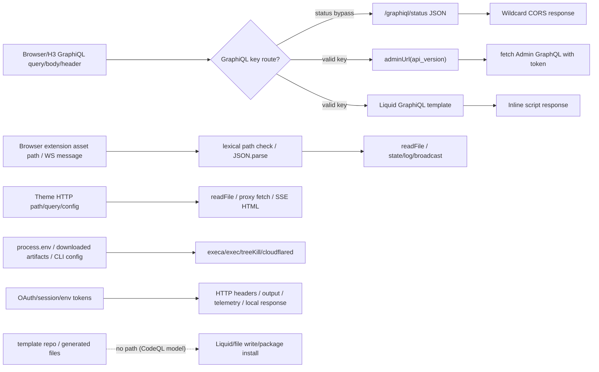

### Machine-Generated CFD Diagram

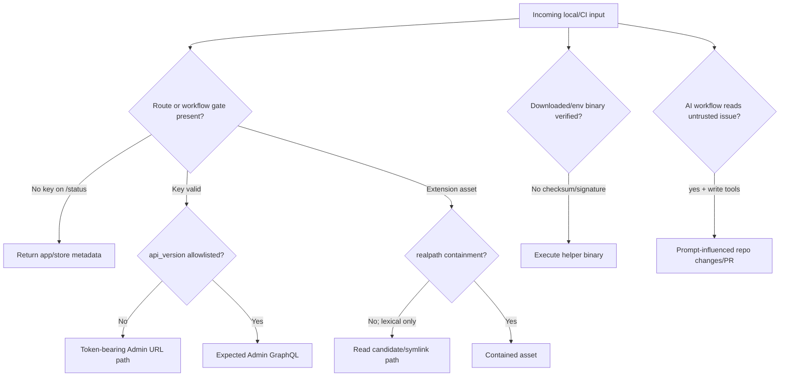

### Structural notes

- CodeQL recognized `commandargs`, `environment`, `file`, `remote`, `response`, `stdin`, and React `view-component-input` sources. `commandargs` was present in `entry-points.json` and was not explicit in the Phase 3 DFD source taxonomy; it is now modeled as local attacker-controlled input for CLI and release tooling review.
- `sinks.json` found `file-access`, `command-execution`, `http-request-*`, and `http-response-body` sinks. These map to unmodeled high-risk local dev flows in extension asset serving, GraphiQL inline template rendering, and token-bearing proxy requests.
- DFD-7 template/init/generate did not produce a CodeQL path under the current model, likely due to generated template/download helper wrappers requiring additional summaries.

## SAST Enrichment

### Kept candidates entering Phase 8

| Finding | Classification | Attacker Control | Boundary | CodeQL Reachability | Verdict |
|---|---|---|---|---|---|
| p4-001 | security | downstream plugin/local caller controls pid | local plugin/library input -> Windows shell | no-slice | keep |
| p4-002 | security | malicious website controls cross-origin request | browser origin -> local GraphiQL HTTP JSON | reachable | keep |
| p4-003 | security | client with GraphiQL key controls api_version query parameter | browser/local HTTP -> token-bearing Shopify Admin request | reachable | keep |
| p4-004 | security | malicious project/browser controls asset path | browser route/project symlink -> local file read | no-slice | keep |
| p4-005 | security | browser controls app asset filePath route parameter | browser/local HTTP -> local filesystem read | reachable | keep |
| p4-006 | security | release/cache/env controls binary path | download/env binary -> exec | reachable | keep |
| p4-006 | security | release/cache/env controls binary path | download/env binary -> exec | reachable | keep |
| p4-006 | security | release/cache/network supply-chain controls artifact | network artifact -> local executable | reachable | keep |
| p4-007 | security | GitHub issue author controls issue body/title fetched by Claude | untrusted issue text -> write-capable CI agent | no-slice | keep |
| p4-008 | security | malicious website/link controls request URL | browser URL -> localhost HTTP response | no-slice | keep |
| p4-009 | security | client with GraphiQL key controls query/variables | browser URL -> local GraphiQL inline script | no-slice | keep |

### Full enrichment verdict table

Low/note findings were dropped before this table. Full machine-readable enrichment is in `piolium/attack-surface/sast-enrichment.json`; the source/sink artifact also carries this table.

| Finding | Classification | Attacker Control | Boundary | CodeQL Reachability | Verdict |
|---|---|---|---|---|---|
| p4-001 | security | downstream plugin/local caller controls pid | local plugin/library input -> Windows shell | no-slice | keep |
| p4-002 | security | malicious website controls cross-origin request | browser origin -> local GraphiQL HTTP JSON | reachable | keep |
| p4-003 | security | client with GraphiQL key controls api_version query parameter | browser/local HTTP -> token-bearing Shopify Admin request | reachable | keep |
| p4-004 | security | malicious project/browser controls asset path | browser route/project symlink -> local file read | no-slice | keep |
| p4-005 | security | browser controls app asset filePath route parameter | browser/local HTTP -> local filesystem read | reachable | keep |
| p4-006 | security | release/cache/env controls binary path | download/env binary -> exec | reachable | keep |
| p4-006 | security | release/cache/env controls binary path | download/env binary -> exec | reachable | keep |
| p4-006 | security | release/cache/network supply-chain controls artifact | network artifact -> local executable | reachable | keep |
| p4-007 | security | GitHub issue author controls issue body/title fetched by Claude | untrusted issue text -> write-capable CI agent | no-slice | keep |
| p4-008 | security | malicious website/link controls request URL | browser URL -> localhost HTTP response | no-slice | keep |
| p4-009 | security | client with GraphiQL key controls query/variables | browser URL -> local GraphiQL inline script | no-slice | keep |
| codeql:js/client-side-request-forgery:packages/ui-extensions-server-kit/src/ExtensionServerClient/ExtensionSer | correctness/robustness | mostly configured Shopify/store URLs or wrapper arguments | same-user/network wrapper | no-slice | drop |
| codeql:js/client-side-unvalidated-url-redirection:packages/ui-extensions-dev-console/src/sections/Extensions/E | correctness/robustness | not confirmed | no demonstrated exploit path | no-slice | drop |
| codeql:js/client-side-unvalidated-url-redirection:packages/ui-extensions-dev-console/src/sections/Extensions/c | correctness/robustness | not confirmed | no demonstrated exploit path | no-slice | drop |
| codeql:js/command-line-injection:bin/pin-github-actions.js:32 | environment/tooling/admin-only | repo maintainer/CI invocation | developer/release tooling | no-slice | drop |
| codeql:js/command-line-injection:packages/cli-kit/src/public/node/system.ts:302 | environment/tooling/admin-only | local CLI config/env or wrapper caller | same-user local process execution | reachable | drop |
| codeql:js/command-line-injection:packages/plugin-cloudflare/src/install-cloudflared.ts:85 | environment/tooling/admin-only | local CLI config/env or wrapper caller | same-user local process execution | reachable | drop |
| codeql:js/file-access-to-http:bin/update-observe.js:354 | environment/tooling/admin-only | repo maintainer/CI invocation | developer/release tooling | reachable | drop |
| codeql:js/file-access-to-http:bin/update-observe.js:356 | environment/tooling/admin-only | repo maintainer/CI invocation | developer/release tooling | reachable | drop |
| codeql:js/file-access-to-http:bin/update-observe.js:357 | environment/tooling/admin-only | repo maintainer/CI invocation | developer/release tooling | reachable | drop |
| codeql:js/file-system-race:bin/create-homebrew-pr.js:186 | environment/tooling/admin-only | repo maintainer/CI invocation | developer/release tooling | no-slice | drop |
| codeql:js/file-system-race:packages/cli-kit/src/public/node/vendor/dev_server/network/host.ts:15 | correctness/robustness | local path/config in same-user CLI runtime | same-user filesystem | no-slice | drop |
| codeql:js/file-system-race:packages/e2e/setup/app.ts:90 | environment/tooling/admin-only | test/dev fixture only | test-only | no-slice | drop |
| codeql:js/file-system-race:packages/e2e/setup/app.ts:91 | environment/tooling/admin-only | test/dev fixture only | test-only | no-slice | drop |
| codeql:js/incomplete-hostname-regexp:packages/app/src/cli/services/function/binaries.test.ts:331 | environment/tooling/admin-only | test/dev fixture only | test-only | no-slice | drop |
| codeql:js/incomplete-multi-character-sanitization:packages/theme/src/cli/utilities/theme-environment/hot-reloa | correctness/robustness | none confirmed | no demonstrated trust boundary | reachable | drop |
| codeql:js/incomplete-sanitization:packages/cli/src/cli/commands/docs/generate.ts:89 | correctness/robustness | none confirmed | no demonstrated trust boundary | no-slice | drop |
| codeql:js/incomplete-sanitization:packages/cli/src/cli/commands/docs/generate.ts:91 | correctness/robustness | none confirmed | no demonstrated trust boundary | no-slice | drop |
| codeql:js/incomplete-sanitization:packages/theme/src/cli/utilities/repl/evaluator.ts:42 | correctness/robustness | none confirmed | no demonstrated trust boundary | reachable | drop |
| codeql:js/incomplete-url-substring-sanitization:packages/cli-kit/src/public/node/context/fqdn.ts:142 | correctness/robustness | none confirmed | no demonstrated trust boundary | no-slice | drop |
| codeql:js/incomplete-url-substring-sanitization:packages/e2e/setup/store.ts:51 | environment/tooling/admin-only | test/dev fixture only | test-only | no-slice | drop |
| codeql:js/incomplete-url-substring-sanitization:packages/e2e/setup/store.ts:65 | environment/tooling/admin-only | test/dev fixture only | test-only | no-slice | drop |
| codeql:js/indirect-command-line-injection:bin/pin-github-actions.js:32 | environment/tooling/admin-only | repo maintainer/CI invocation | developer/release tooling | no-slice | drop |
| codeql:js/insecure-temporary-file:packages/cli-kit/src/public/node/fs.ts:229 | correctness/robustness | local path/config in same-user CLI runtime | same-user filesystem | reachable | drop |
| codeql:js/insecure-temporary-file:packages/cli-kit/src/public/node/import-extractor.ts:38 | correctness/robustness | local path/config in same-user CLI runtime | same-user filesystem | reachable | drop |
| codeql:js/missing-await:packages/theme/src/cli/utilities/theme-fs.ts:146 | correctness/robustness | none confirmed | no demonstrated trust boundary | reachable | drop |
| codeql:js/overwritten-property:packages/create-app/bin/bundle.js:31 | correctness/robustness | not confirmed | no demonstrated exploit path | no-slice | drop |
| codeql:js/path-injection:bin/update-bugsnag.js:33 | environment/tooling/admin-only | repo maintainer/CI invocation | developer/release tooling | no-slice | drop |
| codeql:js/path-injection:bin/update-bugsnag.js:36 | environment/tooling/admin-only | repo maintainer/CI invocation | developer/release tooling | no-slice | drop |
| codeql:js/path-injection:bin/update-observe.js:384 | environment/tooling/admin-only | repo maintainer/CI invocation | developer/release tooling | reachable | drop |
| codeql:js/path-injection:bin/update-observe.js:385 | environment/tooling/admin-only | repo maintainer/CI invocation | developer/release tooling | reachable | drop |
| codeql:js/path-injection:bin/update-observe.js:391 | environment/tooling/admin-only | repo maintainer/CI invocation | developer/release tooling | reachable | drop |
| codeql:js/path-injection:bin/update-observe.js:392 | environment/tooling/admin-only | repo maintainer/CI invocation | developer/release tooling | reachable | drop |
| codeql:js/path-injection:bin/update-observe.js:394 | environment/tooling/admin-only | repo maintainer/CI invocation | developer/release tooling | reachable | drop |
| codeql:js/path-injection:bin/update-observe.js:402 | environment/tooling/admin-only | repo maintainer/CI invocation | developer/release tooling | reachable | drop |
| codeql:js/path-injection:packages/cli-kit/src/public/node/fs.ts:125 | correctness/robustness | local path/config in same-user CLI runtime | same-user filesystem | reachable | drop |
| codeql:js/path-injection:packages/cli-kit/src/public/node/fs.ts:280 | correctness/robustness | local path/config in same-user CLI runtime | same-user filesystem | reachable | drop |
| codeql:js/path-injection:packages/cli-kit/src/public/node/fs.ts:393 | correctness/robustness | local path/config in same-user CLI runtime | same-user filesystem | reachable | drop |
| codeql:js/path-injection:packages/cli-kit/src/public/node/fs.ts:427 | correctness/robustness | local path/config in same-user CLI runtime | same-user filesystem | reachable | drop |
| codeql:js/path-injection:packages/cli-kit/src/public/node/fs.ts:479 | correctness/robustness | local path/config in same-user CLI runtime | same-user filesystem | reachable | drop |
| codeql:js/path-injection:packages/cli-kit/src/public/node/fs.ts:540 | correctness/robustness | local path/config in same-user CLI runtime | same-user filesystem | reachable | drop |
| codeql:js/path-injection:packages/cli-kit/src/public/node/system.ts:49 | correctness/robustness | local path/config in same-user CLI runtime | same-user filesystem | reachable | drop |
| codeql:js/path-injection:packages/e2e/setup/auth.ts:43 | environment/tooling/admin-only | test/dev fixture only | test-only | no-slice | drop |
| codeql:js/path-injection:packages/e2e/setup/auth.ts:44 | environment/tooling/admin-only | test/dev fixture only | test-only | no-slice | drop |
| codeql:js/path-injection:packages/e2e/setup/auth.ts:45 | environment/tooling/admin-only | test/dev fixture only | test-only | no-slice | drop |
| codeql:js/path-injection:packages/e2e/setup/auth.ts:46 | environment/tooling/admin-only | test/dev fixture only | test-only | no-slice | drop |
| codeql:js/path-injection:packages/e2e/setup/auth.ts:51 | environment/tooling/admin-only | test/dev fixture only | test-only | no-slice | drop |
| codeql:js/path-injection:packages/e2e/setup/auth.ts:52 | environment/tooling/admin-only | test/dev fixture only | test-only | no-slice | drop |
| codeql:js/path-injection:packages/e2e/setup/auth.ts:53 | environment/tooling/admin-only | test/dev fixture only | test-only | no-slice | drop |
| codeql:js/path-injection:packages/e2e/setup/auth.ts:54 | environment/tooling/admin-only | test/dev fixture only | test-only | no-slice | drop |
| codeql:js/path-injection:packages/e2e/setup/browser.ts:60 | environment/tooling/admin-only | test/dev fixture only | test-only | no-slice | drop |
| codeql:js/path-injection:packages/e2e/setup/env.ts:139 | environment/tooling/admin-only | test/dev fixture only | test-only | no-slice | drop |
| codeql:js/path-injection:packages/e2e/setup/global-auth.ts:40 | environment/tooling/admin-only | test/dev fixture only | test-only | no-slice | drop |
| codeql:js/path-injection:packages/e2e/setup/store.ts:56 | environment/tooling/admin-only | test/dev fixture only | test-only | no-slice | drop |
| codeql:js/polynomial-redos:packages/eslint-plugin-cli/rules/banner-headline-format.js:19 | correctness/robustness | none confirmed | no demonstrated trust boundary | no-slice | drop |
| codeql:js/regex-injection:packages/plugin-cloudflare/src/tunnel.ts:178 | correctness/robustness | not confirmed | no demonstrated exploit path | no-slice | drop |
| codeql:js/regex/missing-regexp-anchor:packages/app/src/cli/services/function/binaries.test.ts:128 | environment/tooling/admin-only | test/dev fixture only | test-only | no-slice | drop |
| codeql:js/regex/missing-regexp-anchor:packages/app/src/cli/services/function/binaries.test.ts:229 | environment/tooling/admin-only | test/dev fixture only | test-only | no-slice | drop |
| codeql:js/regex/missing-regexp-anchor:packages/app/src/cli/services/function/binaries.test.ts:249 | environment/tooling/admin-only | test/dev fixture only | test-only | no-slice | drop |
| codeql:js/regex/missing-regexp-anchor:packages/app/src/cli/services/function/binaries.test.ts:50 | environment/tooling/admin-only | test/dev fixture only | test-only | no-slice | drop |
| codeql:js/regex/missing-regexp-anchor:packages/app/src/cli/services/function/binaries.test.ts:70 | environment/tooling/admin-only | test/dev fixture only | test-only | no-slice | drop |
| codeql:js/regex/missing-regexp-anchor:packages/e2e/setup/store.ts:112 | environment/tooling/admin-only | test/dev fixture only | test-only | no-slice | drop |
| codeql:js/remote-property-injection:packages/cli-kit/src/public/node/vendor/dev_server/network/host.ts:29 | correctness/robustness | local app state/config keys; no confirmed cross-tenant impact | same-user state | no-slice | drop |
| codeql:js/remote-property-injection:packages/e2e/setup/global-auth.ts:76 | environment/tooling/admin-only | test/dev fixture only | test-only | no-slice | drop |
| codeql:js/remote-property-injection:packages/ui-extensions-server-kit/src/ExtensionServerClient/ExtensionServe | correctness/robustness | local app state/config keys; no confirmed cross-tenant impact | same-user state | no-slice | drop |
| codeql:js/remote-property-injection:workspace/src/major-change-check.js:104 | environment/tooling/admin-only | test/dev fixture only | test-only | no-slice | drop |
| codeql:js/request-forgery:bin/create-homebrew-pr.js:152 | environment/tooling/admin-only | repo maintainer/CI invocation | developer/release tooling | no-slice | drop |
| codeql:js/request-forgery:bin/update-observe.js:354 | environment/tooling/admin-only | repo maintainer/CI invocation | developer/release tooling | reachable | drop |
| codeql:js/request-forgery:packages/cli-kit/src/public/node/http.ts:142 | correctness/robustness | mostly configured Shopify/store URLs or wrapper arguments | same-user/network wrapper | reachable | drop |
| codeql:js/request-forgery:packages/theme/src/cli/utilities/theme-environment/storefront-renderer.ts:23 | correctness/robustness | mostly configured Shopify/store URLs or wrapper arguments | same-user/network wrapper | reachable | drop |
| codeql:js/request-forgery:packages/theme/src/cli/utilities/theme-environment/storefront-renderer.ts:37 | correctness/robustness | mostly configured Shopify/store URLs or wrapper arguments | same-user/network wrapper | reachable | drop |
| codeql:js/shell-command-injection-from-environment:bin/pin-github-actions.js:32 | environment/tooling/admin-only | repo maintainer/CI invocation | developer/release tooling | no-slice | drop |
| codeql:js/superfluous-trailing-arguments:packages/cli-kit/src/public/node/plugins/tunnel.test.ts:13 | environment/tooling/admin-only | test/dev fixture only | test-only | no-slice | drop |
| codeql:js/trivial-conditional:packages/app/src/cli/models/app/loader.ts:634 | correctness/robustness | none confirmed | no demonstrated trust boundary | no-slice | drop |
| codeql:js/trivial-conditional:packages/app/src/cli/models/app/loader.ts:653 | correctness/robustness | none confirmed | no demonstrated trust boundary | no-slice | drop |
| codeql:js/trivial-conditional:packages/ui-extensions-dev-console/src/sections/Extensions/components/Status/Sta | correctness/robustness | none confirmed | no demonstrated trust boundary | no-slice | drop |
| codeql:js/user-controlled-bypass:bin/pin-github-actions.js:15 | environment/tooling/admin-only | repo maintainer/CI invocation | developer/release tooling | no-slice | drop |
| codeql:js/user-controlled-bypass:bin/update-bugsnag.js:18 | environment/tooling/admin-only | repo maintainer/CI invocation | developer/release tooling | no-slice | drop |
| codeql:js/user-controlled-bypass:bin/update-observe.js:484 | environment/tooling/admin-only | repo maintainer/CI invocation | developer/release tooling | reachable | drop |
| codeql:js/weak-cryptographic-algorithm:packages/cli-kit/src/public/node/crypto.ts:40 | correctness/robustness | none; helper uses legacy hash for non-secret identifiers/file hashes | none | no-slice | drop |
| codeql:js/xss:packages/ui-extensions-dev-console/src/sections/Extensions/Extensions.tsx:34 | correctness/robustness | not confirmed | no demonstrated exploit path | no-slice | drop |
| codeql:js/xss:packages/ui-extensions-dev-console/src/sections/Extensions/components/PreviewLink/PreviewLink.ts | correctness/robustness | not confirmed | no demonstrated exploit path | no-slice | drop |
| semgrep-baseline:javascript.lang.security.audit.unknown-value-with-script-tag.unknown-value-with-script-tag:pa | correctness/robustness | none confirmed | no demonstrated trust boundary | no-slice | drop |
| semgrep-baseline:javascript.lang.security.detect-child-process.detect-child-process:bin/run-command.js:10 | environment/tooling/admin-only | repo maintainer/CI invocation | developer/release tooling | no-slice | drop |
| semgrep-baseline:javascript.node-stdlib.cryptography.crypto-weak-algorithm.crypto-weak-algorithm:bin/cache-inp | environment/tooling/admin-only | repo maintainer/CI invocation | developer/release tooling | no-slice | drop |
| semgrep-baseline:javascript.node-stdlib.cryptography.crypto-weak-algorithm.crypto-weak-algorithm:packages/cli- | correctness/robustness | none; helper uses legacy hash for non-secret identifiers/file hashes | none | no-slice | drop |
| semgrep-baseline:javascript.node-stdlib.cryptography.crypto-weak-algorithm.crypto-weak-algorithm:packages/cli- | correctness/robustness | none; helper uses legacy hash for non-secret identifiers/file hashes | none | no-slice | drop |
| semgrep-baseline:javascript.node-stdlib.cryptography.crypto-weak-algorithm.crypto-weak-algorithm:packages/cli- | correctness/robustness | none; helper uses legacy hash for non-secret identifiers/file hashes | none | no-slice | drop |
| semgrep-baseline:yaml.github-actions.security.run-shell-injection.run-shell-injection:.github/workflows/garden | environment/tooling/admin-only | GitHub event metadata, quoted/numeric or handled via artifact | CI workflow | no-slice | drop |
| semgrep-baseline:yaml.github-actions.security.run-shell-injection.run-shell-injection:.github/workflows/releas | environment/tooling/admin-only | workflow_dispatch input by maintainer | admin CI | no-slice | drop |
| semgrep-custom:piolium.semgrep-rules.shopify-cli.auth-header-forwarded-to-proxy:bin/update-observe.js:356 | environment/tooling/admin-only | repo maintainer/CI invocation | developer/release tooling | reachable | drop |
| semgrep-custom:piolium.semgrep-rules.shopify-cli.auth-header-forwarded-to-proxy:packages/cli-kit/src/public/no | environment/tooling/admin-only | test/dev fixture only | test-only | no-slice | drop |
| semgrep-custom:piolium.semgrep-rules.shopify-cli.auth-header-forwarded-to-proxy:packages/theme/src/cli/utiliti | environment/tooling/admin-only | test/dev fixture only | test-only | no-slice | drop |
| semgrep-custom:piolium.semgrep-rules.shopify-cli.auth-header-forwarded-to-proxy:packages/theme/src/cli/utiliti | correctness/robustness | mostly configured Shopify/store URLs or wrapper arguments | same-user/network wrapper | reachable | drop |
| semgrep-custom:piolium.semgrep-rules.shopify-cli.auth-header-forwarded-to-proxy:packages/theme/src/cli/utiliti | environment/tooling/admin-only | test/dev fixture only | test-only | no-slice | drop |
| semgrep-custom:piolium.semgrep-rules.shopify-cli.child-process-exec-template-string:bin/get-graphql-schemas.js | environment/tooling/admin-only | repo maintainer/CI invocation | developer/release tooling | no-slice | drop |
| semgrep-custom:piolium.semgrep-rules.shopify-cli.graphql-parse-without-mutation-guard:packages/app/src/cli/ser | correctness/robustness | rule matched validator/helper parse sites | validation helper | no-slice | drop |
| semgrep-custom:piolium.semgrep-rules.shopify-cli.graphql-parse-without-mutation-guard:packages/app/src/cli/ser | correctness/robustness | rule matched validator/helper parse sites | validation helper | no-slice | drop |
| semgrep-custom:piolium.semgrep-rules.shopify-cli.graphql-parse-without-mutation-guard:packages/cli-kit/src/pub | correctness/robustness | rule matched validator/helper parse sites | validation helper | no-slice | drop |
| semgrep-custom:piolium.semgrep-rules.shopify-cli.graphql-parse-without-mutation-guard:packages/cli-kit/src/pub | correctness/robustness | rule matched validator/helper parse sites | validation helper | no-slice | drop |
| semgrep-custom:piolium.semgrep-rules.shopify-cli.graphql-parse-without-mutation-guard:packages/store/src/cli/s | correctness/robustness | rule matched validator/helper parse sites | validation helper | no-slice | drop |
| semgrep-custom:piolium.semgrep-rules.shopify-cli.lodash-tainted-key-footgun:packages/cli-kit/src/public/common | correctness/robustness | local app state/config keys; no confirmed cross-tenant impact | same-user state | no-slice | drop |
| semgrep-custom:piolium.semgrep-rules.shopify-cli.lodash-tainted-key-footgun:packages/cli-kit/src/public/common | correctness/robustness | local app state/config keys; no confirmed cross-tenant impact | same-user state | no-slice | drop |
| semgrep-custom:piolium.semgrep-rules.shopify-cli.lodash-tainted-key-footgun:packages/ui-extensions-server-kit/ | correctness/robustness | local app state/config keys; no confirmed cross-tenant impact | same-user state | no-slice | drop |
| semgrep-custom:piolium.semgrep-rules.shopify-cli.lodash-tainted-key-footgun:packages/ui-extensions-server-kit/ | correctness/robustness | local app state/config keys; no confirmed cross-tenant impact | same-user state | no-slice | drop |
| semgrep-custom:piolium.semgrep-rules.shopify-cli.lodash-tainted-key-footgun:packages/ui-extensions-server-kit/ | correctness/robustness | local app state/config keys; no confirmed cross-tenant impact | same-user state | no-slice | drop |
| semgrep-custom:piolium.semgrep-rules.shopify-cli.lodash-tainted-key-footgun:packages/ui-extensions-server-kit/ | correctness/robustness | local app state/config keys; no confirmed cross-tenant impact | same-user state | no-slice | drop |
| semgrep-custom:piolium.semgrep-rules.shopify-cli.lodash-tainted-key-footgun:packages/ui-extensions-server-kit/ | environment/tooling/admin-only | test/dev fixture only | test-only | no-slice | drop |
| semgrep-custom:piolium.semgrep-rules.shopify-cli.missing-realpath-containment:packages/cli-kit/src/public/node | correctness/robustness | none confirmed | no demonstrated trust boundary | no-slice | drop |
| semgrep-custom:piolium.semgrep-rules.shopify-cli.token-to-output-log-telemetry:bin/github-utils.js:37 | environment/tooling/admin-only | repo maintainer/CI invocation | developer/release tooling | reachable | drop |
| semgrep-custom:piolium.semgrep-rules.shopify-cli.token-to-output-log-telemetry:bin/github-utils.js:43 | environment/tooling/admin-only | repo maintainer/CI invocation | developer/release tooling | reachable | drop |
| semgrep-custom:piolium.semgrep-rules.shopify-cli.token-to-output-log-telemetry:bin/update-observe.js:466 | environment/tooling/admin-only | repo maintainer/CI invocation | developer/release tooling | reachable | drop |
| semgrep-custom:piolium.semgrep-rules.shopify-cli.token-to-output-log-telemetry:packages/app/src/cli/services/a | correctness/robustness | rule matched token-like variable/function names, not confirmed secret value | logging/telemetry pattern only | no-slice | drop |
| semgrep-custom:piolium.semgrep-rules.shopify-cli.token-to-output-log-telemetry:packages/app/src/cli/services/a | correctness/robustness | rule matched token-like variable/function names, not confirmed secret value | logging/telemetry pattern only | no-slice | drop |
| semgrep-custom:piolium.semgrep-rules.shopify-cli.token-to-output-log-telemetry:packages/app/src/cli/services/b | correctness/robustness | rule matched token-like variable/function names, not confirmed secret value | logging/telemetry pattern only | no-slice | drop |
| semgrep-custom:piolium.semgrep-rules.shopify-cli.token-to-output-log-telemetry:packages/app/src/cli/services/d | correctness/robustness | rule matched token-like variable/function names, not confirmed secret value | logging/telemetry pattern only | reachable | drop |
| semgrep-custom:piolium.semgrep-rules.shopify-cli.token-to-output-log-telemetry:packages/app/src/cli/services/d | correctness/robustness | rule matched token-like variable/function names, not confirmed secret value | logging/telemetry pattern only | no-slice | drop |
| semgrep-custom:piolium.semgrep-rules.shopify-cli.token-to-output-log-telemetry:packages/app/src/cli/services/d | correctness/robustness | rule matched token-like variable/function names, not confirmed secret value | logging/telemetry pattern only | reachable | drop |
| semgrep-custom:piolium.semgrep-rules.shopify-cli.token-to-output-log-telemetry:packages/app/src/cli/services/d | correctness/robustness | rule matched token-like variable/function names, not confirmed secret value | logging/telemetry pattern only | reachable | drop |
| semgrep-custom:piolium.semgrep-rules.shopify-cli.token-to-output-log-telemetry:packages/app/src/cli/services/d | correctness/robustness | rule matched token-like variable/function names, not confirmed secret value | logging/telemetry pattern only | no-slice | drop |
| semgrep-custom:piolium.semgrep-rules.shopify-cli.token-to-output-log-telemetry:packages/app/src/cli/services/d | correctness/robustness | rule matched token-like variable/function names, not confirmed secret value | logging/telemetry pattern only | no-slice | drop |
| semgrep-custom:piolium.semgrep-rules.shopify-cli.token-to-output-log-telemetry:packages/app/src/cli/services/f | correctness/robustness | rule matched token-like variable/function names, not confirmed secret value | logging/telemetry pattern only | no-slice | drop |
| semgrep-custom:piolium.semgrep-rules.shopify-cli.token-to-output-log-telemetry:packages/app/src/cli/services/g | correctness/robustness | rule matched token-like variable/function names, not confirmed secret value | logging/telemetry pattern only | no-slice | drop |
| semgrep-custom:piolium.semgrep-rules.shopify-cli.token-to-output-log-telemetry:packages/app/src/cli/services/g | correctness/robustness | rule matched token-like variable/function names, not confirmed secret value | logging/telemetry pattern only | no-slice | drop |
| semgrep-custom:piolium.semgrep-rules.shopify-cli.token-to-output-log-telemetry:packages/app/src/cli/services/i | correctness/robustness | rule matched token-like variable/function names, not confirmed secret value | logging/telemetry pattern only | no-slice | drop |
| semgrep-custom:piolium.semgrep-rules.shopify-cli.token-to-output-log-telemetry:packages/app/src/cli/services/i | correctness/robustness | rule matched token-like variable/function names, not confirmed secret value | logging/telemetry pattern only | no-slice | drop |
| semgrep-custom:piolium.semgrep-rules.shopify-cli.token-to-output-log-telemetry:packages/app/src/cli/services/l | correctness/robustness | rule matched token-like variable/function names, not confirmed secret value | logging/telemetry pattern only | no-slice | drop |
| semgrep-custom:piolium.semgrep-rules.shopify-cli.token-to-output-log-telemetry:packages/app/src/cli/services/l | correctness/robustness | rule matched token-like variable/function names, not confirmed secret value | logging/telemetry pattern only | no-slice | drop |
| semgrep-custom:piolium.semgrep-rules.shopify-cli.token-to-output-log-telemetry:packages/app/src/cli/services/l | correctness/robustness | rule matched token-like variable/function names, not confirmed secret value | logging/telemetry pattern only | no-slice | drop |
| semgrep-custom:piolium.semgrep-rules.shopify-cli.token-to-output-log-telemetry:packages/app/src/cli/utilities/ | correctness/robustness | rule matched token-like variable/function names, not confirmed secret value | logging/telemetry pattern only | no-slice | drop |
| semgrep-custom:piolium.semgrep-rules.shopify-cli.token-to-output-log-telemetry:packages/app/src/cli/utilities/ | correctness/robustness | rule matched token-like variable/function names, not confirmed secret value | logging/telemetry pattern only | reachable | drop |
| semgrep-custom:piolium.semgrep-rules.shopify-cli.token-to-output-log-telemetry:packages/app/src/cli/utilities/ | correctness/robustness | rule matched token-like variable/function names, not confirmed secret value | logging/telemetry pattern only | reachable | drop |
| semgrep-custom:piolium.semgrep-rules.shopify-cli.token-to-output-log-telemetry:packages/app/src/cli/utilities/ | correctness/robustness | rule matched token-like variable/function names, not confirmed secret value | logging/telemetry pattern only | reachable | drop |
| semgrep-custom:piolium.semgrep-rules.shopify-cli.token-to-output-log-telemetry:packages/app/src/cli/utilities/ | correctness/robustness | rule matched token-like variable/function names, not confirmed secret value | logging/telemetry pattern only | reachable | drop |
| semgrep-custom:piolium.semgrep-rules.shopify-cli.token-to-output-log-telemetry:packages/app/src/cli/utilities/ | correctness/robustness | rule matched token-like variable/function names, not confirmed secret value | logging/telemetry pattern only | reachable | drop |
| semgrep-custom:piolium.semgrep-rules.shopify-cli.token-to-output-log-telemetry:packages/cli-kit/src/private/no | correctness/robustness | rule matched token-like variable/function names, not confirmed secret value | logging/telemetry pattern only | reachable | drop |
| semgrep-custom:piolium.semgrep-rules.shopify-cli.token-to-output-log-telemetry:packages/cli-kit/src/private/no | correctness/robustness | rule matched token-like variable/function names, not confirmed secret value | logging/telemetry pattern only | no-slice | drop |
| semgrep-custom:piolium.semgrep-rules.shopify-cli.token-to-output-log-telemetry:packages/cli-kit/src/private/no | correctness/robustness | rule matched token-like variable/function names, not confirmed secret value | logging/telemetry pattern only | no-slice | drop |
| semgrep-custom:piolium.semgrep-rules.shopify-cli.token-to-output-log-telemetry:packages/cli-kit/src/private/no | correctness/robustness | rule matched token-like variable/function names, not confirmed secret value | logging/telemetry pattern only | no-slice | drop |
| semgrep-custom:piolium.semgrep-rules.shopify-cli.token-to-output-log-telemetry:packages/cli-kit/src/private/no | correctness/robustness | rule matched token-like variable/function names, not confirmed secret value | logging/telemetry pattern only | no-slice | drop |
| semgrep-custom:piolium.semgrep-rules.shopify-cli.token-to-output-log-telemetry:packages/cli-kit/src/private/no | correctness/robustness | rule matched token-like variable/function names, not confirmed secret value | logging/telemetry pattern only | no-slice | drop |
| semgrep-custom:piolium.semgrep-rules.shopify-cli.token-to-output-log-telemetry:packages/cli-kit/src/private/no | correctness/robustness | rule matched token-like variable/function names, not confirmed secret value | logging/telemetry pattern only | reachable | drop |
| semgrep-custom:piolium.semgrep-rules.shopify-cli.token-to-output-log-telemetry:packages/cli-kit/src/private/no | correctness/robustness | rule matched token-like variable/function names, not confirmed secret value | logging/telemetry pattern only | reachable | drop |
| semgrep-custom:piolium.semgrep-rules.shopify-cli.token-to-output-log-telemetry:packages/cli-kit/src/private/no | correctness/robustness | rule matched token-like variable/function names, not confirmed secret value | logging/telemetry pattern only | reachable | drop |
| semgrep-custom:piolium.semgrep-rules.shopify-cli.token-to-output-log-telemetry:packages/cli-kit/src/private/no | correctness/robustness | rule matched token-like variable/function names, not confirmed secret value | logging/telemetry pattern only | reachable | drop |
| semgrep-custom:piolium.semgrep-rules.shopify-cli.token-to-output-log-telemetry:packages/cli-kit/src/private/no | correctness/robustness | rule matched token-like variable/function names, not confirmed secret value | logging/telemetry pattern only | no-slice | drop |
| semgrep-custom:piolium.semgrep-rules.shopify-cli.token-to-output-log-telemetry:packages/cli-kit/src/public/nod | correctness/robustness | rule matched token-like variable/function names, not confirmed secret value | logging/telemetry pattern only | no-slice | drop |
| semgrep-custom:piolium.semgrep-rules.shopify-cli.token-to-output-log-telemetry:packages/cli-kit/src/public/nod | correctness/robustness | rule matched token-like variable/function names, not confirmed secret value | logging/telemetry pattern only | no-slice | drop |
| semgrep-custom:piolium.semgrep-rules.shopify-cli.token-to-output-log-telemetry:packages/cli-kit/src/public/nod | correctness/robustness | rule matched token-like variable/function names, not confirmed secret value | logging/telemetry pattern only | no-slice | drop |
| semgrep-custom:piolium.semgrep-rules.shopify-cli.token-to-output-log-telemetry:packages/cli-kit/src/public/nod | correctness/robustness | rule matched token-like variable/function names, not confirmed secret value | logging/telemetry pattern only | no-slice | drop |
| semgrep-custom:piolium.semgrep-rules.shopify-cli.token-to-output-log-telemetry:packages/cli-kit/src/public/nod | correctness/robustness | rule matched token-like variable/function names, not confirmed secret value | logging/telemetry pattern only | no-slice | drop |
| semgrep-custom:piolium.semgrep-rules.shopify-cli.token-to-output-log-telemetry:packages/cli-kit/src/public/nod | correctness/robustness | rule matched token-like variable/function names, not confirmed secret value | logging/telemetry pattern only | reachable | drop |
| semgrep-custom:piolium.semgrep-rules.shopify-cli.token-to-output-log-telemetry:packages/cli-kit/src/public/nod | correctness/robustness | rule matched token-like variable/function names, not confirmed secret value | logging/telemetry pattern only | reachable | drop |
| semgrep-custom:piolium.semgrep-rules.shopify-cli.token-to-output-log-telemetry:packages/cli-kit/src/public/nod | correctness/robustness | rule matched token-like variable/function names, not confirmed secret value | logging/telemetry pattern only | reachable | drop |
| semgrep-custom:piolium.semgrep-rules.shopify-cli.token-to-output-log-telemetry:packages/cli-kit/src/public/nod | correctness/robustness | rule matched token-like variable/function names, not confirmed secret value | logging/telemetry pattern only | reachable | drop |
| semgrep-custom:piolium.semgrep-rules.shopify-cli.token-to-output-log-telemetry:packages/cli-kit/src/public/nod | correctness/robustness | rule matched token-like variable/function names, not confirmed secret value | logging/telemetry pattern only | reachable | drop |
| semgrep-custom:piolium.semgrep-rules.shopify-cli.token-to-output-log-telemetry:packages/cli-kit/src/public/nod | correctness/robustness | rule matched token-like variable/function names, not confirmed secret value | logging/telemetry pattern only | reachable | drop |
| semgrep-custom:piolium.semgrep-rules.shopify-cli.token-to-output-log-telemetry:packages/cli-kit/src/public/nod | correctness/robustness | rule matched token-like variable/function names, not confirmed secret value | logging/telemetry pattern only | reachable | drop |
| semgrep-custom:piolium.semgrep-rules.shopify-cli.token-to-output-log-telemetry:packages/cli-kit/src/public/nod | correctness/robustness | rule matched token-like variable/function names, not confirmed secret value | logging/telemetry pattern only | reachable | drop |
| semgrep-custom:piolium.semgrep-rules.shopify-cli.token-to-output-log-telemetry:packages/cli-kit/src/public/nod | correctness/robustness | rule matched token-like variable/function names, not confirmed secret value | logging/telemetry pattern only | reachable | drop |
| semgrep-custom:piolium.semgrep-rules.shopify-cli.token-to-output-log-telemetry:packages/cli-kit/src/public/nod | correctness/robustness | rule matched token-like variable/function names, not confirmed secret value | logging/telemetry pattern only | reachable | drop |
| semgrep-custom:piolium.semgrep-rules.shopify-cli.token-to-output-log-telemetry:packages/cli-kit/src/public/nod | correctness/robustness | rule matched token-like variable/function names, not confirmed secret value | logging/telemetry pattern only | reachable | drop |
| semgrep-custom:piolium.semgrep-rules.shopify-cli.token-to-output-log-telemetry:packages/cli-kit/src/public/nod | correctness/robustness | rule matched token-like variable/function names, not confirmed secret value | logging/telemetry pattern only | reachable | drop |
| semgrep-custom:piolium.semgrep-rules.shopify-cli.token-to-output-log-telemetry:packages/cli-kit/src/public/nod | correctness/robustness | rule matched token-like variable/function names, not confirmed secret value | logging/telemetry pattern only | reachable | drop |
| semgrep-custom:piolium.semgrep-rules.shopify-cli.token-to-output-log-telemetry:packages/cli-kit/src/public/nod | correctness/robustness | rule matched token-like variable/function names, not confirmed secret value | logging/telemetry pattern only | reachable | drop |
| semgrep-custom:piolium.semgrep-rules.shopify-cli.token-to-output-log-telemetry:packages/cli-kit/src/public/nod | correctness/robustness | rule matched token-like variable/function names, not confirmed secret value | logging/telemetry pattern only | reachable | drop |
| semgrep-custom:piolium.semgrep-rules.shopify-cli.token-to-output-log-telemetry:packages/cli-kit/src/public/nod | correctness/robustness | rule matched token-like variable/function names, not confirmed secret value | logging/telemetry pattern only | reachable | drop |
| semgrep-custom:piolium.semgrep-rules.shopify-cli.token-to-output-log-telemetry:packages/cli-kit/src/public/nod | correctness/robustness | rule matched token-like variable/function names, not confirmed secret value | logging/telemetry pattern only | reachable | drop |
| semgrep-custom:piolium.semgrep-rules.shopify-cli.token-to-output-log-telemetry:packages/cli-kit/src/public/nod | correctness/robustness | rule matched token-like variable/function names, not confirmed secret value | logging/telemetry pattern only | reachable | drop |
| semgrep-custom:piolium.semgrep-rules.shopify-cli.token-to-output-log-telemetry:packages/cli-kit/src/public/nod | correctness/robustness | rule matched token-like variable/function names, not confirmed secret value | logging/telemetry pattern only | reachable | drop |
| semgrep-custom:piolium.semgrep-rules.shopify-cli.token-to-output-log-telemetry:packages/cli-kit/src/public/nod | correctness/robustness | rule matched token-like variable/function names, not confirmed secret value | logging/telemetry pattern only | reachable | drop |
| semgrep-custom:piolium.semgrep-rules.shopify-cli.token-to-output-log-telemetry:packages/cli-kit/src/public/nod | correctness/robustness | rule matched token-like variable/function names, not confirmed secret value | logging/telemetry pattern only | reachable | drop |
| semgrep-custom:piolium.semgrep-rules.shopify-cli.token-to-output-log-telemetry:packages/cli-kit/src/public/nod | correctness/robustness | rule matched token-like variable/function names, not confirmed secret value | logging/telemetry pattern only | no-slice | drop |
| semgrep-custom:piolium.semgrep-rules.shopify-cli.token-to-output-log-telemetry:packages/cli-kit/src/public/nod | correctness/robustness | rule matched token-like variable/function names, not confirmed secret value | logging/telemetry pattern only | no-slice | drop |
| semgrep-custom:piolium.semgrep-rules.shopify-cli.token-to-output-log-telemetry:packages/cli-kit/src/public/nod | correctness/robustness | rule matched token-like variable/function names, not confirmed secret value | logging/telemetry pattern only | no-slice | drop |
| semgrep-custom:piolium.semgrep-rules.shopify-cli.token-to-output-log-telemetry:packages/cli-kit/src/public/nod | correctness/robustness | rule matched token-like variable/function names, not confirmed secret value | logging/telemetry pattern only | no-slice | drop |
| semgrep-custom:piolium.semgrep-rules.shopify-cli.token-to-output-log-telemetry:packages/cli-kit/src/public/nod | correctness/robustness | rule matched token-like variable/function names, not confirmed secret value | logging/telemetry pattern only | no-slice | drop |
| semgrep-custom:piolium.semgrep-rules.shopify-cli.token-to-output-log-telemetry:packages/cli-kit/src/public/nod | correctness/robustness | rule matched token-like variable/function names, not confirmed secret value | logging/telemetry pattern only | no-slice | drop |
| semgrep-custom:piolium.semgrep-rules.shopify-cli.token-to-output-log-telemetry:packages/cli-kit/src/public/nod | correctness/robustness | rule matched token-like variable/function names, not confirmed secret value | logging/telemetry pattern only | no-slice | drop |
| semgrep-custom:piolium.semgrep-rules.shopify-cli.token-to-output-log-telemetry:packages/cli-kit/src/public/nod | correctness/robustness | rule matched token-like variable/function names, not confirmed secret value | logging/telemetry pattern only | no-slice | drop |
| semgrep-custom:piolium.semgrep-rules.shopify-cli.token-to-output-log-telemetry:packages/cli-kit/src/public/nod | correctness/robustness | rule matched token-like variable/function names, not confirmed secret value | logging/telemetry pattern only | reachable | drop |
| semgrep-custom:piolium.semgrep-rules.shopify-cli.token-to-output-log-telemetry:packages/cli-kit/src/public/nod | correctness/robustness | rule matched token-like variable/function names, not confirmed secret value | logging/telemetry pattern only | no-slice | drop |
| semgrep-custom:piolium.semgrep-rules.shopify-cli.token-to-output-log-telemetry:packages/cli-kit/src/public/nod | correctness/robustness | rule matched token-like variable/function names, not confirmed secret value | logging/telemetry pattern only | no-slice | drop |
| semgrep-custom:piolium.semgrep-rules.shopify-cli.token-to-output-log-telemetry:packages/cli-kit/src/public/nod | correctness/robustness | rule matched token-like variable/function names, not confirmed secret value | logging/telemetry pattern only | no-slice | drop |
| semgrep-custom:piolium.semgrep-rules.shopify-cli.token-to-output-log-telemetry:packages/cli-kit/src/public/nod | correctness/robustness | rule matched token-like variable/function names, not confirmed secret value | logging/telemetry pattern only | no-slice | drop |
| semgrep-custom:piolium.semgrep-rules.shopify-cli.token-to-output-log-telemetry:packages/cli-kit/src/public/nod | correctness/robustness | rule matched token-like variable/function names, not confirmed secret value | logging/telemetry pattern only | no-slice | drop |
| semgrep-custom:piolium.semgrep-rules.shopify-cli.token-to-output-log-telemetry:packages/cli-kit/src/public/nod | correctness/robustness | rule matched token-like variable/function names, not confirmed secret value | logging/telemetry pattern only | no-slice | drop |
| semgrep-custom:piolium.semgrep-rules.shopify-cli.token-to-output-log-telemetry:packages/cli-kit/src/public/nod | correctness/robustness | rule matched token-like variable/function names, not confirmed secret value | logging/telemetry pattern only | no-slice | drop |
| semgrep-custom:piolium.semgrep-rules.shopify-cli.token-to-output-log-telemetry:packages/cli-kit/src/public/nod | correctness/robustness | rule matched token-like variable/function names, not confirmed secret value | logging/telemetry pattern only | no-slice | drop |
| semgrep-custom:piolium.semgrep-rules.shopify-cli.token-to-output-log-telemetry:packages/cli-kit/src/public/nod | correctness/robustness | rule matched token-like variable/function names, not confirmed secret value | logging/telemetry pattern only | no-slice | drop |
| semgrep-custom:piolium.semgrep-rules.shopify-cli.token-to-output-log-telemetry:packages/cli-kit/src/public/nod | correctness/robustness | rule matched token-like variable/function names, not confirmed secret value | logging/telemetry pattern only | no-slice | drop |
| semgrep-custom:piolium.semgrep-rules.shopify-cli.token-to-output-log-telemetry:packages/cli-kit/src/public/nod | correctness/robustness | rule matched token-like variable/function names, not confirmed secret value | logging/telemetry pattern only | no-slice | drop |
| semgrep-custom:piolium.semgrep-rules.shopify-cli.token-to-output-log-telemetry:packages/cli-kit/src/public/nod | correctness/robustness | rule matched token-like variable/function names, not confirmed secret value | logging/telemetry pattern only | no-slice | drop |
| semgrep-custom:piolium.semgrep-rules.shopify-cli.token-to-output-log-telemetry:packages/cli-kit/src/public/nod | correctness/robustness | rule matched token-like variable/function names, not confirmed secret value | logging/telemetry pattern only | no-slice | drop |
| semgrep-custom:piolium.semgrep-rules.shopify-cli.token-to-output-log-telemetry:packages/store/src/cli/services | correctness/robustness | rule matched token-like variable/function names, not confirmed secret value | logging/telemetry pattern only | no-slice | drop |
| semgrep-custom:piolium.semgrep-rules.shopify-cli.token-to-output-log-telemetry:packages/store/src/cli/services | correctness/robustness | rule matched token-like variable/function names, not confirmed secret value | logging/telemetry pattern only | no-slice | drop |
| semgrep-custom:piolium.semgrep-rules.shopify-cli.token-to-output-log-telemetry:packages/store/src/cli/services | correctness/robustness | rule matched token-like variable/function names, not confirmed secret value | logging/telemetry pattern only | no-slice | drop |
| semgrep-custom:piolium.semgrep-rules.shopify-cli.token-to-output-log-telemetry:packages/store/src/cli/services | correctness/robustness | rule matched token-like variable/function names, not confirmed secret value | logging/telemetry pattern only | no-slice | drop |
| semgrep-custom:piolium.semgrep-rules.shopify-cli.token-to-output-log-telemetry:packages/store/src/cli/services | correctness/robustness | rule matched token-like variable/function names, not confirmed secret value | logging/telemetry pattern only | no-slice | drop |
| semgrep-custom:piolium.semgrep-rules.shopify-cli.token-to-output-log-telemetry:packages/store/src/cli/services | correctness/robustness | rule matched token-like variable/function names, not confirmed secret value | logging/telemetry pattern only | no-slice | drop |
| semgrep-custom:piolium.semgrep-rules.shopify-cli.token-to-output-log-telemetry:packages/store/src/cli/services | correctness/robustness | rule matched token-like variable/function names, not confirmed secret value | logging/telemetry pattern only | no-slice | drop |
| semgrep-custom:piolium.semgrep-rules.shopify-cli.token-to-output-log-telemetry:packages/store/src/cli/services | correctness/robustness | rule matched token-like variable/function names, not confirmed secret value | logging/telemetry pattern only | no-slice | drop |
| semgrep-custom:piolium.semgrep-rules.shopify-cli.token-to-output-log-telemetry:packages/store/src/cli/services | correctness/robustness | rule matched token-like variable/function names, not confirmed secret value | logging/telemetry pattern only | no-slice | drop |
| semgrep-custom:piolium.semgrep-rules.shopify-cli.token-to-output-log-telemetry:packages/store/src/cli/services | correctness/robustness | rule matched token-like variable/function names, not confirmed secret value | logging/telemetry pattern only | no-slice | drop |
| semgrep-custom:piolium.semgrep-rules.shopify-cli.token-to-output-log-telemetry:packages/store/src/cli/services | correctness/robustness | rule matched token-like variable/function names, not confirmed secret value | logging/telemetry pattern only | no-slice | drop |
| semgrep-custom:piolium.semgrep-rules.shopify-cli.token-to-output-log-telemetry:packages/store/src/cli/services | correctness/robustness | rule matched token-like variable/function names, not confirmed secret value | logging/telemetry pattern only | no-slice | drop |
| semgrep-custom:piolium.semgrep-rules.shopify-cli.token-to-output-log-telemetry:packages/store/src/cli/services | correctness/robustness | rule matched token-like variable/function names, not confirmed secret value | logging/telemetry pattern only | no-slice | drop |
| semgrep-custom:piolium.semgrep-rules.shopify-cli.token-to-output-log-telemetry:packages/store/src/cli/services | correctness/robustness | rule matched token-like variable/function names, not confirmed secret value | logging/telemetry pattern only | no-slice | drop |
| semgrep-custom:piolium.semgrep-rules.shopify-cli.token-to-output-log-telemetry:packages/store/src/cli/services | correctness/robustness | rule matched token-like variable/function names, not confirmed secret value | logging/telemetry pattern only | no-slice | drop |
| semgrep-custom:piolium.semgrep-rules.shopify-cli.token-to-output-log-telemetry:packages/store/src/cli/services | correctness/robustness | rule matched token-like variable/function names, not confirmed secret value | logging/telemetry pattern only | no-slice | drop |
| semgrep-custom:piolium.semgrep-rules.shopify-cli.token-to-output-log-telemetry:packages/store/src/cli/services | correctness/robustness | rule matched token-like variable/function names, not confirmed secret value | logging/telemetry pattern only | no-slice | drop |
| semgrep-custom:piolium.semgrep-rules.shopify-cli.token-to-output-log-telemetry:packages/store/src/cli/services | correctness/robustness | rule matched token-like variable/function names, not confirmed secret value | logging/telemetry pattern only | no-slice | drop |
| semgrep-custom:piolium.semgrep-rules.shopify-cli.token-to-output-log-telemetry:packages/store/src/cli/services | correctness/robustness | rule matched token-like variable/function names, not confirmed secret value | logging/telemetry pattern only | no-slice | drop |
| semgrep-custom:piolium.semgrep-rules.shopify-cli.token-to-output-log-telemetry:packages/store/src/cli/services | correctness/robustness | rule matched token-like variable/function names, not confirmed secret value | logging/telemetry pattern only | no-slice | drop |
| semgrep-custom:piolium.semgrep-rules.shopify-cli.token-to-output-log-telemetry:packages/theme/src/cli/services | correctness/robustness | rule matched token-like variable/function names, not confirmed secret value | logging/telemetry pattern only | no-slice | drop |
| semgrep-custom:piolium.semgrep-rules.shopify-cli.token-to-output-log-telemetry:packages/theme/src/cli/services | correctness/robustness | rule matched token-like variable/function names, not confirmed secret value | logging/telemetry pattern only | no-slice | drop |
| semgrep-custom:piolium.semgrep-rules.shopify-cli.token-to-output-log-telemetry:packages/theme/src/cli/services | correctness/robustness | rule matched token-like variable/function names, not confirmed secret value | logging/telemetry pattern only | no-slice | drop |
| semgrep-custom:piolium.semgrep-rules.shopify-cli.token-to-output-log-telemetry:packages/theme/src/cli/utilitie | correctness/robustness | rule matched token-like variable/function names, not confirmed secret value | logging/telemetry pattern only | no-slice | drop |
| semgrep-custom:piolium.semgrep-rules.shopify-cli.token-to-output-log-telemetry:packages/theme/src/cli/utilitie | environment/tooling/admin-only | test/dev fixture only | test-only | no-slice | drop |
| semgrep-custom:piolium.semgrep-rules.shopify-cli.token-to-output-log-telemetry:packages/theme/src/cli/utilitie | environment/tooling/admin-only | test/dev fixture only | test-only | no-slice | drop |
| semgrep-custom:piolium.semgrep-rules.shopify-cli.token-to-output-log-telemetry:packages/theme/src/cli/utilitie | correctness/robustness | rule matched token-like variable/function names, not confirmed secret value | logging/telemetry pattern only | reachable | drop |
| semgrep-custom:piolium.semgrep-rules.shopify-cli.token-to-output-log-telemetry:packages/theme/src/cli/utilitie | correctness/robustness | rule matched token-like variable/function names, not confirmed secret value | logging/telemetry pattern only | reachable | drop |
| semgrep-custom:piolium.semgrep-rules.shopify-cli.token-to-output-log-telemetry:packages/theme/src/cli/utilitie | correctness/robustness | rule matched token-like variable/function names, not confirmed secret value | logging/telemetry pattern only | reachable | drop |
| semgrep-custom:piolium.semgrep-rules.shopify-cli.token-to-output-log-telemetry:packages/theme/src/cli/utilitie | environment/tooling/admin-only | test/dev fixture only | test-only | no-slice | drop |
| semgrep-custom:piolium.semgrep-rules.shopify-cli.token-to-output-log-telemetry:packages/theme/src/cli/utilitie | environment/tooling/admin-only | test/dev fixture only | test-only | no-slice | drop |
| semgrep-custom:piolium.semgrep-rules.shopify-cli.token-to-output-log-telemetry:packages/theme/src/cli/utilitie | environment/tooling/admin-only | test/dev fixture only | test-only | no-slice | drop |
| semgrep-custom:piolium.semgrep-rules.shopify-cli.token-to-output-log-telemetry:packages/theme/src/cli/utilitie | correctness/robustness | rule matched token-like variable/function names, not confirmed secret value | logging/telemetry pattern only | no-slice | drop |
| semgrep-custom:piolium.semgrep-rules.shopify-cli.token-to-output-log-telemetry:packages/theme/src/cli/utilitie | correctness/robustness | rule matched token-like variable/function names, not confirmed secret value | logging/telemetry pattern only | no-slice | drop |
| semgrep-custom:piolium.semgrep-rules.shopify-cli.token-to-output-log-telemetry:packages/theme/src/cli/utilitie | correctness/robustness | rule matched token-like variable/function names, not confirmed secret value | logging/telemetry pattern only | no-slice | drop |
| semgrep-custom:piolium.semgrep-rules.shopify-cli.token-to-output-log-telemetry:packages/theme/src/cli/utilitie | correctness/robustness | rule matched token-like variable/function names, not confirmed secret value | logging/telemetry pattern only | reachable | drop |
| semgrep-custom:piolium.semgrep-rules.shopify-cli.token-to-output-log-telemetry:packages/theme/src/cli/utilitie | correctness/robustness | rule matched token-like variable/function names, not confirmed secret value | logging/telemetry pattern only | no-slice | drop |
| semgrep-custom:piolium.semgrep-rules.shopify-cli.token-to-output-log-telemetry:packages/theme/src/cli/utilitie | correctness/robustness | rule matched token-like variable/function names, not confirmed secret value | logging/telemetry pattern only | no-slice | drop |
| semgrep-custom:piolium.semgrep-rules.shopify-cli.wildcard-cors-local-route:packages/app/src/cli/services/dev/e | correctness/robustness | none confirmed | no demonstrated trust boundary | no-slice | drop |
| semgrep-custom:piolium.semgrep-rules.shopify-cli.workflow-expression-injection-run:.github/workflows/gardener- | environment/tooling/admin-only | GitHub event metadata, quoted/numeric or handled via artifact | CI workflow | no-slice | drop |
| semgrep-custom:piolium.semgrep-rules.shopify-cli.workflow-expression-injection-run:.github/workflows/gardener- | environment/tooling/admin-only | GitHub event metadata, quoted/numeric or handled via artifact | CI workflow | no-slice | drop |
| semgrep-custom:piolium.semgrep-rules.shopify-cli.workflow-expression-injection-run:.github/workflows/release.y | environment/tooling/admin-only | workflow_dispatch input by maintainer | admin CI | no-slice | drop |
| semgrep-custom:piolium.semgrep-rules.shopify-cli.workflow-expression-injection-run:.github/workflows/shopify-d | environment/tooling/admin-only | GitHub event metadata, quoted/numeric or handled via artifact | CI workflow | no-slice | drop |
| semgrep-custom:piolium.semgrep-rules.shopify-cli.workflow-expression-injection-run:.github/workflows/tests-pr. | environment/tooling/admin-only | test/dev fixture only | test-only | no-slice | drop |

## Coverage Gaps

| Gap | Why it matters | Suggested follow-up phase/action |
|---|---|---|
| No live localhost/tunnel dynamic testing in Stage 03 | CORS, DNS rebinding, WS Origin, and SSE behavior are runtime-sensitive and cannot be fully proven statically. | Phase 7 manual testing: malicious-origin page against GraphiQL, extension server, theme dev, store callback; tunnel URL tests. |
| Last-30-days Reddit/X research unavailable | Recent bypasses/advisories for local dev servers, Vite, LiquidJS, OAuth, npm supply chain may not be fully captured. | Re-run `last30days` with a working script/API backend; refresh `piolium/tmp/stage03-domain-search.txt`. |
| GitHub authenticated advisory source unavailable in Stage 01 | Private Dependabot/security alerts and repo advisories may contain first-party vulnerabilities not visible unauthenticated. | Re-run advisory collection with valid `gh` credentials and security advisory access. |
| Generated/dist bundles not exhaustively inspected | Published package behavior may differ from TS source due bundling, generated manifests, and oclif manifest. | Phase 4/5 include `dist`/bundle spot-checks or build reproducibility check. |
| Private Shopify platform behavior not modeled | Server-side authorization/scoping controls are outside repo; local CLI may rely on remote APIs. | Phase 6 spec/API contract review; verify client does not rely on undocumented server behavior. |
| Windows-specific behavior not dynamically validated | Highest-priority `treeKill` issue is Windows-specific; path separators/drive/UNC handling also differ. | Run Windows test harness or targeted unit tests for process/path sinks. |
| CI/CD workflows partially inventoried | P4 ran agentic-actions-auditor and identified one Claude workflow; broader release provenance/workflow hardening remains for later phases. | Later CI/CD phase for non-agentic workflow security and release provenance. |
| No full dependency reachability proof yet | Stage 01 dependency advisories are hypotheses until source-to-sink reachability is modeled. | Phase 4 CodeQL/Semgrep custom extraction and Phase 5 manual reachability triage. |

## Spec Gap Candidates

Specs/protocols/APIs implemented or consumed that are candidates for Phase 6 compliance/gap analysis:

| Spec / protocol | Repo implementation area | Phase 6 questions |
|---|---|---|
| OAuth 2.0 Authorization Framework (RFC 6749) | `cli-kit` session/token exchange; Store auth. | Are redirect URIs exact, tokens scoped/audienced, error handling and refresh semantics correct? |
| OAuth 2.0 Device Authorization Grant (RFC 8628) | `cli-kit/src/private/node/session/device-authorization.ts`. | Polling interval/backoff, device/user code handling, timeout, phishing-resistant UX. |
| OAuth 2.0 PKCE (RFC 7636) | `packages/store/src/cli/services/store/auth/pkce.ts`. | Verifier entropy, S256 challenge, single-use binding to callback state. |
| OAuth 2.0 Token Exchange (RFC 8693) / Shopify-specific token exchange | `cli-kit/src/private/node/session/exchange.ts`. | Audience/subject token validation, scope narrowing, token type assumptions. |
| JWT / JOSE (RFC 7519, RFC 7515 family) | `jose` decode/use in session flows. | Ensure decoded JWT claims are not trusted without signature/audience/issuer validation. |
| HTTP semantics (RFC 9110) and CORS/Fetch | local dev servers, HTTP clients, proxies. | Header normalization, Host/origin checks, redirect/header forwarding, preflight behavior. |
| WebSocket Protocol (RFC 6455) | Extension dev server. | Upgrade auth/origin checks, frame/message limits, close behavior. |
| Server-Sent Events / EventSource | Theme hot reload. | Origin/exposure behavior, no secret leakage over event stream. |
| GraphQL over HTTP and Shopify Admin/Partners/App Management APIs | GraphQL clients, GraphiQL proxy, `store execute`, `app execute`. | Endpoint/API-version validation, query/variables handling, error redaction, mutation controls. |
| TOML v1.0 and Shopify app/theme/extension schema docs | App/theme config loaders. | Parser differences, strict schema enforcement, unknown-key handling. |
| Liquid template language / Shopify Liquid | Template rendering, theme files. | Escaping context, include/render path rules, file system root constraints. |
| Zip/archive path conventions | Theme package/archive utilities. | Zip-slip prevention, symlink policy, absolute path rejection. |
| Cloudflare tunnel protocol/quick tunnels (provider-specific) | `plugin-cloudflare`. | Public exposure assumptions, binary integrity, tunnel lifecycle cleanup. |
| OpenTelemetry/OTLP | telemetry env/config. | Sensitive attribute redaction, endpoint trust, opt-out semantics. |


## State & Concurrency Audit

- State-holding entities catalogued: 13
- Concurrency primitives observed: `AsyncLocalStorage` for theme multi-environment context; in-process `downloadsInProgress` promise map for function/tool binary downloads; no SQL transactions, row locks, advisory locks, Redis/Redlock, or distributed locks observed.
- Idempotency infrastructure: absent for first-party local/remote mutating command retries; request IDs are telemetry/API metadata only. `bulkOperationRunMutation` exposes `clientIdentifier`, but the CLI caller does not send it.
- Drafts filed: 2 (idempotency: 1, double-submit: 1)

## Authorization Audit

- Endpoints enumerated: 102
- Frameworks covered: h3 local HTTP, Node `http`, `ws` WebSocket, SSE/event-stream handlers, oclif CLI command registry/classes, Shopify CLI auth/session helper conventions
- Dynamic/unresolved endpoints: 7 (see `piolium/authz-coverage-gaps.md`)
- Drafts filed: 2 (`authz-missing-guard`: 2)
- Matrix: `piolium/attack-surface/public-routes-authz-matrix.md`

## Spec Gap Analysis

Stage 07 fetched the Phase 3 candidate specifications/contracts into `piolium/tmp/specs/` and compared security-relevant clauses against the implementation using the spec-to-code-compliance methodology. OAuth2/PKCE/device auth/token exchange/JWT, HTTP/CORS, GraphQL over HTTP, SSE, TOML/schema, archive/path, Cloudflare tunnel, and OTLP candidates either matched the client-side requirement, were already represented by earlier P4/P5 findings, or did not meet the Medium+ exploitability bar after tracing.

Filtered duplicate: RFC 6455 Sections 4.2.2/10.2 require origin-aware WebSocket servers to reject unexpected browser origins; the extension dev WebSocket still upgrades on `request.url === '/extensions'` without an Origin/key check, but that root cause is already filed as `piolium/findings-draft/p5-001-ui-extension-dev-server-missing-auth.md`, so Stage 07 did not create a duplicate P7 draft.

### Gap: LiquidJS rendering uses the caller working directory as the include/render root for downloaded templates

- **RFC/Spec**: LiquidJS `LiquidOptions` / Render Files contract, `root`, `partials`, `layouts`, `relativeReference`, and `templates` options.
- **Requirement**: LiquidJS documents `root` as "A directory or an array of directories from where to resolve layout and include templates, and the filename passed to `.renderFile()` ... Defaults to `["."]`." It documents `partials` and `layouts` as defaulting to `root`, and `relativeReference` as: "To avoid arbitrary filesystem read, paths been referenced also need to be within corresponding root, partials, layouts." It also offers `templates` to "Render from in-memory `templates` mapping instead of file system." For untrusted downloaded scaffolds, the effective filesystem root therefore needs to be the downloaded template directory, or filesystem template loading needs to be disabled.
- **Code Path**: `packages/cli-kit/src/public/node/liquid.ts:24` — `renderLiquidTemplate()` constructs `new Liquid()` with no `root`, `partials`, `layouts`, or `templates` boundary; `packages/cli-kit/src/public/node/liquid.ts:39-83` walks downloaded template trees and renders both output paths (`liquid.ts:55`) and `.liquid` file contents (`liquid.ts:65-72`); `packages/app/src/cli/commands/app/init.ts:41-45` allows arbitrary GitHub templates, and `packages/app/src/cli/services/init/init.ts:72-99` renders the downloaded template without changing process CWD or constraining Liquid's root.
- **Gap Type**: missing-check
- **Attack Vector**: A malicious or compromised app template includes Liquid ``, ``, or `` tags that reference files under the directory from which the developer invoked the CLI, such as `.env` in a workspace root. Because the engine default root is `["."]`, those tags resolve against the process working directory rather than the downloaded template directory. The rendered secret can be written into the generated project, then exfiltrated by template-controlled install scripts or later committed/shared with the scaffold.
- **Exploit Conditions**: The developer selects an attacker-controlled or compromised GitHub template/flavor; the CLI is launched from a directory containing sensitive files that LiquidJS can resolve under `.`; and the attacker has a follow-on channel such as generated files, dependency-install scripts, or later publication of the scaffold.
- **Impact**: Local file disclosure from the developer workstation during scaffold generation. The trust boundary expands from "downloaded template contents" to "any file under the caller's current working directory".
- **Severity**: MEDIUM
- **Evidence**: LiquidJS contract quotes above; the code uses default engine options and renders untrusted downloaded `.liquid` content:
  ```ts
  // packages/cli-kit/src/public/node/liquid.ts:24-26
  export function renderLiquidTemplate(templateContent: string, data: object): Promise<string> {
    const engine = new Liquid()
    return engine.render(engine.parse(templateContent), data)
  }
  ```
  ```ts
  // packages/cli-kit/src/public/node/liquid.ts:65-72
  } else if (templateItemPath.endsWith('.liquid') && !bypass) {
    await mkdir(dirname(outputPath))
    const content = await readFile(templateItemPath)
    const contentOutput = await renderLiquidTemplate(content, data)
    const isExecutable = await fileHasExecutablePermissions(templateItemPath)
    const outputPathWithoutLiquid = outputPath.replace('.liquid', '')
    await copyFile(templateItemPath, outputPathWithoutLiquid)
    await writeFile(outputPathWithoutLiquid, contentOutput)
  ```

## Cross-Service Taint Propagation

- Services analysed: 8 in-repo runtime components (+2 external/out-of-repo peers recorded for coverage)
- Edges stitched: 7 (3 internal/local HTTP, 2 WebSocket, 2 external HTTP; 0 gRPC, 0 queue, 0 db-write, 0 file)
- Coverage gaps: out-of-repo user app receivers and external Shopify platform consumers; no in-repo gRPC/queue/shared-DB topology — see `piolium/attack-surface/cross-service-edges.md`
- Drafts filed: 0 (existing `p5-001`/`p8-001` cover the validated extension WebSocket boundary issue; existing P4/P5 drafts cover GraphiQL edge issues)
